# A Guided Tour of the Claude Desktop User Interface

*Every button, tab, and toggle — explained for people who just installed the thing five minutes ago.*

!!! mascot-welcome "Welcome, Fellow Prompt Crafters!"
    
    Time to talk to AI! You've got Claude Desktop open, and it's staring back at you with a friendly "Coffee and Claude time?" Lovely. But what do all those little icons *do*? This guide walks you through the whole screen, region by region, so you never have to guess which button does what. Let's get you comfortable!

This appendix is a visual field guide to the **Claude Desktop** application. It's built for brand-new students who have just installed the app and want to know what they're looking at. We'll go region by region, screen by screen, with two hands-on interactive diagrams you can hover, click, and quiz yourself on.

## First, a Reality Check: This App Changes Daily

Claude Desktop is being co-written by Claude itself — one of the most capable models ever built — and the team ships new features at a genuinely dizzying pace. New buttons appear. Old ones move. A panel you learned yesterday might wear a slightly different hat tomorrow.

!!! mascot-encourage "Don't Panic When Things Move"
    
    If you open the app and something looks different from these screenshots, that's not you losing your mind — that's just Tuesday. This guide will drift out of date within days of being written, and that's a *good* sign. What matters isn't memorizing pixel positions; it's understanding the *concepts*: Chat vs. Cowork, Projects, Skills, Memory, permissions. Those ideas stick around even when the buttons shuffle.

So treat the exact layouts here as "true as of this writing" and focus on the ideas. The ideas are what transfer.

## The Home Screen

When you open Claude Desktop in Home mode, this is your launchpad. The left **sidebar** holds your navigation and recent chats; the big **prompt box** in the center is where the magic starts.

The interactive diagram below labels every region. Switch to **Quiz** mode to test yourself once you've explored.

<iframe src="../../sims/claude-desktop-home-screen/main.html" width="100%" height="902px" frameborder="0" scrolling="no"></iframe>

[Open the Home Screen diagram fullscreen](../sims/claude-desktop-home-screen/index.md){ .md-button }

Here's the static screenshot for reference:

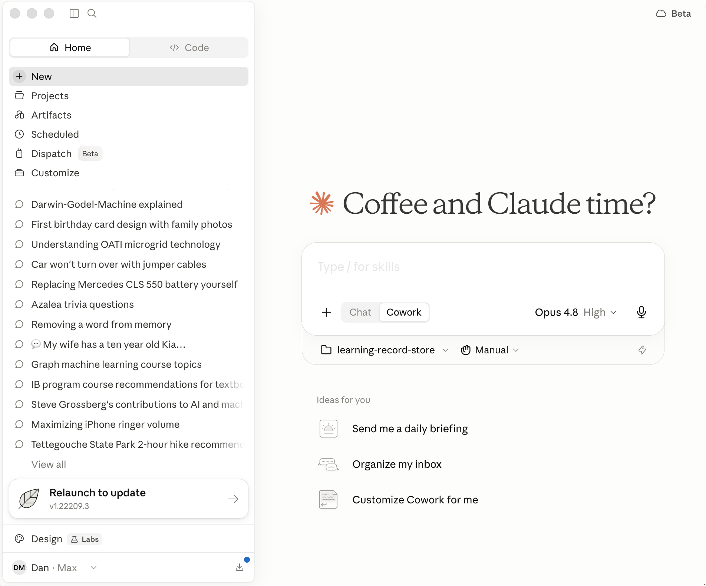

A few regions deserve special attention, and they get their own sections below.

## Chat vs. Cowork vs. Code

Claude Desktop can act in three different "modes," and knowing which one you're in is half the battle. The first choice you make is right under the prompt box: a little toggle between **Chat** and **Cowork**.

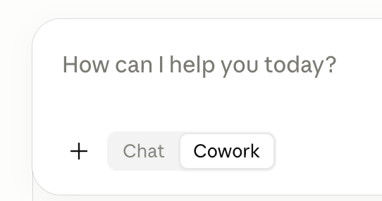

!!! mascot-thinking "The Big Idea: Talk vs. Do"
    
    Here's the "aha!" that makes the whole app click: **Chat talks, Cowork does.** Chat is a back-and-forth conversation — Claude gives you advice but can't touch your files. Cowork is *agentic* — you describe an outcome, step away, and come back to finished work: edited documents, organized folders, real deliverables. Same friendly Claude, very different superpowers.

### Chat vs. Cowork

The key difference is **file access and autonomy.**

- **Chat** is for regular back-and-forth conversation. Claude responds to your messages one at a time and can offer guidance, but it can't directly read, edit, or create files on your computer. Think of it as talking to a brilliant colleague over coffee.

- **Cowork** is agentic. You describe an outcome, and Claude takes on complex, multi-step tasks and executes them on your behalf — reading, editing, and creating files in folders *you* specify, using connected tools. It *completes* tasks rather than just describing how to do them. Crucially, it does not go outside your desktop.

Here's the difference in one before/after:

> **Chat:** "How would I organize a messy downloads folder?" → You get a thoughtful list of steps to do yourself.
>
> **Cowork:** "Organize my messy downloads folder into subfolders by file type." → Claude actually does it, and you come back to a tidy folder.

### Cowork vs. Code

There's a third mode — **Claude Code** — reachable from the **Code** tab at the top of the sidebar. Cowork and Code run on the *same* agentic engine, but they're built for different people.

- **Claude Code** is built for software engineering — writing, debugging, and shipping code. It's aimed at developers and lives in the terminal, IDEs like VS Code and JetBrains, and the desktop app.

- **Cowork** is built for non-coding knowledge work — research, analysis, document creation, organizing files, and other multi-step tasks. It's aimed at knowledge workers and professionals, requires no terminal, and lets Claude read, edit, and create files in folders you specify.

In short: **same engine, different audience.** Code targets engineers in a developer environment; Cowork targets everyone else doing general knowledge work.

## Cloud Continuation

See that little cloud badge in the top-right corner? When you start a task, you can choose where it runs.

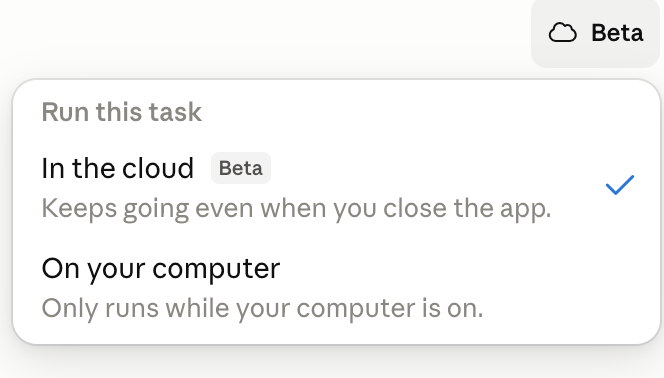

- **In the cloud** — keeps going even when you close the app. Perfect for long jobs: kick it off, shut the laptop, come back to finished work.
- **On your computer** — only runs while your computer is on.

!!! mascot-tip "Polly's Tip"
    
    Words matter — let's get them right! Reach for **cloud** mode when you've asked for something big and slow, like "research every competitor and write me a summary." Then go make actual coffee. Claude keeps working whether your laptop is open or not.

## Projects

**Projects** let you put prompt resources together — files, instructions, and context that Claude should remember across many related chats. Instead of re-explaining your situation every time, you set it up once in a Project.

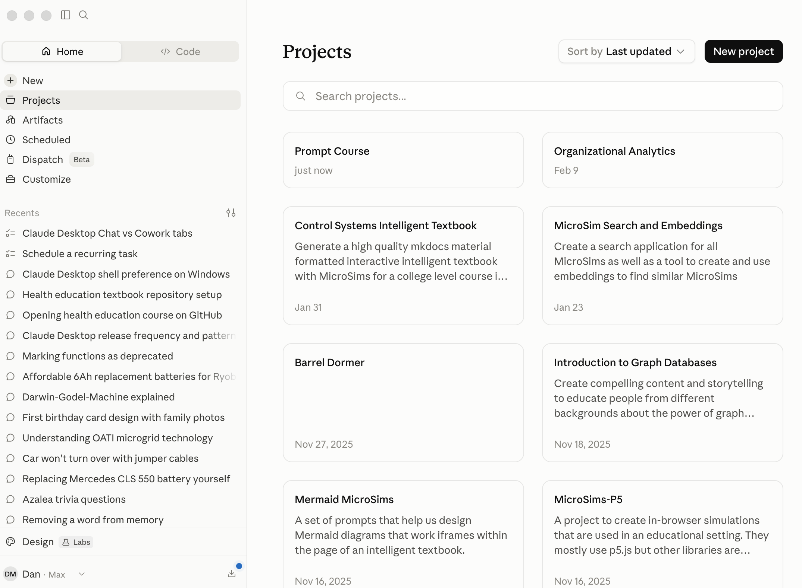

Click **New project** to start one, and give it a clear name and a short description of what it's for. One important note: **Home Projects (Chat and Cowork) are different from Code Projects.** They live in separate places because they serve different kinds of work.

## Customize: Skills, Connectors, Plugins, and Memory

The **Customize** panel is your control room. This is where Claude goes from "smart chatbot" to "tailored assistant that knows your tools and remembers your preferences." It has four sections:

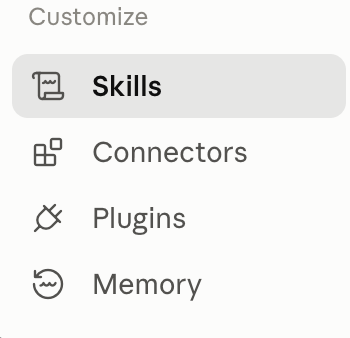

| Section | What it is |
|---------|-----------|
| **Skills** | Packages of precise rules for specific tasks — like a recipe Claude follows to produce a consistent result every time. |
| **Connectors** | Ways to connect Claude to applications and databases. |
| **Plugins** | Bundles of capabilities (often Skills + Connectors together) you can install in one click. |
| **Memory** | What Claude remembers about you between sessions. |

Let's look at Plugins and Memory more closely.

### Plugins

The **Plugins** directory is a marketplace of ready-made capability bundles — Design, Marketing, Data, Finance, Product Management, and more. Each shows how many people have installed it. Click the **+** to add one.

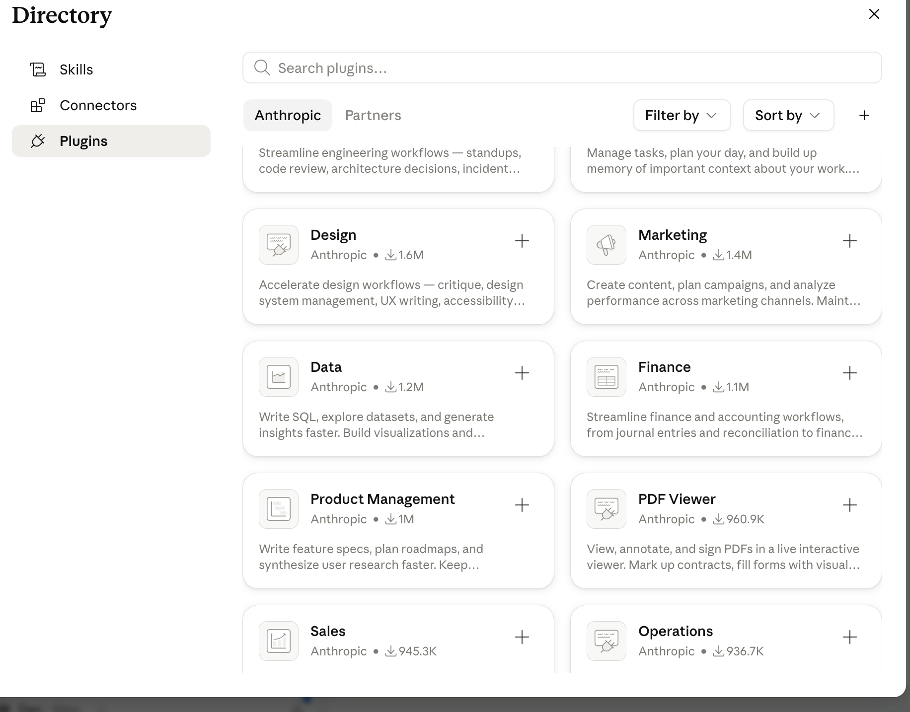

You can browse **Anthropic**-built plugins or **Partners**, filter and sort, and search by keyword. Installing a well-chosen plugin is one of the fastest ways to level up what Claude can do for your specific line of work.

### Memory

**Memory** is what lets Claude feel like it actually knows you. Instead of starting from scratch every session, Claude can carry forward relevant context — your role, your projects, your preferences.

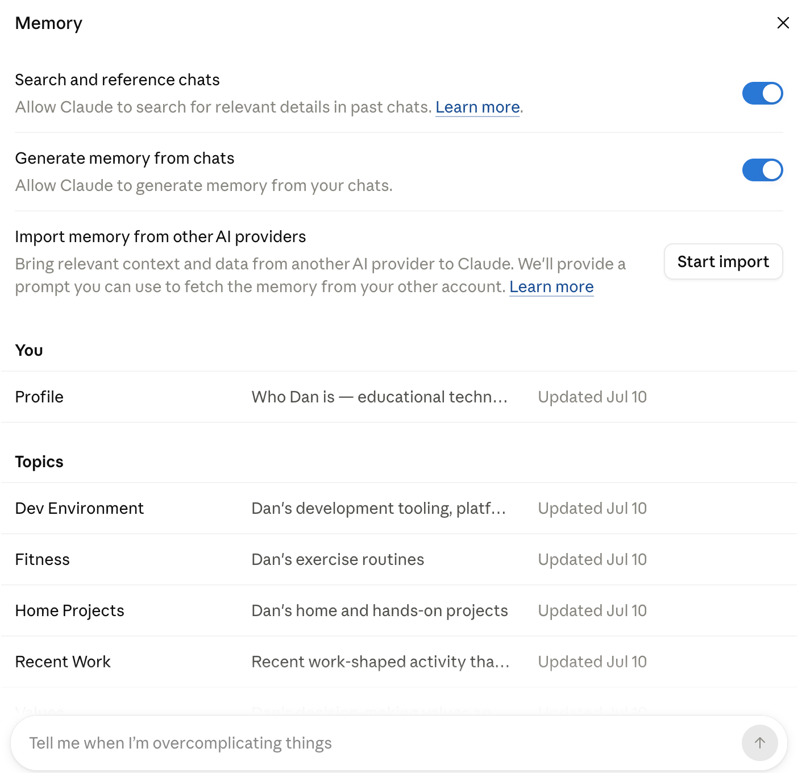

Two toggles control the automatic side of Memory:

- **Search and reference chats** — lets Claude search past conversations for relevant details.
- **Generate memory from chats** — lets Claude build up memory from what you discuss.

Memory is organized into a **Profile** (who you are) and **Topics** (Dev Environment, Fitness, Home Projects, and so on). You can also **import memory from other AI providers** to bring your existing context along.

#### Your Profile

The **Profile** is the heart of your Memory — a short summary and a bulleted list of details about who you are and what you're working on. You can view it, edit it, or delete it entirely.

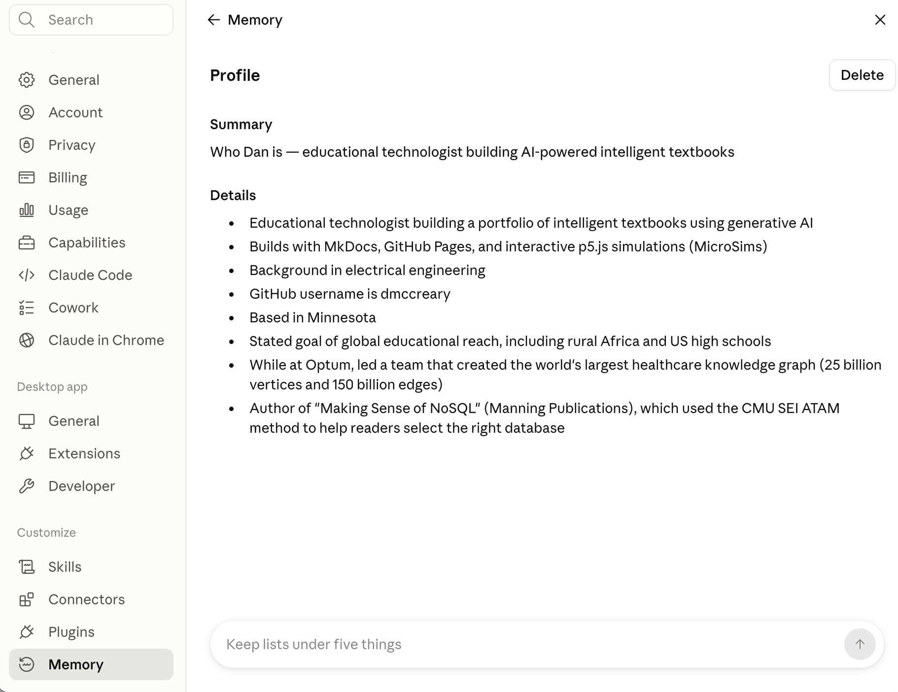

!!! tip "Keep Your Lists Short"
    Notice the little coaching prompts at the bottom of these panels, like "Keep lists under five things." That's not just decoration — tidy, focused memory helps Claude give you sharper answers. Prune it now and then, the same way you'd clean out a junk drawer.

## Skipping Approvals — and Using Chrome

By default, Cowork pauses and asks permission before doing certain things. That's a safety feature. But you'll eventually meet a dialog offering to **Skip all approvals** so Claude can use your connectors without pausing — and a toggle to let Claude **Use Chrome** to browse and act on websites.

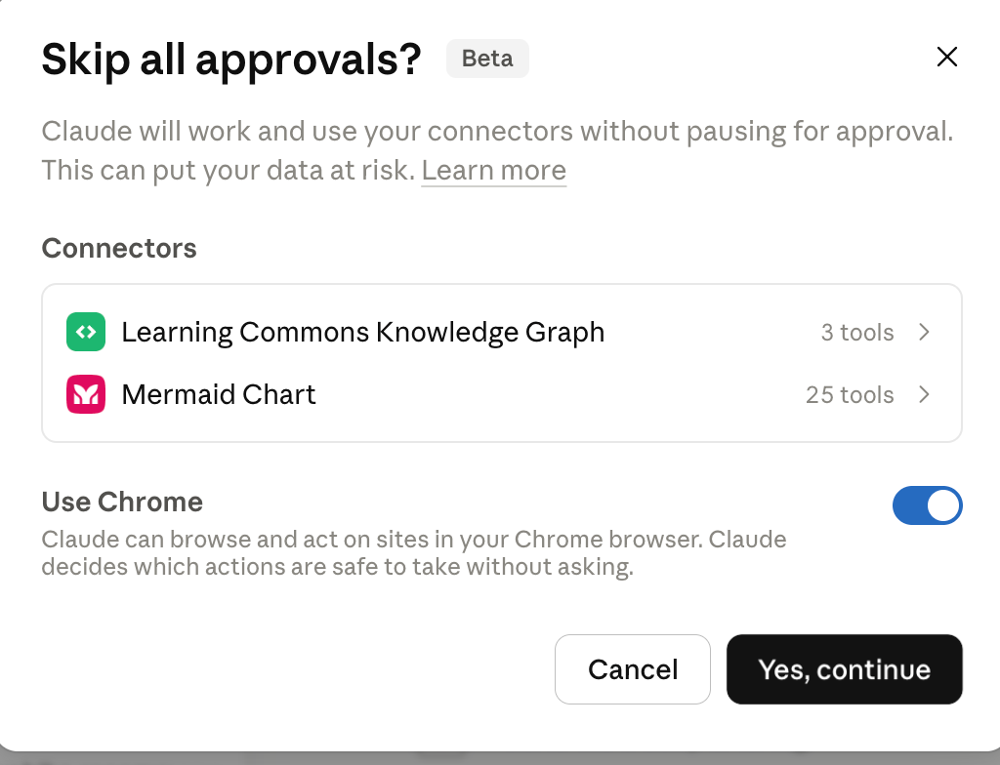

!!! mascot-warning "Read This Before You Click 'Yes, Continue'"
    
    I've seen this go sideways more times than I've molted feathers, and trust me, that's a lot. "Skip all approvals" means Claude will work and use your connectors **without pausing for your OK** — and yes, the dialog literally warns "This can put your data at risk." When you're new, keep approvals **on**. Watch what Claude does a few dozen times first. Turn this off only once you deeply trust a specific, well-tested workflow. Same goes for **Use Chrome**: powerful, but it lets Claude act on live websites, so grant it deliberately, not reflexively.

The safe habit: start cautious, loosen slowly, and never click "Yes, continue" on a dialog you don't fully understand.

## The Code Dashboard and Screen Regions

Switch to the **Code** tab and the Home screen becomes a developer dashboard — "What's up next, Dan?" — complete with usage stats, session counts, and a heat-map of your activity.

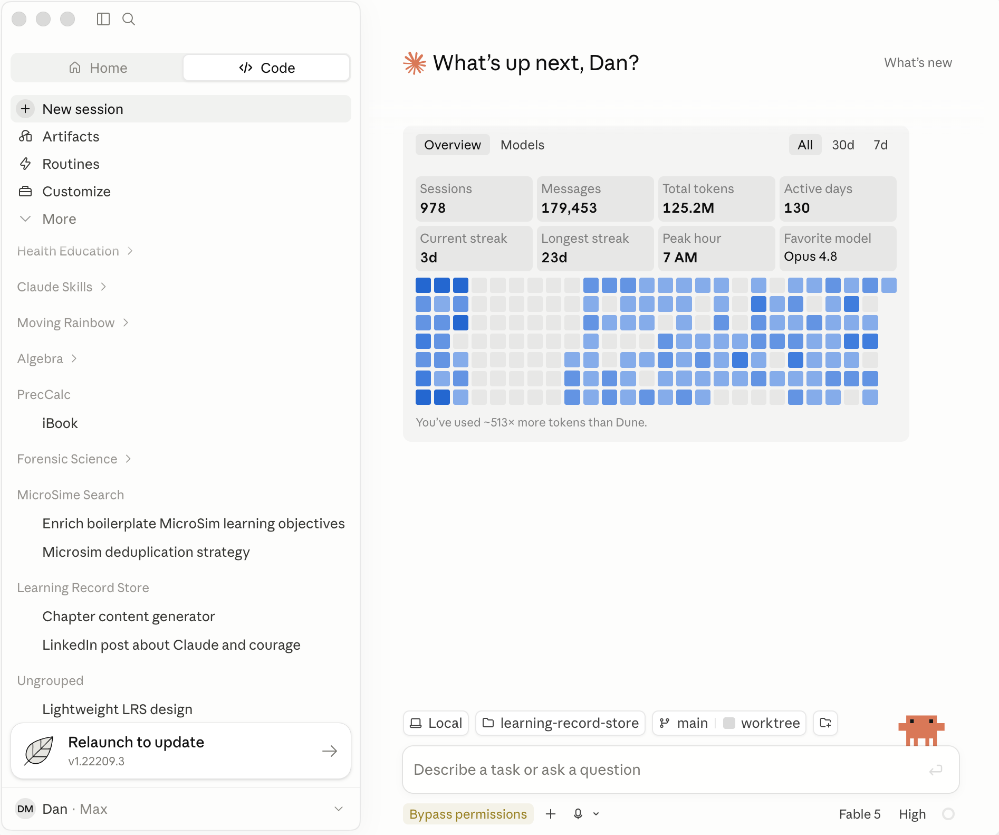

The overall layout stays familiar: a **sidebar** on the left (now organized by project), a big **content area** in the middle, and — most important for daily driving — a dense **footer bar** along the bottom. That footer packs a remarkable amount of control into a thin strip, so it gets its own interactive diagram next.

## The Footer Bar

The footer is small but mighty. It's where you set your file context (local or cloud, which directory, which Git branch), choose your model and effort level, control permissions, and keep an eye on how much usage you have left.

Hover over each numbered marker in the diagram below to learn what it does. It's a wide strip, so labels sit above and below the image.

<iframe src="../../sims/claude-desktop-footer/main.html" width="100%" height="522px" frameborder="0" scrolling="no"></iframe>

[Open the Footer Regions diagram fullscreen](../sims/claude-desktop-footer/index.md){ .md-button }

Here's the static screenshot for reference:

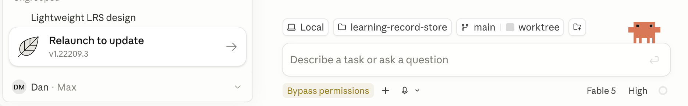

Two footer controls are worth memorizing early:

- The **Directory** chip tells you exactly which folder Cowork can read and write. Glance at it before every task — it's your safety rail.
- The **Permissions & Planning** chip (you may see it read "Bypass permissions") sets how much Claude does without asking. Revisit the warning above before you loosen it.

## Installing Claude Desktop on Windows

If you're on Windows, one extra step: Claude Desktop requires the **Windows Subsystem for Linux (WSL)** to be installed first. Anthropic maintains an up-to-date walkthrough:

- [Deploy Claude Desktop for Windows](https://support.claude.com/en/articles/12622703-deploy-claude-desktop-for-windows)

Follow that guide to get WSL and the desktop app set up, then come back here to learn your way around the screen.

## You've Got the Map

That's the whole cockpit. You now know the sidebar, the three modes, Projects, the Customize control room, Memory, permissions, and that mighty little footer.

!!! mascot-celebration "Nicely Done, Word Wizards!"
    
    Use your words! Twenty minutes ago that screen was a wall of mystery icons. Now you can point at any region and say what it does — and you've got two interactive diagrams to quiz yourself with whenever the app shuffles things around. Remember: the buttons will keep moving, but the *concepts* are yours forever. Go make Claude do something useful. Time to talk to AI!

## Related Reading

- [Crash Course in Talking to Agents](crash-course-talking-to-agents.md) — the six-week plan for getting fluent with these tools.
- [Home Screen interactive diagram](../sims/claude-desktop-home-screen/index.md)
- [Footer Regions interactive diagram](../sims/claude-desktop-footer/index.md)
