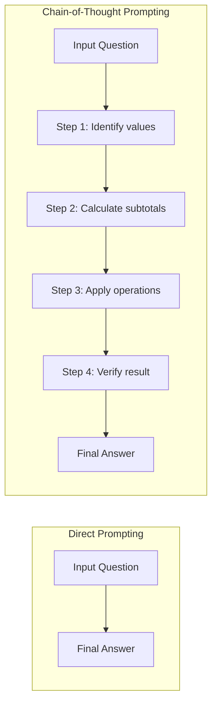
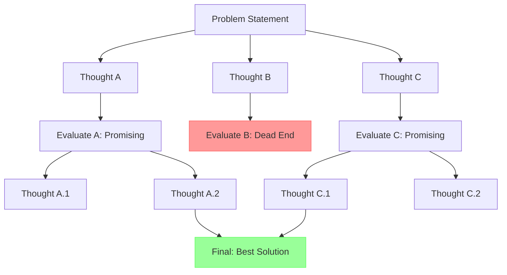

# Core Prompt Techniques

!!! mascot-welcome "Welcome Back, Prompt Crafters!"
    
    Let's craft the perfect prompt! You've learned the fundamentals — now it's time to fill your toolbox with the techniques that separate casual AI users from true prompt engineers. By the end of this chapter, you'll have a whole arsenal of strategies and know exactly when to reach for each one.

## From Fundamentals to Technique

In Chapters 1 and 2, you learned what prompts are, how AI models process them, and the core principles of clarity and structure. That's like learning what a kitchen is and how an oven works. This chapter? This is where we actually start cooking.

The techniques you're about to learn have names that sound more intimidating than they actually are. "Zero-shot prompting" sounds like something from a science fiction movie. "Chain-of-thought reasoning" sounds like a philosophy dissertation. In reality, these are simple, practical strategies that you probably already use in everyday conversation — you just didn't know they had fancy names.

Here's a secret the "10 Secret Prompts That Will Make You a Millionaire!" crowd doesn't want you to know: there are no secret prompts. There are just well-understood techniques, applied thoughtfully. And you're about to learn all of them.

## Zero-Shot Prompting

**Zero-shot prompting** is the simplest technique in prompt engineering. You give the AI a task with *zero* examples of what you want. You just ask, and the model figures it out based on its training data.

Every time you type a question into an AI chatbot without providing any examples, you're doing zero-shot prompting. It's the default mode of interaction, and for many tasks, it works remarkably well.

```
Classify the following movie review as positive or negative:
"The cinematography was stunning, but the plot made absolutely no sense."
```

That's a zero-shot prompt. You didn't show the model any examples of classified reviews — you just trusted it to understand the task. For straightforward requests like this, zero-shot prompting is perfectly adequate. The model has seen millions of movie reviews during training and understands sentiment classification intuitively.

**When to use zero-shot prompting:**

- Simple, well-defined tasks (translation, summarization, classification)
- When the task is common enough that the model has extensive training data
- When speed matters more than precision
- For quick exploratory interactions

**When zero-shot falls short:** If your task is unusual, domain-specific, or requires a very particular output format, zero-shot prompting may produce inconsistent or incorrect results. That's where examples come in.

## One-Shot Prompting

**One-shot prompting** adds exactly one example to your prompt, showing the AI what you expect before asking it to perform the task. That single example acts as a template that guides the model's response.

```
Classify the following movie reviews as positive or negative.

Review: "I loved every minute of this film, a true masterpiece!"
Classification: Positive

Review: "The cinematography was stunning, but the plot made absolutely no sense."
Classification: ???
```

By providing one example, you've shown the model the exact format you want: the label "Positive" or "Negative" after each review. This small addition can dramatically improve consistency, especially when you need a specific output structure.

!!! mascot-thinking "Think About It"
    
    Words matter - let's get them right! One-shot prompting is like showing someone a single finished jigsaw puzzle before asking them to complete a different one. They may not know the picture, but they understand the shape, the edges, and how the pieces fit together.

One-shot prompting is particularly useful when:

- Your desired output format isn't obvious from the task description alone
- You want to establish a specific tone or style
- The task is slightly unusual but not complex enough to warrant multiple examples

## Few-Shot Prompting

**Few-shot prompting** extends the idea further by providing multiple examples — typically two to five — before presenting the actual task. The more examples you provide, the clearer the pattern becomes for the model.

```
Convert the following product descriptions into catchy taglines.

Description: "A lightweight running shoe with memory foam insoles"
Tagline: "Run lighter. Land softer."

Description: "An insulated water bottle that keeps drinks cold for 24 hours"
Tagline: "Ice cold. All day long."

Description: "A noise-canceling headphone with 40-hour battery life"
Tagline: "Silence the world. Listen forever."

Description: "A portable solar charger that unfolds like a book"
Tagline:
```

With three examples, the model now has a clear picture of what you want: short, punchy taglines with a two-part structure separated by a period. The consistency of your examples teaches the model the pattern far more effectively than any written instruction could.

The table below summarizes the three shot-based techniques you've just learned:

| Technique | Examples Provided | Best For | Trade-off |
|-----------|:-:|-----------|-----------|
| Zero-shot | 0 | Common, simple tasks | Fast but less precise |
| One-shot | 1 | Format demonstration | Quick with basic guidance |
| Few-shot | 2-5+ | Pattern establishment | More precise but uses more tokens |

## Example Selection: Quality Over Quantity

Simply throwing examples into a prompt isn't enough. **Example selection** — the practice of deliberately choosing which examples to include — can make or break your few-shot prompts.

Think about it this way: if you're teaching someone to identify poisonous mushrooms, you wouldn't show them five examples that all look identical. You'd pick diverse examples that cover the range of what they might encounter. The same principle applies to few-shot prompting.

**Principles of good example selection:**

- **Diversity** — Cover the range of possible inputs and outputs. If you're classifying sentiment, include positive, negative, and neutral examples.
- **Relevance** — Choose examples that resemble the actual task. If you'll be classifying product reviews, don't use movie reviews as examples.
- **Edge cases** — Include at least one example that's tricky or ambiguous. This helps the model handle uncertainty gracefully.
- **Consistency** — All examples should follow the exact same format. Inconsistent formatting confuses the model.
- **Ordering** — Place your strongest, clearest examples first. Models pay more attention to the beginning and end of prompts.

!!! mascot-warning "Watch Out!"
    
    A common mistake is including examples that contradict each other. If one example classifies "It was okay" as positive and another classifies "It was fine" as negative, you've just confused the model. Review your examples for internal consistency before hitting send!

## Chain-of-Thought Prompting

Now we move from *showing* to *thinking*. **Chain-of-thought (CoT) prompting** is a technique where you ask the AI to explain its reasoning step by step before arriving at a final answer. Instead of jumping straight to a conclusion, the model "thinks out loud."

This technique was a game-changer when researchers at Google introduced it in 2022. It dramatically improved AI performance on tasks involving math, logic, and multi-step reasoning — sometimes boosting accuracy by over 50%.

Here's the difference in action:

**Without chain-of-thought:**

```
If a store sells 3 widgets at $5 each and 2 gadgets at $8 each,
and there's a 10% discount on the total, what's the final price?

Answer: $27.90
```

**With chain-of-thought:**

```
If a store sells 3 widgets at $5 each and 2 gadgets at $8 each,
and there's a 10% discount on the total, what's the final price?
Think through this step by step.

Step 1: Calculate widget cost: 3 × $5 = $15
Step 2: Calculate gadget cost: 2 × $8 = $16
Step 3: Calculate total before discount: $15 + $16 = $31
Step 4: Calculate discount: $31 × 0.10 = $3.10
Step 5: Calculate final price: $31 - $3.10 = $27.90

Answer: $27.90
```

Both arrive at the same answer, but the chain-of-thought version is *verifiable*. You can check each step. More importantly, when the model shows its work, it's far less likely to make reasoning errors — just like a student who shows their math work on an exam.

The magic phrase? Simply adding **"Let's think step by step"** or **"Think through this step by step"** to your prompt can trigger chain-of-thought reasoning. It's almost absurdly simple for how effective it is.

<details markdown="1">
<summary>Diagram: Chain-of-Thought vs. Direct Prompting</summary>

#### Diagram: Chain-of-Thought vs. Direct Prompting



This diagram contrasts the two approaches. Direct prompting jumps straight from input to output, while chain-of-thought prompting forces the model through a series of intermediate reasoning steps before producing a final answer. The intermediate steps serve as both a reasoning scaffold and a verification mechanism.
</details>

## Step-by-Step Reasoning

**Step-by-step reasoning** is closely related to chain-of-thought prompting but focuses specifically on breaking complex problems into a numbered sequence of discrete steps. While chain-of-thought is about encouraging the model to show its thinking, step-by-step reasoning is about *structuring* that thinking into a clear, ordered process.

This technique shines when you need the AI to follow a procedure or when the task has a natural sequential flow:

```
I need to migrate our company blog from WordPress to a static site generator.
Break this into a step-by-step plan with clear phases.
```

The model will produce an organized migration plan with numbered phases, each building on the previous one. Without the step-by-step instruction, you might get a rambling essay about migration strategies. With it, you get an actionable checklist.

**When to use step-by-step reasoning:**

- Planning and project management tasks
- Debugging and troubleshooting
- Multi-stage calculations
- Process documentation
- Any task where order matters

Step-by-step reasoning also pairs beautifully with chain-of-thought prompting. You can combine them:

```
Analyze this business scenario and recommend a strategy.
Think through your reasoning step by step,
numbering each step of your analysis.
```

## Self-Consistency

What if you could ask the AI the same question multiple times and pick the best answer? That's essentially what **self-consistency** does, but in a smarter way.

**Self-consistency** is a technique where you generate multiple chain-of-thought reasoning paths for the same problem and then select the answer that appears most frequently. The idea is simple: if three out of five reasoning paths lead to the same answer, that answer is probably correct, even if the other two paths went astray.

Here's how it works in practice. Imagine you ask a complex logic puzzle:

1. Generate 5 different chain-of-thought responses (by asking the same question multiple times or asking the model to consider multiple approaches)
2. Each response reasons through the problem differently
3. Three responses arrive at Answer A, one at Answer B, one at Answer C
4. You select Answer A as the most likely correct answer

You don't always need to do this manually. You can ask the model directly:

```
Solve this logic puzzle. Consider three different approaches,
show the reasoning for each, and then tell me which answer
you're most confident in and why.
```

!!! mascot-tip "Pro Tip"
    
    Self-consistency is your best friend for high-stakes tasks — legal analysis, medical information, financial calculations — anywhere the cost of a wrong answer is high. It takes more time and uses more tokens, but the accuracy boost is worth it when it matters.

Self-consistency works because language models are *probabilistic*. Each generation samples slightly differently from the probability distribution. By sampling multiple times and looking for convergence, you effectively reduce the noise in the output.

## Tree of Thoughts

If chain-of-thought is a single path through a reasoning maze, **Tree of Thoughts (ToT)** is exploring multiple paths simultaneously and choosing the best route at each junction.

**Tree of Thoughts** is an advanced prompting technique where the model considers multiple possible reasoning branches at each step, evaluates which branches are most promising, and continues only along the best paths. It's inspired by how human experts approach complex problems — they don't just follow one line of thinking; they consider alternatives, evaluate trade-offs, and backtrack when a path leads to a dead end.

Here's a simplified example:

```
I need to design a new feature for our mobile app.
Use a Tree of Thoughts approach:

1. Generate 3 possible approaches to this feature
2. For each approach, identify the top 2 strengths and 2 weaknesses
3. Select the most promising approach and develop it further
4. For the selected approach, generate 3 possible implementations
5. Evaluate and select the best implementation
```

This structured exploration mimics how a design team might whiteboard ideas, narrow down options, and iterate on the winner. It's particularly useful for creative tasks, strategic planning, and complex problem-solving where there isn't a single "right" answer.

<details markdown="1">
<summary>Diagram: Tree of Thoughts Structure</summary>

#### Diagram: Tree of Thoughts Structure



This diagram shows how Tree of Thoughts branches into multiple reasoning paths from the initial problem. Each thought is evaluated, unpromising branches are pruned (shown in red), and the most promising paths continue to branch further. The best solutions from surviving branches converge into a final answer (shown in green).
</details>

The following table summarizes the reasoning techniques covered so far:

| Technique | Core Idea | Best For | Complexity |
|-----------|-----------|----------|:----------:|
| Chain-of-Thought | Show reasoning steps | Math, logic, analysis | Low |
| Step-by-Step | Number sequential actions | Planning, debugging | Low |
| Self-Consistency | Multiple reasoning paths, majority vote | High-stakes decisions | Medium |
| Tree of Thoughts | Branch, evaluate, prune reasoning | Creative and strategic tasks | High |

## Prompt Chaining

All the techniques you've learned so far operate within a single prompt. **Prompt chaining** breaks that boundary. It's the practice of using the output of one prompt as the input to the next, creating a sequence — or chain — of prompts that work together to accomplish a complex task.

Think of prompt chaining like an assembly line. Each station (prompt) handles one specific job, and the product moves from station to station until it's complete. No single station tries to do everything.

Here's a practical example of a three-step chain for writing a blog post:

**Prompt 1: Research and Outline**

```
Research the topic "sustainable packaging trends in 2026"
and create a detailed outline with 5 main sections.
```

**Prompt 2: Draft** (uses output from Prompt 1)

```
Using the following outline, write a 1000-word blog post.
Write in a conversational, informative tone.

[Paste outline from Prompt 1]
```

**Prompt 3: Edit** (uses output from Prompt 2)

```
Edit the following blog post for clarity, grammar, and flow.
Suggest a catchy title and three social media teaser lines.

[Paste draft from Prompt 2]
```

Each prompt in the chain is focused, manageable, and produces higher-quality results than trying to do everything in a single massive prompt. This is one of the most powerful patterns in practical prompt engineering.

**Why prompt chaining works:**

- **Reduced complexity** — Each prompt handles one well-defined task
- **Better quality** — The model can focus its full "attention" on a single objective
- **Easier debugging** — When something goes wrong, you can identify exactly which step failed
- **Flexibility** — You can swap out individual prompts without redesigning the whole workflow
- **Human review** — You can inspect and adjust output between steps

!!! mascot-encourage "You're Doing Great!"
    
    If prompt chaining feels like a lot to take in, don't worry! Start with just two prompts chained together. Once that feels natural, add a third. Before you know it, you'll be building five-step chains like a pro. Every expert started with two links in the chain.

## Prompt Templates

Once you've crafted a great prompt, why start from scratch next time? **Prompt templates** are reusable prompt structures with placeholders that you fill in for each new use case. They let you capture proven prompt patterns so you — and your team — can use them consistently.

A prompt template uses variables (often marked with curly braces or brackets) to indicate where custom content should be inserted:

```
You are a {role} with expertise in {domain}.

Analyze the following {content_type}:
---
{content}
---

Provide your analysis in the following format:
1. Summary (2-3 sentences)
2. Key strengths (bullet points)
3. Areas for improvement (bullet points)
4. Overall rating (1-10 with justification)
```

This single template can be used to analyze resumes, business proposals, code reviews, marketing copy, student essays — anything. You just swap out the variables.

**Benefits of prompt templates:**

- **Consistency** — Same structure produces reliably similar quality
- **Efficiency** — No need to reinvent the wheel each time
- **Collaboration** — Teams can share and improve templates together
- **Version control** — Templates can be tracked and improved over time
- **Scalability** — What works for one task can be adapted for many

## Reusable Prompts

**Reusable prompts** take the template concept one step further. While templates are structures with placeholders, reusable prompts are complete, tested prompts or prompt systems designed to be used repeatedly across different projects, contexts, or team members.

Think of the difference this way: a prompt template is a recipe with blanks ("Add ___ cups of ___"). A reusable prompt is a tested, perfected recipe with notes about what works best, common pitfalls, and suggested variations.

Building a library of reusable prompts is one of the most practical things you can do as a prompt engineer. Here's what a well-documented reusable prompt looks like:

```
NAME: Technical Explainer
PURPOSE: Explain complex technical concepts to non-technical audiences
TESTED ON: ChatGPT, Claude, Gemini
SUCCESS RATE: High for STEM topics, moderate for abstract philosophy

PROMPT:
Explain {concept} to someone who has no technical background.
Use an everyday analogy to make the core idea intuitive.
Then provide a brief technical explanation for context.
Keep the total response under 200 words.
Structure: Analogy first, then "In technical terms..." section.

NOTES:
- Works best when {concept} is a single, well-defined term
- For multi-part concepts, chain with a follow-up prompt
- Adding "Avoid jargon except in the technical section" improves output
```

A reusable prompt library becomes increasingly valuable over time. You'll find yourself reaching for your "meeting summarizer" prompt, your "code reviewer" prompt, or your "email drafter" prompt without a second thought. It's like building a personal toolkit — the quiet win that makes people wonder how you get so much done.

!!! mascot-celebration "Toolbox Complete!"
    
    Use your words! You've just filled an entire prompt engineering toolbox — from zero-shot basics all the way to reusable prompt libraries. That's eleven techniques in one chapter, and you now know more about prompting than most people who claim to be AI experts on LinkedIn. Not bad for a single chapter!

## Putting It All Together

The techniques in this chapter aren't meant to be used in isolation. The real power comes from combining them. Here's how a seasoned prompt engineer might approach a complex task:

1. **Start with zero-shot** to see if the model can handle the task directly
2. **Add examples (few-shot)** if the output format or style isn't quite right
3. **Add chain-of-thought** if the task requires reasoning or calculation
4. **Use self-consistency** if accuracy is critical
5. **Break into a chain** if the task is too complex for a single prompt
6. **Save as a template** if you'll need to do this task again

This iterative approach is the hallmark of skilled prompt engineering. You start simple and add complexity only when needed. You don't use Tree of Thoughts for "What's the capital of France?" — and you don't use zero-shot for tax calculations.

The best prompt engineers aren't the ones who use the fanciest techniques. They're the ones who pick the right technique for the right job. And now you have a full menu to choose from.

## Key Takeaways

- **Zero-shot prompting** asks the AI to perform a task with no examples. It's fast and works well for common, simple tasks.
- **One-shot and few-shot prompting** provide one or multiple examples to establish patterns, formats, and expectations. More examples generally means more consistent output.
- **Example selection** matters as much as example quantity. Choose diverse, relevant, consistent examples that cover edge cases.
- **Chain-of-thought prompting** asks the model to show its reasoning step by step, dramatically improving accuracy on math, logic, and multi-step tasks.
- **Step-by-step reasoning** structures thinking into numbered sequences, ideal for planning and process-oriented tasks.
- **Self-consistency** generates multiple reasoning paths and selects the most common answer, boosting reliability for high-stakes decisions.
- **Tree of Thoughts** explores multiple reasoning branches, evaluates them, and continues along the most promising paths — great for creative and strategic tasks.
- **Prompt chaining** breaks complex tasks into a sequence of simpler prompts, each feeding into the next, producing higher quality than monolithic prompts.
- **Prompt templates** capture proven prompt patterns with placeholders for reuse, enabling consistency and collaboration.
- **Reusable prompts** are fully tested, documented prompt systems that form a personal or team library, saving time and improving quality over the long term.
- Start simple (zero-shot), add complexity as needed, and always pick the right technique for the task at hand.

## Concepts

1. Zero-Shot Prompting
2. One-Shot Prompting
3. Few-Shot Prompting
4. Example Selection
5. Chain-of-Thought Prompting
6. Step-by-Step Reasoning
7. Self-Consistency
8. Tree of Thoughts
9. Prompt Chaining
10. Prompt Templates
11. Reusable Prompts

## Prerequisites

- [Chapter 1: AI and Machine Learning Foundations](../01-ai-ml-foundations/index.md)
- [Chapter 2: Prompt Fundamentals](../02-prompt-fundamentals/index.md)
