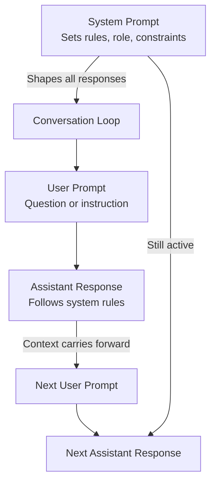

# Advanced Prompt Techniques

!!! mascot-welcome "Level Up, Word Wizards!"
    
    Let's craft the perfect prompt! You've built a solid foundation with core techniques like zero-shot, few-shot, and chain-of-thought prompting. Now we're stepping into the director's chair. This chapter is about *shaping* AI behavior — controlling not just what the model says, but how it says it, who it pretends to be, and what it refuses to do.

## Beyond the Basics

In the previous chapters, you learned techniques that help AI models produce accurate answers. That's essential, but accuracy alone doesn't make a great AI interaction. Consider the difference between a doctor who gives you the correct diagnosis in impenetrable medical jargon and one who explains it clearly using everyday language. Both are accurate. Only one is *useful*.

Advanced prompt techniques give you fine-grained control over the AI's personality, boundaries, and reasoning style. Think of the core techniques from Chapter 4 as learning to drive a car. The techniques in this chapter are learning to drive it *well* — adjusting mirrors, reading the road, and knowing when to speed up or slow down.

And if anyone tells you they have a "secret advanced prompting hack that 10x's your productivity," feel free to smile politely and back away slowly. What actually works is understanding these well-documented techniques and applying them with good judgment. No hacks required — just craft.

## Tone Control

**Tone control** is the practice of explicitly directing the AI to adopt a specific emotional register, level of formality, or communication style in its response. Without tone guidance, models default to a neutral, slightly formal voice that sounds like a helpful but personality-free encyclopedia.

You control tone by adding explicit instructions about how the response should *feel*:

```
Explain quantum entanglement in a casual, conversational tone,
as if you're chatting with a friend at a coffee shop.
```

Compare that with:

```
Explain quantum entanglement in a formal, academic tone suitable
for a peer-reviewed journal introduction.
```

The underlying information is the same, but the delivery is completely different. The first response might say "So basically, these two particles are linked in this wild way..." while the second would open with "Quantum entanglement refers to a phenomenon whereby two or more particles become correlated..."

**Common tone dimensions you can control:**

| Dimension | Example Values |
|-----------|---------------|
| Formality | Casual, conversational, professional, academic, legal |
| Emotion | Enthusiastic, neutral, empathetic, serious, humorous |
| Complexity | Simple, moderate, technical, expert-level |
| Pacing | Brief and punchy, detailed and thorough, measured |

Tone control is especially powerful when combined with other techniques. A prompt that specifies both a chain-of-thought reasoning approach *and* a friendly tone produces responses that are both logically rigorous and pleasant to read.

## Audience Adaptation

**Audience adaptation** means tailoring your prompt so the AI adjusts its vocabulary, depth, and examples to match a specific reader or listener. This goes hand-in-hand with tone control, but focuses specifically on *who* will consume the output.

The same topic explained to different audiences should look dramatically different:

```
Explain how a neural network learns.
Audience: A curious 10-year-old.
```

```
Explain how a neural network learns.
Audience: A senior machine learning engineer.
```

The first response might use an analogy about a student learning to recognize dogs versus cats by looking at lots of pictures. The second would dive into backpropagation, gradient descent, and loss functions without apology.

**Effective audience adaptation prompts specify:**

- **Knowledge level** — What can you assume the reader already knows?
- **Vocabulary constraints** — Should you avoid jargon, or use it freely?
- **Relevant examples** — What domains or experiences will resonate?
- **Desired depth** — Overview or deep dive?

!!! mascot-thinking "Think About It"
    
    Words matter - let's get them right! Audience adaptation is like being a tour guide. If you're leading a group of geology professors through the Grand Canyon, you talk about stratigraphy and tectonic uplift. If you're leading a group of kindergartners, you say "Look at the big colorful rocks!" Same canyon, different tour.

## Role Assignment

**Role assignment** is a technique where you tell the AI to act as a specific professional or expert before performing a task. By assigning a role, you prime the model to draw on knowledge patterns and communication styles associated with that expertise.

```
You are an experienced pediatrician.
A parent asks you: "My toddler has had a fever of 101F for two days.
Should I be worried?"
Provide a helpful, reassuring response.
```

When the AI receives a role assignment, it shifts its response in several ways. It prioritizes domain-relevant knowledge, adopts appropriate terminology, and follows the communication norms of that profession. A "pediatrician" response will be calm, reassuring, and medically grounded. An "emergency room doctor" response to the same question might be more direct and action-oriented.

**Popular role assignments and their effects:**

| Role | Typical Effect on Response |
|------|--------------------------|
| Teacher | Patient, step-by-step explanations with examples |
| Lawyer | Precise language, qualifications, disclaimers |
| Comedian | Humor-forward, unexpected angles, wordplay |
| Editor | Concise, focused on clarity and structure |
| Scientist | Evidence-based, cautious claims, citations |
| Marketing copywriter | Persuasive, benefit-focused, action-oriented |

Role assignment is not magic. The AI doesn't actually *become* a doctor or lawyer. It pattern-matches against its training data to produce text that sounds like what that professional might say. This distinction matters — AI role-playing as an expert is not a substitute for actual expert advice.

## Persona Prompting

**Persona prompting** extends role assignment by giving the AI a more detailed character with specific traits, background, opinions, or quirks. While role assignment says "be a teacher," persona prompting says "be a high school physics teacher from Texas who loves football analogies and never misses an opportunity to reference Newton's laws in everyday life."

```
You are Chef Maria, a no-nonsense Italian grandmother who has been
cooking for 60 years. You are passionate about fresh ingredients,
skeptical of food trends, and you believe that love is the most
important ingredient. You often say "In my kitchen..."

A student asks: "What's the secret to great pasta?"
```

Persona prompting produces more engaging and consistent responses because the AI has a richer character model to work with. The more specific the persona, the more distinctive the output.

**When persona prompting shines:**

- Creating educational content with memorable characters
- Generating creative writing with consistent voices
- Building chatbot prototypes with defined personalities
- Making dry topics more engaging through a compelling narrator

## The Three-Part Conversation: System, User, and Assistant

Modern AI systems structure conversations using three distinct message types. Understanding these is critical for advanced prompt engineering.

A **system prompt** is a special instruction that sets the overall behavior, personality, and rules for the AI before any conversation begins. It acts as the "director's notes" that shape every response the model produces. Users typically don't see the system prompt — it runs behind the scenes.

A **user prompt** is the actual message or question that a person types into the AI interface. This is what you have been writing throughout this course. User prompts are the visible part of the interaction.

An **assistant response** is the AI's reply to a user prompt, generated according to the rules established in the system prompt and the context of the conversation.

```
System:    You are a helpful cooking assistant. Always suggest
           vegetarian alternatives. Keep responses under 100 words.

User:      How do I make a hearty winter soup?

Assistant: Try a roasted butternut squash soup! Dice the squash,
           toss with olive oil, and roast at 400F for 30 minutes.
           Blend with vegetable broth, a pinch of nutmeg, and a
           swirl of coconut cream. For a protein boost, add white
           beans or red lentils.
```

The system prompt in this example does two things: it assigns a role (cooking assistant) and sets constraints (vegetarian alternatives, word limit). The user prompt is a straightforward question. The assistant response follows both the role and the constraints — notice it suggests vegetarian ingredients without being asked.

<details markdown="1">
<summary>Diagram: The Three-Part Conversation Flow</summary>

#### Diagram: System-User-Assistant Message Flow

This diagram shows how messages flow in a modern AI conversation. The system prompt sits above the conversation, influencing every exchange. User and assistant messages alternate below it, with the system prompt's rules applied to each assistant response.



</details>

## Instruction Following

**Instruction following** refers to the AI's ability to adhere to explicit directions embedded in a prompt. While every prompt implicitly asks the AI to do something, instruction following as a technique means being deliberate and specific about your requirements. Think of it as the difference between saying "make me dinner" and "make me a vegetarian stir-fry with tofu, broccoli, and a ginger-soy sauce, served over brown rice."

The more precise your instructions, the more predictable the output. Vague prompts produce vague results. Specific prompts produce specific results. This is not a revolutionary insight — it is the single most important principle in prompt engineering, and it never stops being true no matter how advanced your techniques become.

```
Write a product description for a wireless Bluetooth speaker.
Requirements:
- Exactly 3 paragraphs
- First paragraph: key features
- Second paragraph: ideal use cases
- Third paragraph: call to action
- Tone: upbeat and conversational
- Maximum 150 words total
- Include the phrase "sound that moves with you"
```

That prompt leaves very little room for misinterpretation. Each requirement is a clear, testable instruction. You can verify whether the response met every single one.

## Constraint Setting

**Constraint setting** is the practice of defining explicit boundaries and limitations within your prompt to narrow the AI's output. Constraints act as guardrails that keep the response focused and useful. Without them, AI models tend to produce responses that are technically correct but impractically broad — like asking someone for restaurant recommendations and getting a list of every restaurant in the city.

Common constraints include:

- **Length limits** — "Respond in exactly three sentences" or "Keep your answer under 200 words"
- **Format requirements** — "Present your answer as a numbered list" or "Use markdown headers"
- **Scope boundaries** — "Only discuss events from the 20th century" or "Focus exclusively on open-source tools"
- **Vocabulary restrictions** — "Explain using only words a fifth-grader would know"
- **Content exclusions** — "Do not include pricing information" or "Avoid mentioning competitors"

!!! mascot-tip "Pro Tip from Polly"
    
    Use your words! The best constraints are specific and testable. Instead of "keep it short," say "respond in under 50 words." Instead of "make it simple," say "use no words with more than three syllables." If you can't verify whether a constraint was met, it's not specific enough.

## Negative Prompting

**Negative prompting** is the technique of telling the AI what *not* to do. While most prompting focuses on desired outcomes, negative prompting explicitly excludes unwanted behaviors, formats, or content. It is the "please don't" of prompt engineering.

```
Explain the water cycle to a middle school student.

Do NOT:
- Use scientific jargon without defining it
- Include mathematical formulas
- Make the explanation longer than 200 words
- Use a condescending tone
- Start with "Great question!"
```

That last constraint might make you smile, but it solves a real problem. AI models have a well-known tendency to begin responses with empty pleasantries. Negative prompting lets you surgically remove specific bad habits.

Negative prompting is especially useful when you have tried a prompt and received output with specific problems. Rather than redesigning the entire prompt, you can add targeted exclusions. It is a scalpel, not a sledgehammer.

**When to use negative prompting:**

- When the AI keeps including something you don't want
- When you've seen specific failure patterns in previous attempts
- When you want to prevent common AI cliches and filler phrases
- When working with sensitive topics that require careful boundaries

## Delimiter Usage

**Delimiter usage** is the technique of using special characters or formatting markers to clearly separate different sections of a prompt. Delimiters help the AI understand where instructions end, where context begins, where examples live, and where the actual task is. They are the punctuation marks of prompt engineering.

Common delimiters include triple backticks, XML-style tags, triple dashes, and section headers:

```
<instructions>
Summarize the following article in exactly 3 bullet points.
Focus on the main argument, not supporting details.
</instructions>

<article>
[Your article text goes here...]
</article>

<output_format>
- Bullet point 1
- Bullet point 2
- Bullet point 3
</output_format>
```

Without delimiters, long prompts can become ambiguous. The AI might confuse part of your example text with an instruction, or treat context as a task. Delimiters eliminate this confusion by creating clear visual and semantic boundaries.

**Why delimiters matter:**

- They prevent the AI from confusing instructions with content
- They make complex prompts easier for humans to read and edit
- They enable reliable processing of user-provided input (avoiding prompt injection)
- They support structured multi-part prompts with distinct sections

## Contextual Priming

**Contextual priming** is the technique of providing background information, context, or framing before asking the AI to perform a task. By "priming" the model with relevant context, you guide it toward more accurate and relevant responses. It is like briefing a consultant before they start working on your project.

```
Context: Our company, GreenLeaf Technologies, is a mid-size
software firm specializing in environmental monitoring tools.
We serve municipal governments and conservation nonprofits.
Our brand voice is professional but warm, and we avoid
aggressive sales language.

Task: Write a LinkedIn post announcing our new water quality
monitoring dashboard.
```

Without the context section, the AI would write a generic product announcement. With it, the response will naturally incorporate the right terminology, audience awareness, and brand voice. The context does not need to explicitly say "use these words" — the AI picks up on the patterns and applies them.

Contextual priming is particularly powerful for:

- Brand-specific content creation
- Domain-specific analysis (legal, medical, technical)
- Continuation of existing documents or conversations
- Tasks that require specialized background knowledge

## Socratic Prompting

**Socratic prompting** is a technique where you instruct the AI to teach or explore a topic by asking questions rather than providing direct answers. Named after the ancient Greek philosopher Socrates, who taught entirely through questioning, this technique turns the AI into a guide that helps users discover answers on their own.

```
You are a Socratic tutor helping a student understand
photosynthesis. Instead of explaining the concept directly,
ask a series of guiding questions that lead the student to
understand how plants convert sunlight into energy. Start with
what the student might already know about plants and sunlight.
```

Socratic prompting is incredibly valuable in educational contexts because it promotes deeper learning. When a student arrives at an understanding through guided questioning, that knowledge tends to stick better than information that was simply presented.

!!! mascot-encourage "You Can Do This!"
    
    Time to talk to AI! Socratic prompting might feel unusual at first — you're asking the AI to ask *you* questions instead of answering them. But this technique is one of the most powerful learning tools in prompt engineering. Try it with a topic you're studying, and watch how the guided questions deepen your understanding.

**Effective Socratic prompting instructions include:**

- Start from what the learner already knows
- Ask one question at a time
- Build on each answer to go deeper
- Avoid giving away the answer in the question
- Provide gentle correction when the learner goes off track

## Analogical Prompting

**Analogical prompting** instructs the AI to explain or solve problems by drawing parallels to more familiar concepts. This technique leverages the power of analogy — one of the most effective communication tools humans have — to make complex or abstract ideas accessible.

```
Explain how encryption works using an analogy to physical mail.
Map each component of encryption (plaintext, ciphertext, key,
encryption algorithm, decryption) to something in the physical
mail system that a non-technical person would understand.
```

The AI might respond by comparing plaintext to a letter written in English, encryption to translating that letter into a secret code, the key to a decoder ring that both sender and receiver have, and so on. The analogy makes an abstract concept concrete and memorable.

Analogical prompting is not just for explanation. You can also use it for problem-solving:

```
I'm trying to improve employee retention at my company.
Think about how a gardener keeps plants healthy and thriving.
What lessons from gardening could apply to keeping employees
engaged and loyal?
```

By forcing the AI to think through a different lens, analogical prompting often produces more creative and insightful responses than direct questioning.

## Reflective Prompting

**Reflective prompting** asks the AI to evaluate, critique, or improve its own output. Instead of accepting the first response at face value, you build a feedback loop directly into the prompt. This technique catches errors, improves quality, and produces more thoughtful results.

```
Write a persuasive argument for investing in renewable energy.

After writing your argument, review it critically:
1. Identify any logical fallacies or weak points
2. Note any claims that need citations
3. Suggest specific improvements
4. Rewrite the argument incorporating those improvements
```

Reflective prompting works because it forces the AI to engage in self-evaluation — a form of reasoning that typically produces higher-quality output than a single pass. It is the prompt engineering equivalent of editing your own writing: the first draft is never the best draft.

You can also use reflective prompting across conversation turns. Ask the AI to produce something, then in your next message, ask it to evaluate what it just created. This two-step approach gives the model a chance to catch mistakes it wouldn't have noticed in a single response.

## Meta-Prompting

**Meta-prompting** is the technique of using AI to help you write better prompts. Instead of crafting the perfect prompt yourself, you ask the AI to generate, refine, or optimize prompts for a specific task. It is prompting about prompting — and it is one of the most powerful techniques in this entire course.

```
I need to write a prompt that will help me generate detailed
lesson plans for high school biology. The prompt should produce
consistent, well-structured results every time.

Please write an optimized prompt template I can reuse.
Include placeholders for the topic, grade level, and
time duration. Make sure it specifies the output format.
```

The AI will generate a prompt template that is likely more thorough and well-structured than what most people would write from scratch. This is not because the AI is smarter than you — it is because the AI has seen millions of prompts and knows what patterns tend to produce the best results.

!!! mascot-celebration "Nice Work, Prompt Crafters!"
    
    Look at you — you've gone from basic prompts to meta-prompts! That's like going from learning to cook dinner to teaching a cooking class. These advanced techniques are your superpower toolkit. You don't need to use every technique in every prompt, but knowing they exist means you can reach for exactly the right tool when you need it.

**Meta-prompting use cases:**

- Generating reusable prompt templates for recurring tasks
- Refining existing prompts that aren't producing good results
- Creating prompt libraries for teams or organizations
- Experimenting with different prompt structures for the same task
- Building automated workflows that require reliable prompts

<details markdown="1">
<summary>Diagram: The Advanced Prompt Techniques Toolkit</summary>

#### Diagram: Categorizing Advanced Prompt Techniques

This diagram organizes all sixteen techniques from this chapter into four functional categories: shaping the voice (tone and audience), defining the character (roles and personas), controlling the boundaries (constraints and structure), and advancing the reasoning (higher-order techniques). Each category builds on the previous one.


</details>

## Putting It All Together

The techniques in this chapter are not meant to be used in isolation. The real power emerges when you combine them. A single well-crafted prompt might use role assignment, tone control, constraint setting, delimiter usage, and contextual priming all at once:

```
<system>
You are a patient, encouraging high school math tutor who
specializes in making algebra accessible to struggling students.
You use sports analogies whenever possible. Never give the
answer directly — guide students to discover it themselves
through Socratic questioning.
</system>

<constraints>
- Use casual, supportive language
- Maximum 3 sentences per response
- Ask exactly one guiding question per turn
- If the student is wrong, say what's right about their thinking
  before redirecting
</constraints>

<context>
The student is working on solving 2x + 5 = 13.
They have already correctly identified that they need to
isolate x, but they subtracted 5 from the left side only.
</context>
```

That prompt combines persona prompting (math tutor with sports analogies), tone control (casual and supportive), negative prompting (never give the answer directly), Socratic prompting (guide through questions), constraint setting (three-sentence limit), delimiter usage (XML tags), and contextual priming (the student's current state). Seven techniques in one prompt — and it reads naturally.

Great prompt engineering is not about memorizing technique names. It is about developing an intuition for when your prompts need more specificity, better structure, or a different approach. The techniques in this chapter are your tools. The skill is knowing which ones to reach for.

## Key Takeaways

- **Tone control** and **audience adaptation** shape *how* the AI communicates, not just *what* it says
- **Role assignment** provides a general professional lens, while **persona prompting** creates a detailed character with specific traits
- **System prompts** set invisible rules that shape every response; **user prompts** are the visible questions; **assistant responses** follow both
- **Instruction following** improves with specificity — vague instructions produce vague results
- **Constraint setting** and **negative prompting** are complementary: one says what to do, the other says what not to do
- **Delimiters** prevent confusion in complex prompts by creating clear boundaries between sections
- **Contextual priming** gives the AI background information that shapes the relevance of its response
- **Socratic prompting** turns the AI into a guide that teaches through questions rather than answers
- **Analogical prompting** makes abstract concepts concrete by drawing parallels to familiar ideas
- **Reflective prompting** builds self-evaluation into the AI's process, catching errors and improving quality
- **Meta-prompting** uses AI to write better prompts — it is one of the highest-leverage skills in prompt engineering
- The most effective prompts combine multiple techniques naturally, without forcing every tool into every situation

## Concepts

1. Tone Control
2. Audience Adaptation
3. Role Assignment
4. Persona Prompting
5. System Prompt
6. User Prompt
7. Assistant Response
8. Instruction Following
9. Constraint Setting
10. Negative Prompting
11. Delimiter Usage
12. Contextual Priming
13. Socratic Prompting
14. Analogical Prompting
15. Reflective Prompting
16. Meta-Prompting

## Prerequisites

- [Chapter 1: AI and Machine Learning Foundations](../01-ai-ml-foundations/index.md)
- [Chapter 2: Prompt Fundamentals](../02-prompt-fundamentals/index.md)
- [Chapter 3: Prompt Types and Model Parameters](../03-prompt-types-parameters/index.md)
- [Chapter 4: Core Prompt Techniques](../04-core-prompt-techniques/index.md)
