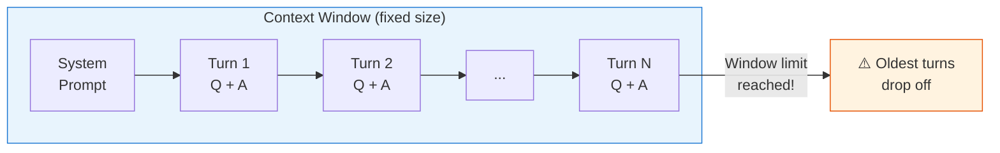
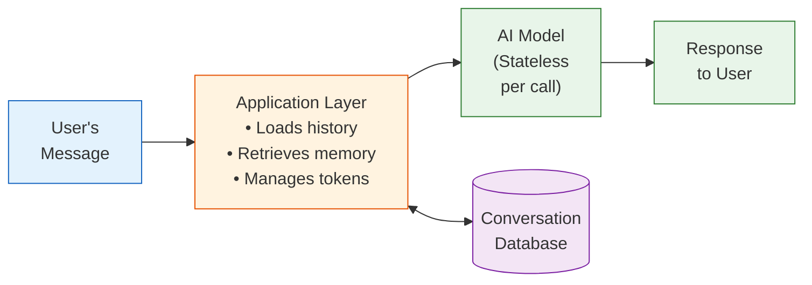
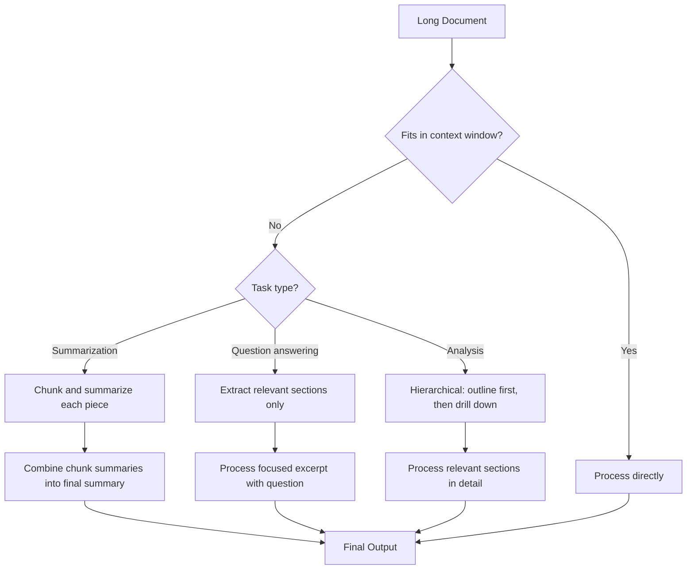
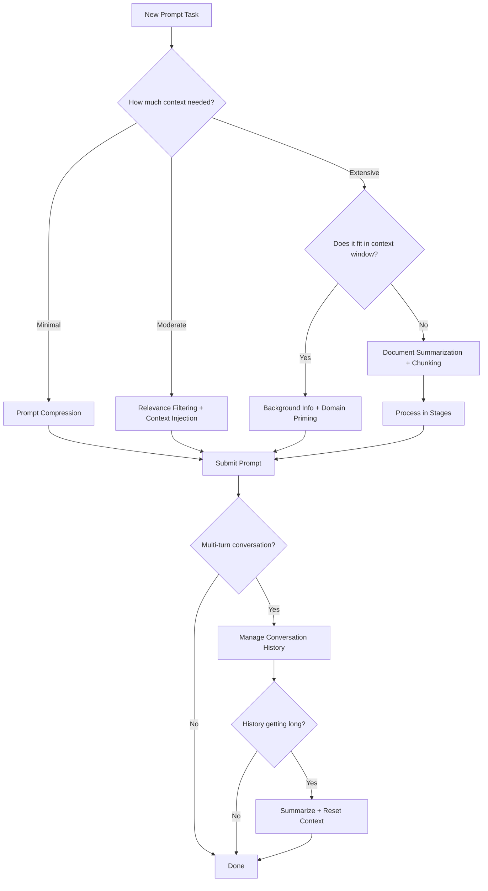

# Context, Memory, and Information Management

!!! mascot-welcome "Welcome Back, Fellow Prompt Crafters!"
    
    Let's craft the perfect prompt! In this chapter, we tackle one of the sneakiest challenges in prompt engineering: managing context. Think of it like packing a suitcase — you can't bring everything, so you need to be smart about what goes in.

## The Context Challenge

Every conversation you have with an AI model takes place inside an invisible box called the **context window**. This window has a fixed size, measured in tokens, and it holds *everything* — your prompt, the system instructions, previous conversation turns, and the model's responses. When the box gets full, something has to go.

Understanding this constraint is what separates effective prompt engineers from frustrated users who wonder why their AI "forgot" what they told it five minutes ago. The truth is, the AI didn't forget. It simply ran out of room — or, more precisely, the oldest content fell out of the window while new content was added.

This chapter gives you a toolkit for making the most of that limited space. You'll learn how to compress information, expand it when needed, filter for relevance, manage conversation history, and inject context strategically. These are the skills that let you work with AI on complex, multi-step projects instead of just quick one-off questions.

## Context Window Limits

A **context window limit** is the maximum number of tokens a model can process in a single interaction, including both input and output. Early models like GPT-3 had context windows of about 4,000 tokens — roughly 3,000 words. Modern models offer windows of 100,000 to 200,000 tokens or more. That sounds like a lot, but it fills up faster than you'd expect.

Here's a practical way to think about it: a typical novel is about 80,000 words, or roughly 100,000 tokens. A model with a 128K token context window can theoretically hold an entire novel. But remember, the output also consumes tokens from that same window. And if you're having a multi-turn conversation, every previous exchange is using space too.

<!-- ASCII art original:
Why does my AI seem to "forget" things?

The AI's context window works like a conveyor belt:
┌──────────────────────────────────────────────┐
│  System    │ Turn 1 │ Turn 2 │ ... │ Turn N  │
│  Prompt    │ Q + A  │ Q + A  │     │ Q + A   │
└──────────────────────────────────────────────┘
                                    ▲
                            Window limit reached!
                            Oldest turns drop off.
-->

*Why does my AI seem to "forget" things?*

The AI's context window works like a conveyor belt:



The practical implication: you must treat context space as a precious resource. Every unnecessary word in your prompt is a word that could have been used for something more valuable.

## Token Counting

**Token counting** is the practice of estimating or measuring how many tokens a piece of text consumes within a model's context window. Tokens are the fundamental units that language models use to process text. A token is not the same as a word — it's a chunk of text that the model's tokenizer has learned to treat as a single unit.

In English, a rough rule of thumb is that one token equals about 0.75 words, or alternatively, 100 tokens equals about 75 words. But this varies significantly across languages, technical content, and special characters.

Here are some practical token estimates:

| Content Type | Approximate Length | Estimated Tokens |
|---|---|---|
| A short prompt | 1-2 sentences | 20-50 tokens |
| A detailed prompt with examples | 1-2 paragraphs | 100-300 tokens |
| A one-page document | ~500 words | ~650 tokens |
| A 10-page report | ~5,000 words | ~6,500 tokens |
| A full novel | ~80,000 words | ~100,000 tokens |

Why does this matter for prompt engineering? Because every token you spend on your prompt is a token the model cannot use for its response. If you paste a 50-page document into a model with a 16K token window and ask for a detailed analysis, the model may not have enough room left to generate a complete answer.

!!! mascot-thinking "Tokens Are Not Words"
    
    Here's something that trips people up: the word "unbelievable" is one word but might be split into three tokens ("un", "believ", "able"). Meanwhile, common words like "the" are almost always a single token. Technical terms, code, and non-English text tend to use more tokens per word. When in doubt, use a tokenizer tool to get exact counts!

Most AI platforms provide tokenizer tools or APIs that let you count tokens precisely. OpenAI's `tiktoken` library, Anthropic's token counting API, and various online tools can give you exact numbers. When you're working on projects where context space is tight, checking your token count before submitting a prompt is a smart habit.

## Stateless Interaction

Here's a fact that surprises many people: most AI models are fundamentally **stateless**. A stateless interaction means the model has no persistent memory between separate API calls. Each time you send a prompt, the model treats it as a completely fresh conversation — unless the application layer sends along the previous conversation history.

When you use a chat interface like ChatGPT or Claude, it *feels* like the model remembers your conversation. But what's actually happening behind the scenes is that the application is resending the entire conversation history with each new message. The model reads through all of it, generates a response, and then immediately "forgets" everything. It's like a goldfish with perfect reading comprehension — brilliant in the moment, but starting fresh every time.

This is why your conversation eventually seems to "lose" earlier context. As the conversation grows longer, the application must either truncate older messages to stay within the context window or summarize them to save space.

Understanding statelessness is crucial because it means **you** are responsible for managing what information the model has access to at any given moment.

## Memory in AI Systems

Given that models are stateless, how do modern AI applications create the illusion of **memory**? Memory in AI systems refers to any mechanism that allows information to persist across interactions, giving the appearance (and practical benefit) of continuity.

There are several approaches to AI memory:

**Conversation-level memory** is the simplest form. The application stores the current conversation and resends it with each new message. This is what most chat interfaces do by default. It works well for short conversations but degrades as the conversation exceeds the context window.

**Session persistence** extends memory beyond a single conversation. Session persistence means saving conversation state so that a user can return later and continue where they left off. Some applications store session data in databases and reload relevant portions when you return. This is how ChatGPT's "memory" feature and Claude's project knowledge work.

**Long-term memory systems** use external storage (databases, vector stores, or files) to maintain information indefinitely. When you start a new conversation, the system retrieves relevant stored information and injects it into the prompt. This approach is the foundation of many enterprise AI applications.

<!-- ASCII art original:
Memory Architecture in AI Chat Applications:

┌─────────────┐    ┌──────────────────┐    ┌────────────┐
│   User's    │───▶│  Application     │───▶│  AI Model  │
│   Message   │    │  Layer           │    │  (Stateless│
└─────────────┘    │                  │    │   per call)│
                   │ - Loads history  │    └────────────┘
                   │ - Retrieves      │           │
                   │   memory         │           │
                   │ - Manages tokens │    ┌──────┘
                   └──────────────────┘    │
                          │                ▼
                   ┌──────────────┐  ┌──────────┐
                   │  Conversation│  │ Response  │
                   │  Database    │  │ to User   │
                   └──────────────┘  └──────────┘
-->

#### Diagram: Memory Architecture in AI Chat Applications:**



The key insight is that "memory" in current AI systems is really an engineering solution built *around* a stateless model. The model itself doesn't remember anything — the surrounding system manages memory on its behalf.

## Context Management

**Context management** is the overarching discipline of deciding what information to include in a prompt, how to structure it, and when to add or remove content as a conversation evolves. It's the strategic skill that ties together everything else in this chapter.

Good context management means asking yourself three questions before every prompt:

1. **What does the model need to know right now?** Not everything — just what's relevant to this specific request.
2. **What is the model likely to already know?** Models have extensive training data. You don't need to explain what Python is to a model that has seen millions of Python files.
3. **What can I leave out to save space?** Every token saved is a token available for a better response.

Think of yourself as an editor briefing a brilliant but amnesiac consultant. You need to provide enough context for them to do excellent work, without drowning them in irrelevant details.

!!! mascot-tip "The 80/20 Rule of Context"
    
    Words matter — let's get them right! In most prompts, about 20% of the context does 80% of the work. Before pasting a long document into your prompt, ask yourself: "Can I include just the relevant section instead?" A focused excerpt almost always produces better results than a full document dump.

## Prompt Compression

**Prompt compression** is the technique of reducing the token count of your prompt while preserving its essential meaning and instructions. It's the art of saying more with less.

Why compress? Because shorter prompts leave more room for the model's response, cost less (if you're paying per token), and often produce more focused answers. A compressed prompt forces you to identify what truly matters.

Here are practical compression techniques:

**Remove redundancy.** If you've stated something once, don't repeat it. Models have excellent reading comprehension within their context window.

**Use abbreviations and shorthand** when the meaning is clear. Instead of "Please generate a comprehensive summary of the following document," try "Summarize this document."

**Replace examples with patterns.** Instead of giving five examples of the output format you want, give one example and a clear description of the pattern.

**Use structured formats.** A bulleted list of requirements often uses fewer tokens than the same requirements written as prose paragraphs.

Here's a before-and-after example:

```
BEFORE (87 tokens):
I would like you to please analyze the following customer feedback 
and provide me with a summary of the main themes. Please make sure 
to identify both positive and negative sentiments. Also, I would 
appreciate it if you could organize the themes by frequency, with 
the most common themes listed first. Please be thorough.

AFTER (34 tokens):
Analyze this customer feedback. Identify main themes (positive and 
negative), ordered by frequency. Be thorough.
```

Same instructions. Less than half the tokens. The model will produce equally good results — possibly better, because the signal-to-noise ratio improved.

## Prompt Expansion

**Prompt expansion** is the opposite of compression: deliberately adding more detail, context, examples, or constraints to a prompt to improve the quality and specificity of the response. Sometimes a short prompt is too ambiguous, and the model needs more guidance to deliver what you actually want.

Expansion is appropriate when:

- The task is complex or multi-step
- The domain is specialized and the model might make incorrect assumptions
- You need the output to follow a very specific format or style
- Previous attempts with shorter prompts produced inadequate results

Effective expansion adds *useful* information, not filler. Compare these two expansions of a simple prompt:

```
ORIGINAL:
Write a project proposal.

POOR EXPANSION (adds words but not value):
Write a very good, detailed, comprehensive, thorough project 
proposal that covers all the important aspects and is well-written.

GOOD EXPANSION (adds specific context):
Write a project proposal for a school library digitization project.
Audience: school board members (non-technical).
Sections: Executive Summary, Problem Statement, Proposed Solution, 
Timeline (6 months), Budget ($50K), Expected Outcomes.
Tone: professional, persuasive.
Length: 2 pages.
```

The good expansion succeeds because it provides concrete details that eliminate ambiguity. The poor expansion just adds adjectives that the model would have tried to satisfy anyway.

## Conversation History

**Conversation history** refers to the accumulated record of all previous messages (both user prompts and model responses) in a multi-turn interaction. Managing this history effectively is one of the most important practical skills in prompt engineering.

As conversations grow longer, you face a dilemma: you want the model to remember important context from earlier in the conversation, but you also need room for new instructions and responses. Here are strategies for managing this tension:

**Periodic summarization.** Every few turns, ask the model to summarize the key decisions and context from the conversation so far. Then start a new conversation with that summary as the opening context. This is like taking meeting notes — you compress hours of discussion into a page of key points.

**Selective history.** Not every turn in a conversation is equally important. If turns 3-7 were about exploring options and turn 8 was the final decision, you might only need to keep turn 8 going forward.

**Explicit state tracking.** For complex projects, maintain a running "state document" that captures all current decisions, requirements, and context. Update it as the conversation progresses and include it at the start of each new prompt.

```
Example: Explicit State Tracking

Include at the top of each prompt:
---
PROJECT STATE:
- Project: Customer portal redesign
- Decision: React frontend, Python API backend
- Current phase: Database schema design
- Constraints: Must support 10K concurrent users
- Open questions: Authentication provider selection
---

Your new question or instruction goes here.
```

## Long-Form Context

**Long-form context** refers to working with source material that spans many pages — documents, reports, codebases, or datasets that may approach or exceed the model's context window. This is where context management gets genuinely challenging.

When working with long documents, you have several strategies:

**Chunking.** Break the document into smaller pieces and process each piece separately. Then combine the results. This works well for tasks like summarization where each section can be processed independently.

**Hierarchical processing.** First, ask the model to create an outline or table of contents from the document. Then, use that outline to identify which sections are relevant to your question and only include those sections in your follow-up prompt.

**Progressive refinement.** Start with a high-level pass over the entire document (or a summary of it), then drill down into specific sections that need detailed attention.

#### Diagram: Long-Form Document Processing Strategies


<details markdown="1">
<summary>Expand to see diagram specification</summary>
Create a flowchart using Mermaid syntax that shows decision logic for processing long documents:
This diagram should help students decide which strategy to use based on their document size and task type.
</details>

## Document Summarization and Summary Generation

**Document summarization** is the process of using AI to condense a longer text into a shorter version that captures the essential information. **Summary generation** is the broader skill of creating summaries at various levels of detail for different audiences and purposes.

Summarization is one of the most common prompt engineering tasks, and it's also where context management skills pay off most directly. A well-managed summarization prompt produces a tight, useful summary. A poorly managed one produces either a truncated mess or a summary that misses key points.

Effective summarization prompts specify:

- **Target length** — "Summarize in 3 paragraphs" or "Summarize in under 200 words"
- **Audience** — "Summarize for a technical audience" versus "Summarize for a general reader"
- **Focus** — "Focus on the financial implications" or "Focus on the methodology"
- **Format** — "Use bullet points" or "Write a narrative paragraph"

```
Effective summarization prompt:

Summarize the attached research paper. 
Target: 250 words.
Audience: Healthcare administrators (non-researchers).
Focus: Practical implications for hospital workflow.
Format: 3-4 bullet points for key findings, followed by a 
one-paragraph recommendation.
```

## Information Extraction and Key Point Identification

**Information extraction** is the technique of using prompts to pull specific data points, facts, or structured information from unstructured text. **Key point identification** is the related skill of finding the most important ideas or arguments in a document.

These skills are essential when you don't need a full summary — you need specific answers. Consider the difference:

- *Summarize this contract* → gives you an overview
- *Extract all payment terms from this contract* → gives you specific data
- *What are the three main arguments in this essay?* → gives you key points

Information extraction works best when you tell the model exactly what to look for:

```
Extract the following from this job posting:
- Job title
- Required years of experience
- Required technical skills (list)
- Salary range (if mentioned)
- Remote work policy

Format: JSON object
```

**Key point identification** is particularly useful for quickly processing large volumes of text. You might ask: "What are the 5 most important points in this article?" or "What claims does the author support with evidence?"

## Relevance Filtering

**Relevance filtering** is the practice of selectively including only the most pertinent information in your prompt, excluding everything that doesn't directly contribute to the current task. It's the context management skill that most directly saves you tokens and improves response quality.

Think of relevance filtering as being a good research assistant. If your boss asks you to brief them on a competitor's pricing strategy, you don't hand them the competitor's entire annual report. You find the relevant pages, highlight the key sections, and present just what they need.

Apply the same principle to your prompts:

- **Don't paste entire documents** when a relevant excerpt will do
- **Remove boilerplate** — headers, footers, legal disclaimers, and formatting artifacts
- **Strip metadata** that doesn't affect the task — timestamps, internal reference numbers, formatting codes
- **Prioritize recent information** when working with time-sensitive content

!!! mascot-warning "The Context Window Is Not a Junk Drawer"
    
    One of the most common mistakes in prompt engineering is the "kitchen sink" approach — pasting in everything you can find and hoping the model will sort it out. This usually backfires. Irrelevant context confuses the model, dilutes the signal from your actual instructions, and wastes precious tokens. Be a curator, not a hoarder!

## Context Injection and Background Information

**Context injection** is the technique of strategically inserting relevant information into a prompt that the model would not otherwise have access to. This includes private data, recent events, domain-specific details, or any information that falls outside the model's training data.

**Background information** is any supplementary context you provide to help the model understand the situation, constraints, or domain it's working within.

Context injection is one of the most powerful prompt engineering techniques because it lets you combine the model's general intelligence with your specific, up-to-date knowledge. Common scenarios include:

- Providing a company's style guide before asking the model to write marketing copy
- Including a patient's medical history before asking the model to help draft a clinical summary
- Pasting in relevant code files before asking the model to debug an issue
- Sharing meeting notes before asking the model to draft follow-up action items

The key to effective context injection is placement and labeling. Clearly separate the injected context from your instructions:

```
CONTEXT:
[Your background information here]

INSTRUCTIONS:
[What you want the model to do with that context]
```

This structure helps the model understand which parts are reference material and which parts are action items.

## Domain Knowledge Priming

**Domain knowledge priming** is the technique of providing the model with specialized vocabulary, rules, conventions, or background knowledge for a specific field before asking it to perform a task in that domain. It's a specific form of context injection focused on expertise rather than data.

Why is this necessary? While models have broad knowledge across many domains, their understanding can be shallow or outdated in specialized fields. Domain knowledge priming fills those gaps.

```
Example: Priming for a legal domain task

You are assisting a contracts attorney. Key terms for this task:
- "Indemnification" = obligation to compensate for loss or damage
- "Force majeure" = unforeseeable circumstances preventing 
  contract fulfillment
- "Liquidated damages" = predetermined compensation amount 
  agreed upon in the contract
- Governing jurisdiction: State of Delaware, USA

Now, review the following contract clause and identify any 
potential risks for the buyer...
```

Priming is especially valuable when working with:

- Industry-specific terminology that has different meanings in general usage
- Internal company processes or naming conventions
- Regulatory frameworks with precise definitions
- Academic fields with evolving standards or competing schools of thought

## Report Generation and Technical Writing

**Report generation** is the use of AI to create structured documents that present information, analysis, or recommendations in a formal format. **Technical writing** is the specialized discipline of communicating complex or specialized information clearly and accurately.

These are output-focused applications of context management. To generate a good report, you need to provide the model with the right raw materials (data, findings, context) and clear instructions about the report's structure, audience, and purpose.

A strong report generation prompt follows this pattern:

```
Generate a quarterly sales report.

DATA:
[Insert key metrics, trends, and figures]

STRUCTURE:
1. Executive Summary (3-4 sentences)
2. Key Metrics (table format)
3. Trend Analysis (2-3 paragraphs)
4. Recommendations (bullet points)

AUDIENCE: VP of Sales (familiar with industry terminology)
TONE: Professional, data-driven
LENGTH: 2 pages
```

Technical writing requires additional attention to precision. When generating technical content, include instructions like:

- "Define all acronyms on first use"
- "Use active voice"
- "Include specific version numbers and dates"
- "Cite sources for all factual claims"

#### Diagram: Context Management Decision Framework



<details markdown="1">
<summary>Expand to see diagram specification</summary>

Create a diagram showing how different context management techniques relate to each other and when to use each one:

This diagram provides students with a practical decision tree for choosing the appropriate context management strategy for any given task.

</details>

## Putting It All Together: A Context Management Workflow

Let's walk through a realistic scenario that combines multiple techniques from this chapter.

**Scenario:** You're a project manager who needs to use AI to analyze a 40-page project requirements document and produce a two-page executive summary for your steering committee.

**Step 1: Assess the context.** The document is roughly 40 pages, or about 52,000 tokens. Your model has a 128K context window. It fits, but it will consume a large portion of your available space.

**Step 2: Apply relevance filtering.** You scan the document and realize that 15 pages are appendices with raw data tables. You remove those, bringing the document down to 25 pages (~32,500 tokens). Much better.

**Step 3: Apply prompt compression.** You write a concise prompt rather than a verbose one. You specify exactly what the steering committee cares about: timeline, budget, risks, and key deliverables.

**Step 4: Inject background context.** You add a brief note about the steering committee's priorities: "The committee is primarily concerned with budget adherence and the Q3 delivery deadline."

**Step 5: Use domain knowledge priming.** You include a few lines defining internal project terminology that appears throughout the document.

**Step 6: Submit and iterate.** You send the prompt, review the summary, and then ask follow-up questions about specific sections — using the conversation history to maintain continuity.

This workflow demonstrates that context management is not a single technique but a combination of skills applied strategically. With practice, it becomes second nature.

!!! mascot-celebration "You've Mastered Context Management!"
    
    Use your words! You now understand how to pack the right information into every prompt, manage conversation history like a pro, and handle documents of any length. These skills are the backbone of advanced prompt engineering — everything from RAG systems to agentic AI builds on this foundation. Onward!

## Key Takeaways

- **Context windows have hard limits.** Every token in your prompt (including conversation history) counts toward this limit. Treat context space as a precious resource.
- **AI models are stateless.** What feels like "memory" is really the application resending conversation history with each request. Understanding this changes how you structure interactions.
- **Prompt compression saves tokens and improves focus.** Remove redundancy, use concise language, and replace verbose instructions with structured formats.
- **Prompt expansion adds value when tasks are complex.** More detail reduces ambiguity, but only when the added detail is specific and actionable — not just more adjectives.
- **Relevance filtering is your most powerful context management tool.** Include only what the model needs for the current task. Be a curator, not a collector.
- **Context injection and domain priming let you extend the model's knowledge.** Combine the model's general intelligence with your specific, current information.
- **Conversation history management is essential for multi-turn work.** Use periodic summarization, selective history, and explicit state tracking to maintain continuity without exceeding context limits.
- **Document processing requires strategy.** For long documents, choose between chunking, hierarchical processing, and progressive refinement based on your task type and document size.

## Concepts

1. Prompt Compression
2. Prompt Expansion
3. Summary Generation
4. Report Generation
5. Technical Writing
6. Context Management
7. Context Window Limits
8. Token Counting
9. Conversation History
10. Memory in AI Systems
11. Stateless Interaction
12. Session Persistence
13. Long-Form Context
14. Document Summarization
15. Information Extraction
16. Key Point Identification
17. Relevance Filtering
18. Context Injection
19. Background Information
20. Domain Knowledge Priming

## Prerequisites

- [Chapter 1: AI and Machine Learning Foundations](../01-ai-ml-foundations/index.md)
- [Chapter 2: Prompt Fundamentals](../02-prompt-fundamentals/index.md)
- [Chapter 3: Prompt Types and Model Parameters](../03-prompt-types-parameters/index.md)
- [Chapter 4: Core Prompt Techniques](../04-core-prompt-techniques/index.md)
- [Chapter 5: Advanced Prompt Techniques](../05-advanced-prompt-techniques/index.md)
- [Chapter 6: Output Format Control](../06-output-format-control/index.md)
