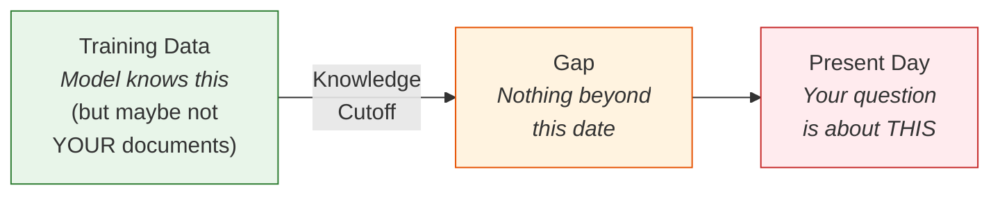
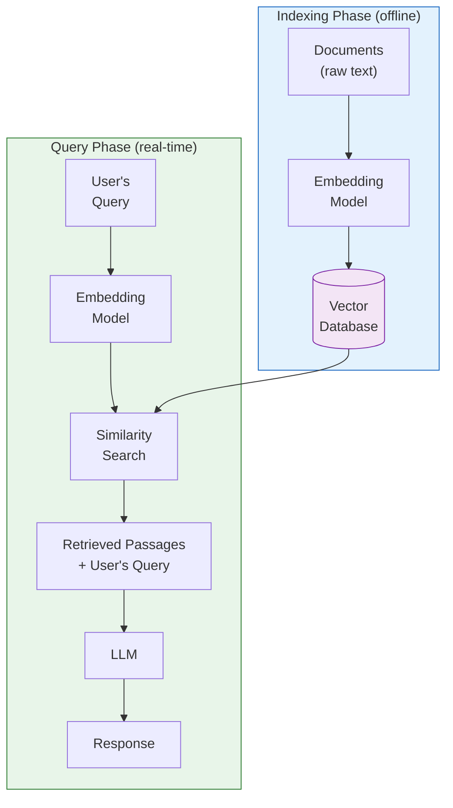
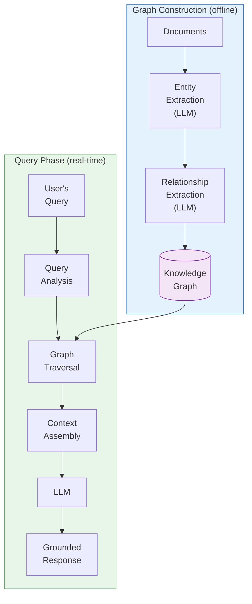

# Retrieval-Augmented Generation and GraphRAG

!!! mascot-welcome "Time to Talk to AI — With Receipts!"
    
    Let's craft the perfect prompt! In this chapter, we explore one of the most important breakthroughs in practical AI: teaching language models to *look things up* before answering. Think of it as giving your AI a library card — and making sure it actually uses it.

## Why Models Need Help Remembering

You've already learned that language models are trained on massive datasets and can generate remarkably fluent text. But here's the uncomfortable truth: a language model's knowledge is frozen in time. Everything it "knows" comes from its training data, which has a hard cutoff date. Ask a model about something that happened last week, and it will either admit ignorance or — more dangerously — make something up with complete confidence.

This limitation is called the **knowledge cutoff**. A knowledge cutoff is the date beyond which a language model has no training data. If a model was trained on data through January 2025, it has no knowledge of events, publications, or discoveries after that date. It's like asking a friend who has been living on a desert island for a year to give you the latest stock prices. No matter how smart they are, they simply don't have the information.

But the knowledge cutoff is only part of the problem. Even within its training period, a model may not have encountered specific documents you care about — your company's internal policies, your research papers, your product documentation, or the latest regulatory filings in your industry. The model's training data, however vast, cannot contain everything.

<!-- ASCII art original:
The Knowledge Gap Problem:

Training Data          Knowledge Cutoff     Present Day
━━━━━━━━━━━━━━━━━━━━━━━━━┫                    │
  ▲ Model knows this     ▲ Nothing beyond     ▲ Your question
  │ (but maybe not        │ this date           │ is about THIS
  │  YOUR documents)      │                     │
-->

**The Knowledge Gap Problem:**



This is where **Retrieval-Augmented Generation** enters the picture.

## What Is Retrieval-Augmented Generation?

**Retrieval-Augmented Generation** (RAG) is a technique that enhances a language model's responses by retrieving relevant information from external sources and including it in the prompt before the model generates its answer. Instead of relying solely on what the model learned during training, RAG gives the model access to up-to-date, specific, and verifiable information at the moment you ask your question.

The core idea is beautifully simple: before the model answers, go find the relevant facts and hand them over. Here's the basic RAG workflow:

1. **You ask a question.** Your prompt is sent to the system.
2. **The system searches for relevant information.** Using your question, the system searches through a collection of documents, databases, or other knowledge sources.
3. **Relevant passages are retrieved.** The search returns the most relevant chunks of text.
4. **The retrieved information is added to the prompt.** The original question is combined with the retrieved passages into an augmented prompt.
5. **The model generates a response.** The language model now answers your question using both its general knowledge and the specific retrieved information.

Think of it this way: instead of asking a brilliant friend to answer your question from memory, you hand them the relevant pages from a textbook and *then* ask the question. They can now give you a much more accurate, detailed, and verifiable answer.

!!! mascot-thinking "RAG Is Not Cheating — It's Smart"
    
    Some people worry that RAG is like "cheating" because the model isn't answering from its own knowledge. But consider this: when *you* write a research paper, do you answer every question from memory? Of course not — you look things up, check your sources, and cite them. RAG is just teaching AI to do the same thing. The smartest people in the room are usually the ones who know where to find the answer, not the ones who try to memorize everything.

## The Knowledge Base

At the heart of every RAG system is a **knowledge base**. A knowledge base is an organized collection of documents, data, or information that serves as the external source of truth for the RAG system. This could be anything: a company's documentation library, a collection of research papers, a product catalog, a legal code, or even a curated set of web pages.

The quality of a RAG system is directly tied to the quality of its knowledge base. A brilliant retrieval system searching through poorly organized, outdated, or inaccurate documents will produce poor results. This is the "garbage in, garbage out" principle at work — the AI can only be as good as the information you give it.

Knowledge bases come in many forms:

| Knowledge Base Type | Examples | Best For |
|---|---|---|
| Document collections | PDFs, Word docs, web pages | Enterprise search, research |
| Structured databases | SQL databases, spreadsheets | Product data, financial records |
| Code repositories | GitHub repos, API docs | Developer assistance |
| Multimedia archives | Transcripts, image metadata | Media search, accessibility |
| Real-time feeds | News APIs, sensor data | Current events, monitoring |

Building an effective knowledge base requires thoughtful curation. You need to decide what information belongs, how often it should be updated, and how to handle contradictions between sources. This is less a technical challenge than an organizational one — and it's where many RAG projects succeed or fail.

## Embeddings: Turning Words Into Numbers

To search a knowledge base effectively, a RAG system needs to understand meaning, not just match keywords. This is where **embeddings** come in. An embedding is a numerical representation of text (or other data) as a vector — a list of numbers that captures the semantic meaning of the content.

Imagine you could place every sentence ever written on a giant map, where sentences with similar meanings are close together and sentences with different meanings are far apart. That's essentially what an embedding does, except the "map" has hundreds or thousands of dimensions instead of just two.

For example, the sentences "The cat sat on the mat" and "A feline rested on the rug" would have very similar embeddings — their vectors would be close together in the embedding space — even though they share almost no words in common. Meanwhile, "The stock market crashed today" would be far away from both of them.

<!-- ASCII art original:
Embedding Space (simplified to 2D):

         "machine learning models"
                 ●
    "neural networks"          "deep learning algorithms"
           ●                          ●

                                           "baking chocolate cake"
                                                    ●
    "AI training data"                  "sourdough bread recipe"
           ●                                   ●
-->

<iframe src="../../sims/embedding-space/main.html" width="100%" height="600px" frameborder="0" scrolling="no"></iframe>

<details markdown="1">
<summary>Expand to see diagram specification</summary>

#### Diagram: Embedding Space Explorer

- **sim-id**: embedding-space
- **Library**: p5.js
- **Bloom Level**: Understand
- **Learning Objective**: Students can explain how text embeddings represent semantic meaning as positions in a vector space, where similar phrases cluster together and dissimilar phrases are far apart.

**Specification:**

Create an interactive 2D scatter plot using p5.js that visualizes a simplified embedding space. The MicroSim should include:

1. **Pre-positioned phrase dots**: ~22 phrases from 5 categories (AI/ML, Cooking, Space, Music, Medicine) placed in 2D so that semantically similar phrases cluster together.
2. **Color-coded categories**: Each category has a distinct color with a legend.
3. **Hover interaction**: Hovering over a dot shows the phrase text and category in a tooltip.
4. **Search/query feature**: A text input where users type a phrase. The system places a query point near the most relevant cluster and draws dashed lines to the 3 nearest neighbors, displaying Euclidean distances.
5. **Reset button**: Clears the search and returns to the default view.
6. **Grid and axis labels**: Light grid lines and axis labels ("Embedding Dimension 1" and "Embedding Dimension 2") to reinforce the spatial metaphor.

The key teaching point is that phrases with similar meanings end up close together in the space, even when they share no words — demonstrating why semantic search outperforms keyword search.

</details>

Embedding models — specialized neural networks designed specifically for this task — convert text into these vectors. Popular embedding models include OpenAI's `text-embedding-3-small`, Cohere's `embed-v3`, and open-source options like `sentence-transformers`. The vectors typically have 256 to 3,072 dimensions, though you'll never need to look at the individual numbers. The system handles all the math behind the scenes.

The key insight is this: embeddings let computers understand *meaning* rather than just matching exact words. This is what makes modern search so much more powerful than the keyword search of the early internet.

## Vector Databases: Where Embeddings Live

Once you've converted your documents into embeddings, you need somewhere to store and search them efficiently. That's the job of a **vector database**. A vector database is a specialized database designed to store, index, and search through high-dimensional vectors (embeddings) at scale.

Traditional databases are great at finding exact matches — "show me all customers named Smith" — but they're terrible at finding *similar* things. Vector databases are built specifically for similarity search. Given a query vector, they can rapidly find the most similar vectors in a collection of millions or billions, usually in milliseconds.

Popular vector databases include Pinecone, Weaviate, Chroma, Qdrant, Milvus, and pgvector (a PostgreSQL extension). Cloud providers also offer managed vector search services, like Amazon OpenSearch, Google Vertex AI Vector Search, and Azure AI Search.

Here's how vector databases fit into the RAG pipeline:

<!-- ASCII art original:
RAG Pipeline with Vector Database:

┌──────────┐    ┌────────────┐    ┌──────────────────┐
│ Documents │───▶│ Embedding  │───▶│  Vector Database  │
│ (raw text)│    │   Model    │    │  (stores vectors) │
└──────────┘    └────────────┘    └──────────────────┘
                                          │
                                          │ At query time:
                                          ▼
┌──────────┐    ┌────────────┐    ┌──────────────────┐
│  User's  │───▶│ Embedding  │───▶│ Similarity Search │
│  Query   │    │   Model    │    │ (find top matches)│
└──────────┘    └────────────┘    └──────────────────┘
                                          │
                                          ▼
                                  ┌──────────────────┐
                                  │ Retrieved Passages│
                                  │ + User's Query    │──▶ LLM ──▶ Response
                                  └──────────────────┘
-->

**RAG Pipeline with Vector Database:**



The "magic" of vector databases is in their indexing algorithms. They use techniques like Hierarchical Navigable Small World (HNSW) graphs and Inverted File (IVF) indexes to avoid comparing the query vector against every single stored vector. Instead, they navigate through a clever data structure that narrows the search space quickly — like using a table of contents instead of reading every page of a book.

## Semantic Search

**Semantic search** is the process of finding information based on meaning rather than exact keyword matches. In a RAG system, semantic search is what connects your question to the most relevant passages in the knowledge base.

Traditional keyword search works by matching the exact words in your query to words in documents. If you search for "automobile repair," you'll only find documents that contain those exact words. You'll miss documents about "car maintenance," "vehicle troubleshooting," or "fixing your truck" — even though they all discuss the same topic.

Semantic search solves this problem by comparing the *meaning* of your query to the *meaning* of the documents, using embeddings and vector similarity. When you search for "automobile repair," semantic search understands the concept behind your words and can retrieve documents about car maintenance, vehicle diagnostics, and mechanic services — even if those exact words never appear in your query.

| Feature | Keyword Search | Semantic Search |
|---|---|---|
| Matching method | Exact word overlap | Meaning similarity |
| Handles synonyms? | No | Yes |
| Handles rephrasing? | No | Yes |
| Speed | Very fast | Fast (with indexing) |
| Setup complexity | Low | Moderate |
| Best for | Known-item search | Exploratory search |

In practice, many RAG systems use a hybrid approach that combines both keyword and semantic search, taking the best of both worlds. This is sometimes called "hybrid search" or "fusion retrieval."

## Document Chunking

Here's a practical challenge: your knowledge base might contain documents that are hundreds or thousands of pages long. You can't embed an entire 500-page manual as a single vector — the meaning would be too diffuse to be useful, and the text would be too long to fit in a prompt. Instead, you need to break documents into smaller pieces. This process is called **document chunking**.

Document chunking is the process of splitting large documents into smaller, meaningful segments that can be individually embedded and retrieved. The goal is to create chunks that are large enough to contain useful information but small enough to be precise and fit within context windows.

This sounds straightforward, but chunking strategy has a surprisingly large impact on RAG quality. Chunk too small, and you lose context — a paragraph might reference something explained two paragraphs earlier. Chunk too large, and your retrieved passages will contain lots of irrelevant information mixed in with the useful bits.

Common chunking strategies include:

- **Fixed-size chunking**: Split text every N characters or tokens, with optional overlap between chunks. Simple and fast, but may split sentences or ideas mid-thought.
- **Sentence-based chunking**: Split at sentence boundaries, grouping a fixed number of sentences together. Better than character splitting but still somewhat arbitrary.
- **Paragraph-based chunking**: Use paragraph breaks as natural splitting points. Works well for well-structured documents.
- **Semantic chunking**: Use an embedding model to detect topic shifts and split at points where the meaning changes significantly. More sophisticated but computationally expensive.
- **Hierarchical chunking**: Create chunks at multiple levels (document, section, paragraph) and store relationships between them. Allows the system to retrieve at the appropriate level of detail.

!!! mascot-tip "The Overlap Trick"
    
    Words matter — let's get them right! When using fixed-size chunking, always add overlap between consecutive chunks. If your chunks are 500 tokens, set a 50-100 token overlap so that information that falls right at a chunk boundary isn't lost. It's like making sure adjacent puzzle pieces share a little bit of their edges — it helps everything fit together.

A good rule of thumb for chunk size is 200-500 tokens, though the optimal size depends on your content type and use case. Technical documentation with dense, self-contained sections might work well with larger chunks, while conversational content like customer support transcripts might benefit from smaller ones.

## Grounding and Factual Accuracy

The primary reason organizations adopt RAG is to improve **grounding**. Grounding is the practice of anchoring an AI model's responses in verifiable, authoritative source material rather than allowing it to generate answers purely from its trained parameters.

Without grounding, language models are prone to a well-known failure mode: **hallucination**. Hallucination occurs when a language model generates information that sounds plausible and is stated with confidence but is factually incorrect or entirely fabricated. The model isn't "lying" — it's doing exactly what it was trained to do, which is produce statistically likely text. Sometimes that text happens to be wrong.

Hallucination is not a rare edge case. Studies have found that language models hallucinate at rates ranging from 5% to 30% depending on the task, the domain, and the model. In high-stakes domains like healthcare, legal, and finance, even a 5% error rate is unacceptable.

RAG reduces hallucination by giving the model actual evidence to work with. When the model can point to a specific passage that supports its answer, it's much less likely to fabricate information. It's like the difference between a witness testifying from memory versus testifying while reviewing their notes — the notes keep them honest.

**Factual accuracy** — the degree to which generated responses contain correct, verifiable information — is the ultimate measure of a RAG system's success. Improving factual accuracy requires attention to every link in the chain: the quality of the knowledge base, the precision of the retrieval, the size and overlap of chunks, and the clarity of the prompt that combines the retrieved information with the user's question.

<details markdown="1">
<summary>Diagram Specification</summary>

#### Diagram: RAG Grounding Pipeline

Create a horizontal flowchart showing how grounding works in a RAG system:

1. **User Query** (rectangle) — "What is our return policy for electronics?"
2. **Retrieval System** (rectangle) — searches the vector database
3. **Retrieved Evidence** (document shape) — shows 3 relevant chunks: "Policy Doc Section 3.2", "FAQ Entry #47", "Customer Service Guide p.12"
4. **Augmented Prompt** (rectangle) — combines the user query with retrieved evidence
5. **LLM** (rectangle) — generates a response grounded in the evidence
6. **Grounded Response** (rectangle) — includes the answer with source citations

Arrows flow left to right. Below the pipeline, show a contrasting "Without RAG" path: User Query goes directly to LLM, which produces an "Ungrounded Response" marked with a warning icon and the label "Risk of hallucination."

Color scheme: Use blue for the RAG pipeline and orange/amber for the warning path. Include a legend distinguishing "grounded" and "ungrounded" paths.
</details>

## Source Citation

One of the most powerful features of RAG is the ability to practice **source citation**. Source citation is the inclusion of specific references to the documents, passages, or data sources that informed the model's response. This isn't just good academic practice — it's what makes RAG responses *verifiable*.

When a RAG system includes citations, users can check the original sources to confirm the answer is correct. This creates a trust-but-verify dynamic that's essential for professional use. Instead of asking "Do I trust this AI?" the user can ask "Do I trust these sources?" — a much more answerable question.

Effective source citation in RAG prompts typically follows this pattern:

```
Prompt Template with Citation Instructions:

You are a helpful assistant. Answer the user's question using
ONLY the information provided in the context below. For each
claim in your response, cite the source using [Source N] notation.
If the context does not contain enough information to answer
the question, say "I don't have enough information to answer
that question."

Context:
[Source 1: Company Policy Manual, Section 3.2]
Electronics purchased within 30 days may be returned with
original packaging for a full refund...

[Source 2: FAQ Database, Entry #47]
Extended warranty products are excluded from the standard
return policy...

Question: {user_question}
```

Notice the instruction to only use provided context and to admit when information is insufficient. These guardrails are critical for maintaining factual accuracy and preventing the model from filling gaps with hallucinated information.

## Real-Time Information and External Data Integration

One of RAG's greatest strengths is its ability to provide **real-time information**. Real-time information refers to data that is current and up-to-date at the moment of the query, as opposed to information that was frozen at the model's training cutoff.

By connecting to live data sources — news feeds, stock tickers, weather services, database APIs, or regularly updated document repositories — a RAG system can answer questions about what's happening right now. This is something a standalone language model simply cannot do.

**External data integration** is the broader practice of connecting a language model to outside data sources, APIs, and systems to extend its capabilities beyond what's in its training data. RAG is the most common form of external data integration, but the concept extends to database queries, API calls, web searches, and more.

Here are some practical examples of external data integration:

| Use Case | External Source | RAG Benefit |
|---|---|---|
| Customer support | Product documentation, knowledge base | Accurate, up-to-date answers |
| Legal research | Case law databases, statutes | Current rulings and citations |
| Medical inquiry | Clinical guidelines, drug databases | Latest treatment protocols |
| Financial analysis | Market data, SEC filings | Real-time figures and trends |
| Technical support | Release notes, bug trackers | Current known issues and fixes |

## Search-Enhanced Prompting

You don't always need a full RAG infrastructure to benefit from retrieval principles. **Search-enhanced prompting** is a technique where users manually or semi-automatically search for relevant information and include it directly in their prompts to improve response quality.

This is something you can start doing immediately, even without any special tools. Here's the basic approach:

1. **Search for relevant information** using Google, an internal wiki, a database, or any other source.
2. **Copy the most relevant passages** into your prompt.
3. **Tell the model to use this information** when generating its response.
4. **Ask for citations** back to the provided material.

For example, instead of asking "What are the best practices for cloud security?" you might search for the latest NIST cloud security guidelines, paste the relevant sections into your prompt, and ask: "Based on the following NIST guidelines, summarize the top five best practices for cloud security and explain each one."

This manual approach gives you many of the benefits of a full RAG system — grounding, factual accuracy, source citation — without requiring any infrastructure. It's RAG done by hand. Think of it as the difference between having a personal research assistant (automated RAG) and doing the research yourself before asking for help (search-enhanced prompting).

!!! mascot-encourage "You're Already Doing RAG!"
    
    Here's something cool: if you've ever copied text from a website and pasted it into a prompt to help the AI answer more accurately, you've already done a manual version of RAG! The automated systems we're discussing in this chapter just do the same thing faster and at scale. You've had the right instinct all along.

## Evidence-Based Responses

The ultimate goal of RAG is to produce **evidence-based responses**. An evidence-based response is a generated answer in which every factual claim is supported by retrieved source material, and those sources are cited for verification.

This concept mirrors the standards of academic and professional writing. A doctor doesn't just tell you what they think; they refer to clinical studies. A lawyer doesn't just offer opinions; they cite case law. Similarly, an AI system producing evidence-based responses provides both the answer and the proof.

Building prompts that encourage evidence-based responses requires clear instructions to the model. Here are some effective techniques:

- **Explicit grounding instructions**: "Answer based ONLY on the provided documents."
- **Citation requirements**: "Cite specific passages using [Source N] notation."
- **Confidence indicators**: "If you're less than 80% confident in an answer, say so."
- **Refusal instructions**: "If the documents don't contain relevant information, state that clearly rather than guessing."
- **Contradiction handling**: "If sources conflict, present both viewpoints with their respective citations."

When these techniques are combined with a well-designed RAG pipeline, the results can be remarkably reliable. The model becomes less of an oracle that you have to trust blindly and more of a research assistant that shows its work.

## Putting It All Together: A RAG Workflow

Let's walk through a complete example to see how all these concepts work together in practice. Imagine you're building a customer support system for a software company.

**Step 1: Build your knowledge base.** You gather all your product documentation, FAQ pages, release notes, and support articles. This is your knowledge base — the source of truth for your system.

**Step 2: Chunk your documents.** You process each document through a chunking strategy. For your well-structured documentation, you use paragraph-based chunking with 400-token chunks and 50-token overlaps.

**Step 3: Generate embeddings.** Each chunk is passed through an embedding model, converting it into a vector. You now have thousands of vectors, each representing the meaning of a specific chunk of documentation.

**Step 4: Store in a vector database.** All the embeddings are stored in a vector database along with the original text and metadata (document title, section, date updated).

**Step 5: Process a user query.** A customer asks: "How do I export my data in CSV format?" The system converts this question into an embedding using the same embedding model.

**Step 6: Retrieve relevant chunks.** The vector database performs a semantic search, finding the five most similar chunks. These include passages from the export documentation, the data management FAQ, and a recent release note about a new export feature.

**Step 7: Build the augmented prompt.** The system combines the user's question with the retrieved passages and includes instructions for citation and grounding.

**Step 8: Generate the response.** The language model reads the augmented prompt and generates a helpful, accurate response that references the specific documentation sections.

<details markdown="1">
<summary>Diagram Specification</summary>

#### Diagram: End-to-End RAG System Architecture

Create a two-part diagram showing the RAG system architecture:

**Part 1 — Indexing Phase (top half):**

Show a horizontal flow from left to right:

1. **Document Sources** (cylinder/database shapes) — "Product Docs," "FAQs," "Release Notes"
2. **Document Processor** (rectangle) — "Chunking Engine" with subtitle "400 tokens, 50 overlap"
3. **Embedding Model** (rectangle) — "text-embedding-3-small"
4. **Vector Database** (cylinder) — "Pinecone / Chroma / pgvector" with subtitle "Stores vectors + metadata"

Arrows connect each stage left to right. Label this section "Offline Indexing (done once, updated periodically)."

**Part 2 — Query Phase (bottom half):**

Show a horizontal flow:

1. **User Query** (rectangle) — "How do I export my data in CSV format?"
2. **Embedding Model** (rectangle) — same model as above, with a dashed line connecting to Part 1's embedding model
3. **Vector Search** (rectangle) — "Top-5 similar chunks"
4. **Prompt Assembly** (rectangle) — combines query + retrieved chunks + instructions
5. **LLM** (rectangle) — generates the final response
6. **Response** (rectangle) — grounded answer with citations

Arrows connect each stage. Label this section "Online Query (happens in real-time)."

Use blue for the indexing path, green for the query path, and connect the two paths at the vector database with a bidirectional arrow. Include timing annotations: "Indexing: minutes to hours" and "Query: milliseconds to seconds."
</details>

## GraphRAG: When Relationships Matter More Than Keywords

Standard RAG is brilliant at finding relevant text passages — but it has a blind spot. When the answer to a question depends on *relationships* between concepts rather than the content of any single document chunk, vector similarity search can struggle. Consider questions like:

- "Which team members have worked on both the billing system and the compliance module?"
- "What are all the downstream effects if we change the authentication API?"
- "How is this drug contraindicated with medications prescribed for patients with heart conditions?"

These questions require **connecting dots across multiple documents**, not just finding the most relevant passage. This is where **GraphRAG** comes in.

**GraphRAG** is an extension of traditional RAG that augments a language model's context with information retrieved from a **knowledge graph** — a structured representation of entities and the relationships between them — rather than (or in addition to) a flat collection of text chunks.

### How Knowledge Graphs Differ from Vector Databases

In a traditional RAG system, your knowledge base is a collection of text chunks stored as vectors. The system finds chunks that are *semantically similar* to your query. This works wonderfully when the answer lives inside a single chunk or a few related chunks.

A knowledge graph, by contrast, stores information as a network of **nodes** (entities like people, products, concepts, or events) and **edges** (relationships like "reports to," "depends on," "is contraindicated with," or "was published in"). This structure preserves the connections between pieces of information — connections that get lost when you chop documents into independent chunks.

| Feature | Traditional RAG | GraphRAG |
|---|---|---|
| Data structure | Flat text chunks as vectors | Nodes and edges in a graph |
| Search method | Semantic similarity | Graph traversal + semantic search |
| Strength | Finding relevant passages | Finding connected information |
| Weakness | Multi-hop reasoning across documents | Requires upfront graph construction |
| Best for | "What does this document say about X?" | "How are X and Y connected?" |

### The GraphRAG Pipeline

A GraphRAG system typically works in two phases, similar to traditional RAG but with a graph construction step:

**Phase 1 — Graph Construction (offline):**

1. **Entity extraction**: An LLM reads through your documents and identifies key entities (people, organizations, concepts, products, events).
2. **Relationship extraction**: The LLM identifies how these entities relate to each other and labels the relationships.
3. **Graph storage**: Entities become nodes and relationships become edges in a graph database (like Neo4j, Amazon Neptune, or a lightweight in-memory graph).
4. **Optional: Community detection**: Algorithms identify clusters of densely connected nodes, creating natural "topic communities" that can be summarized.

**Phase 2 — Query (real-time):**

1. **Query analysis**: The system determines whether the question requires graph traversal, vector search, or both.
2. **Graph retrieval**: For relationship questions, the system traverses the graph to find relevant paths, neighborhoods, or communities.
3. **Context assembly**: Retrieved graph information (nodes, edges, paths, community summaries) is formatted as text and injected into the prompt.
4. **Generation**: The LLM generates a response grounded in the graph-derived context.



### When to Use GraphRAG vs. Traditional RAG

GraphRAG is not a replacement for traditional RAG — it's a complement. The best approach depends on the type of questions your users ask:

**Use traditional RAG when:**

- Questions are about the content of specific documents ("What does our refund policy say?")
- The answer typically lives in one or a few text passages
- Your knowledge base changes frequently and rebuilding a graph would be expensive
- You need a simpler, faster system to deploy

**Use GraphRAG when:**

- Questions involve relationships between entities ("Who approved this change?")
- Answers require synthesizing information across multiple documents
- Your domain has rich, structured relationships (org charts, supply chains, medical ontologies, legal precedent networks)
- Users ask "how" and "why" questions that require tracing chains of cause and effect

**Use both together when:**

- You need the best of both worlds — passage-level detail from vector search combined with relationship awareness from graph traversal
- Your application serves diverse question types
- You're building an enterprise knowledge system that must handle everything from simple lookups to complex analytical queries

!!! mascot-thinking "Graphs Are Everywhere"
    
    Here's something fun to consider: almost every domain has hidden graph structure. An HR system has people connected by reporting relationships. A codebase has modules connected by dependencies. A medical record has conditions connected to medications connected to side effects. When you start seeing graphs everywhere, you'll start seeing opportunities for GraphRAG everywhere too. That's not paranoia — that's pattern recognition, word wizard!

### GraphRAG in Practice: A Quick Example

Imagine you're building an AI assistant for a hospital's clinical staff. A doctor asks: "What medications should I avoid prescribing to patients already taking warfarin who also have liver disease?"

With **traditional RAG**, the system would search for chunks about warfarin interactions and chunks about liver disease medications. It might find relevant passages, but it would struggle to connect the specific drug-drug interactions with the liver disease context across separate documents.

With **GraphRAG**, the knowledge graph contains nodes for drugs, conditions, and interactions. The system traverses from the "warfarin" node along "interacts with" edges, filters the results to drugs that are also connected to "liver disease" via "prescribed for" edges, and returns a precise, structured answer — with the reasoning path visible for verification.

The graph doesn't just find the answer — it shows *how* it got there. That transparency is invaluable in high-stakes domains.

### Building Your First Knowledge Graph for GraphRAG

You don't need enterprise graph databases to experiment with GraphRAG. Here's a practical starting point:

1. **Start with a focused domain.** Pick a small, well-defined set of documents — a team wiki, a product manual, or a course syllabus.
2. **Use an LLM for extraction.** Prompt a language model to extract entities and relationships from your documents. A prompt like "Extract all people, projects, and technologies mentioned in this document, and list how they are related" works surprisingly well.
3. **Store in a simple format.** You can start with a JSON file or CSV of triples (subject, relationship, object) before investing in a graph database.
4. **Query with natural language.** Write prompts that include the relevant graph neighborhood as context, just like you would include retrieved passages in traditional RAG.

```
Example GraphRAG Prompt:

Based on the following knowledge graph relationships, answer
the user's question.

GRAPH CONTEXT:
- Alice (Engineer) --[works on]--> Billing System
- Alice (Engineer) --[works on]--> Compliance Module
- Bob (Engineer) --[works on]--> Billing System
- Bob (Engineer) --[works on]--> Search API
- Carol (Manager) --[manages]--> Alice
- Carol (Manager) --[manages]--> Bob

QUESTION: Which engineers have worked on both the Billing
System and the Compliance Module?
```

The model can now reason over the explicit relationships rather than hoping to find this information buried in a paragraph somewhere.

## Common Pitfalls and Best Practices

RAG is powerful, but it's not magic. Here are common mistakes and how to avoid them:

**Pitfall 1: Poor chunking.** If your chunks are too large, retrieved passages will be diluted with irrelevant text. If too small, they'll lack context. Experiment with chunk sizes and test the results with real queries.

**Pitfall 2: Ignoring metadata.** Don't just store text — store metadata like document title, section heading, date, and author. This information helps with filtering, citation, and debugging. If a user asks about a 2025 policy, you can filter results to documents from 2025.

**Pitfall 3: No instructions to the model.** Simply pasting retrieved text into a prompt without clear instructions is like handing someone a stack of papers without telling them what to do. Always include explicit instructions about how to use the context, when to cite sources, and what to do when information is insufficient.

**Pitfall 4: Stale knowledge bases.** A RAG system is only as current as its knowledge base. If your documents haven't been updated in months, your system will give outdated answers — and it will cite outdated sources while doing it. Establish a regular refresh cycle.

**Pitfall 5: Over-reliance on RAG.** Not every question needs retrieval. Simple conversational queries, creative writing tasks, and general knowledge questions are better handled by the model's native capabilities. Use RAG when accuracy and currency matter, not for everything.

| Best Practice | Why It Matters |
|---|---|
| Test with real user queries | Reveals chunking and retrieval gaps |
| Include source metadata | Enables filtering and proper citation |
| Set a retrieval threshold | Avoids including irrelevant passages |
| Use hybrid search | Combines keyword precision with semantic recall |
| Monitor and iterate | RAG quality improves with tuning |

## Reducing Hallucination with RAG

Let's address the elephant in the room: **hallucination**. While RAG significantly reduces hallucination compared to using a language model alone, it doesn't eliminate it entirely. A model can still hallucinate in a RAG context in several ways:

- **Misinterpreting retrieved information**: The model may draw incorrect conclusions from the retrieved passages.
- **Filling gaps creatively**: If the retrieved information partially addresses the question, the model may "complete" the answer with fabricated details.
- **Ignoring retrieved context**: Sometimes the model relies on its training data instead of the provided context, especially if the training data contradicts the retrieved information.

To minimize hallucination in RAG systems, use these prompting strategies:

1. **Be explicit**: "Use ONLY the provided context to answer. Do not use your general knowledge."
2. **Require citations**: "Every factual claim must reference a specific source from the context."
3. **Allow refusal**: "If the context doesn't contain the answer, respond with 'The provided documents don't contain this information.'"
4. **Request confidence levels**: "Rate your confidence in this answer on a scale of 1-5 based on the strength of the supporting evidence."

These techniques won't achieve perfection, but they dramatically improve reliability. In professional settings, combining RAG with human review creates a workflow where the AI does the heavy lifting of research and drafting while humans verify the final output. (One AI researcher joked that RAG stands for "Really Awesome Guardrails." It doesn't, but the acronym probably should.)

!!! mascot-celebration "You've Unlocked RAG and GraphRAG Knowledge!"
    
    Use your words! You now understand how to connect language models to external knowledge — whether it's flat documents via traditional RAG or structured relationships via GraphRAG. You can reduce hallucination with grounding techniques, build evidence-based responses with proper citations, and reason over connected knowledge. These skills form the foundation of every serious enterprise AI application. Onward to even greater adventures!

## Key Takeaways

- **RAG combines retrieval with generation.** Instead of relying solely on a model's training data, RAG searches external knowledge sources and includes relevant information in the prompt before the model generates its response.
- **Embeddings capture meaning as numbers.** By converting text into high-dimensional vectors, embedding models enable computers to understand semantic similarity — finding related content even when the exact words differ.
- **Vector databases power fast similarity search.** Specialized databases store and index embeddings, enabling millisecond retrieval from collections of millions of documents.
- **Document chunking strategy matters enormously.** How you split documents into smaller pieces directly impacts retrieval quality. Use overlapping chunks at appropriate sizes for your content type.
- **Grounding reduces hallucination.** Anchoring responses in retrieved source material makes AI outputs more reliable, but it doesn't eliminate errors entirely. Always include explicit grounding instructions in your prompts.
- **Source citation builds trust.** Requiring the model to cite specific sources makes responses verifiable and transforms blind trust into informed verification.
- **You can practice RAG manually.** Search-enhanced prompting — finding information yourself and including it in your prompt — gives you many RAG benefits without any infrastructure.
- **RAG quality depends on knowledge base quality.** The best retrieval system in the world can't compensate for outdated, incomplete, or inaccurate source documents. Curate your knowledge base carefully.
- **GraphRAG adds relationship awareness.** When answers depend on connections between entities rather than the content of individual passages, knowledge graphs provide the structured context that vector search misses.
- **GraphRAG and traditional RAG complement each other.** Use vector search for passage-level questions, graph traversal for relationship questions, and both together for complex enterprise applications.

## Concepts

1. Retrieval-Augmented Generation
2. Knowledge Base
3. Vector Database
4. Embedding
5. Semantic Search
6. Document Chunking
7. Source Citation
8. Grounding
9. Hallucination
10. Factual Accuracy
11. Knowledge Cutoff
12. Real-Time Information
13. External Data Integration
14. Search-Enhanced Prompting
15. Evidence-Based Responses
16. GraphRAG
17. Knowledge Graph
18. Entity Extraction
19. Relationship Extraction
20. Graph Traversal

## Prerequisites

- [Chapter 1: AI and Machine Learning Foundations](../01-ai-ml-foundations/index.md)
- [Chapter 2: Prompt Fundamentals](../02-prompt-fundamentals/index.md)
- [Chapter 3: Prompt Types and Model Parameters](../03-prompt-types-parameters/index.md)
- [Chapter 4: Core Prompt Techniques](../04-core-prompt-techniques/index.md)
- [Chapter 5: Advanced Prompt Techniques](../05-advanced-prompt-techniques/index.md)
- [Chapter 6: Output Format Control](../06-output-format-control/index.md)
- [Chapter 7: Context, Memory, and Information Management](../07-context-memory-management/index.md)
