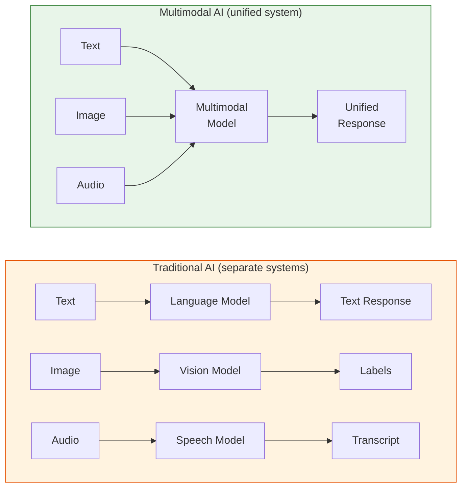

# Multimodal Prompting

!!! mascot-welcome "Time to See the Bigger Picture!"
    
    Let's craft the perfect prompt! Up until now, we've been communicating with AI using text alone. But the world isn't just words — it's photographs, charts, videos, audio recordings, and messy PDF documents from 2007 that someone *really* should have reformatted by now. In this chapter, you'll learn how to prompt AI systems that can see, hear, and read just like you do.

## Beyond Text: Why Multimodal Matters

For most of AI's history, language models could only process text. You typed words in, and you got words back. If you wanted an AI to analyze an image, you needed a completely separate computer vision system. If you wanted it to understand audio, you needed a different speech recognition system. Each modality — text, images, audio, video — lived in its own isolated world.

That era is over. **Multimodal AI** refers to artificial intelligence systems that can process and generate multiple types of data — text, images, audio, video, and documents — within a single unified model. Modern multimodal models like GPT-4o, Claude, and Gemini can look at a photograph and describe what they see, read a chart and explain its trends, or listen to audio and provide a transcript. They combine capabilities that used to require an entire team of specialized systems.

Why does this matter for prompt engineering? Because the way you prompt a multimodal system is fundamentally different from prompting a text-only model. When you attach an image to your prompt, you're not just adding decoration — you're providing an entirely new source of information that the model must interpret, analyze, and integrate with your text instructions. The skill of writing effective multimodal prompts is quickly becoming one of the most valuable capabilities in the prompt engineer's toolkit.

<!-- ASCII art original:
Traditional AI (separate systems):

  Text ──→ [Language Model] ──→ Text Response
  Image ──→ [Vision Model] ──→ Labels
  Audio ──→ [Speech Model] ──→ Transcript

Multimodal AI (unified system):

  Text  ─┐
  Image ─┼──→ [Multimodal Model] ──→ Unified Response
  Audio ─┘
-->



And here's the practical reality: most real-world information isn't pure text. Business reports have charts. Instruction manuals have diagrams. Social media posts have images. Medical records have scans. If your prompt engineering skills only work with text, you're leaving enormous value on the table.

## Image Prompting Fundamentals

**Image prompting** is the practice of including images alongside text instructions to guide a multimodal AI system's analysis and response. This is the most common form of multimodal interaction, and it's where most people start their multimodal journey.

The basic pattern is straightforward: you attach an image and write a text prompt that tells the model what you want it to do with that image. But the *quality* of your text prompt dramatically affects the quality of the response. A vague prompt like "What's this?" produces a vague answer. A specific prompt like "Identify all safety hazards visible in this construction site photograph and categorize them by severity" produces actionable analysis.

Here are the key principles for effective image prompting:

- **Be specific about what you want.** Don't just ask "describe this image." Tell the model what aspects matter: composition, colors, objects, text, emotions, spatial relationships, or technical details.
- **Provide context when helpful.** If the image shows a medical scan, mention the type of scan and what you're looking for. If it's a product photo, explain the intended use case for the description.
- **Set the output format.** Just as with text-only prompts, specify whether you want a paragraph, bullet points, JSON, or a structured analysis.
- **Ask focused questions.** Multiple specific questions produce better results than one broad request.

```
Weak Image Prompt:
"Describe this image."

Strong Image Prompt:
"This photograph shows the lobby of our new office building. Please provide:
1. A description of the architectural style
2. An assessment of the lighting quality for video calls
3. Any accessibility concerns you notice
4. Suggestions for wayfinding signage placement"
```

!!! mascot-thinking "Think About What You're Really Asking"
    
    Words matter — let's get them right! When you send an image to a multimodal AI, the model doesn't "see" the image the way you do. It processes the image through a vision encoder that converts pixels into numerical representations. The text prompt you write determines *what* the model pays attention to in those representations. A good prompt is like pointing a flashlight in a dark room — it directs the model's attention exactly where it needs to go.

## Image Description and Visual Question Answering

Two of the most fundamental multimodal tasks are **image description** and **visual question answering**, and understanding the difference between them will make you a more effective prompt engineer.

**Image description** is the task of generating a textual account of an image's content, composition, and visual characteristics. When you ask a model to "describe this image," you're requesting an image description. The model examines the visual content and produces text that captures what it sees — objects, people, settings, actions, colors, and spatial relationships.

**Visual question answering** (VQA) goes a step further. Instead of asking for a general description, you ask specific questions about the image's content. "How many people are sitting at the table?" "What color is the car in the background?" "Does this room appear to meet fire code requirements?" VQA is more targeted and typically more useful for practical applications.

| Task | Prompt Style | Best For |
|---|---|---|
| Image Description | "Describe what you see in this image" | Cataloging, accessibility, content moderation |
| Visual Question Answering | "Answer these specific questions about the image" | Analysis, inspection, research, fact-checking |
| Comparative Analysis | "Compare these two images and identify differences" | Quality control, before/after documentation |
| Spatial Reasoning | "Describe the layout and spatial relationships" | Architecture, interior design, navigation |

Here's a practical tip that surprises many beginners: when you need both a description and answers to specific questions, it's often better to make *two separate requests* rather than combining them. The model produces more thorough descriptions when focused solely on describing, and more accurate answers when focused solely on answering questions. This is the multimodal equivalent of the "one task per prompt" principle you learned in Chapter 4.

## Document Analysis and PDF Processing

Not all images are photographs. Some of the most valuable multimodal use cases involve **document analysis** — using AI to extract, interpret, and summarize information from document images, scanned pages, and complex layouts that combine text, tables, and figures.

**Document analysis** is the process of using multimodal AI to extract structured information from images of documents, including scanned pages, photographed papers, forms, receipts, and similar materials. The model reads the text in the image, understands the layout, and interprets the relationships between different elements.

**PDF processing** extends this concept to handle PDF files, which may contain a mix of machine-readable text, embedded images, tables, charts, and complex formatting. Modern multimodal models can process PDF pages as images, extracting information that traditional text extraction tools often miss — especially from scanned documents, forms with handwriting, or pages with complex multi-column layouts.

```
Document Analysis Prompt Example:

"This is a scanned insurance claim form. Please:
1. Extract all filled-in fields and their values
2. Identify any fields that appear to be blank or illegible
3. Note any handwritten annotations
4. Flag any dates that seem inconsistent
5. Return the results as a JSON object with field names as keys"
```

The power of multimodal document analysis becomes clear when you consider how much information lives trapped in "unstructured" formats. Every organization has filing cabinets (physical or digital) full of scanned documents, photographed whiteboards, legacy PDFs, and faxed forms. Multimodal AI can unlock that information without expensive specialized OCR software or manual data entry.

<details markdown="1">
<summary>Expand to see the Document Processing Pipeline diagram specification.</summary>

#### Diagram: Document Processing Pipeline

This diagram illustrates how different document types flow through a multimodal AI processing pipeline.

**Type:** Flowchart (left to right)

**Nodes:**

- **Input Sources** (left column, 4 boxes):
    - Scanned Paper Documents
    - Digital PDFs
    - Photographed Whiteboards
    - Screenshots

- **Processing Stage** (center column):
    - Multimodal AI Model (large central box)
    - Text prompt with extraction instructions (attached note)

- **Output Types** (right column, 4 boxes):
    - Structured Data (JSON/CSV)
    - Summary Reports
    - Extracted Tables
    - Searchable Text

**Connections:** Each input source connects to the central AI model. The AI model connects to each output type. A bidirectional arrow between the text prompt note and the AI model indicates the prompt guides processing.

**Color scheme:** Blue for input sources, orange for the AI processing stage, green for output types.

</details>

However, document analysis has important limitations to keep in mind. Models may struggle with very small text, unusual fonts, poor scan quality, or documents in languages they weren't heavily trained on. Always verify critical extracted information — especially numbers, dates, and proper nouns — against the original document. (An AI reading your tax form is helpful. An AI reading your tax form *incorrectly* is an audit waiting to happen.)

## Code Interpretation

**Code interpretation** is the use of multimodal AI to analyze, explain, or debug code that appears in images — such as screenshots of code editors, photographs of textbook examples, or images of error messages. This capability sits at the intersection of vision and programming knowledge.

You might wonder why anyone would send an *image* of code instead of copying and pasting the text. In practice, it happens constantly. A student photographs a textbook exercise. A developer screenshots an error that appears in a complex IDE layout. A colleague shares a screenshot of a code review comment thread. A legacy system displays code in a format that resists text selection.

Effective code interpretation prompts should specify:

- The programming language (if it's not obvious from the image)
- What kind of analysis you want (explanation, debugging, optimization, translation)
- The skill level of the intended audience for the explanation
- Whether you want the model to reproduce the code as text (extremely useful for working with screenshot-sourced code)

```
Code Interpretation Prompt:

"This screenshot shows a Python function from a data science
tutorial. Please:
1. Transcribe the code exactly as shown
2. Explain what each section does in plain language
3. Identify any bugs or potential issues
4. Suggest improvements for readability"
```

## Chart Reading and Diagram Understanding

Two related but distinct skills round out the visual analysis toolkit: **chart reading** and **diagram understanding**. Both involve interpreting visual representations of information, but they require different prompting strategies.

**Chart reading** is the ability of a multimodal AI to interpret data visualizations — bar charts, line graphs, pie charts, scatter plots, and similar figures — and extract the data, trends, and insights they represent. When you send a chart to a multimodal model, it can identify axes, read labels, estimate values, detect trends, and even compare data series.

**Diagram understanding** is the ability to interpret non-data visual representations such as flowcharts, network diagrams, architecture diagrams, circuit schematics, and organizational charts. Diagrams convey relationships, processes, and structures rather than numerical data.

| Visual Type | What to Ask For | Example Prompt Fragment |
|---|---|---|
| Bar chart | Values, comparisons, rankings | "What are the top 3 categories by value?" |
| Line graph | Trends, inflection points, projections | "Describe the trend from Q1 to Q4" |
| Pie chart | Proportions, dominant segments | "What percentage does each segment represent?" |
| Flowchart | Process steps, decision points, paths | "Trace the path for a rejected application" |
| Network diagram | Connections, central nodes, clusters | "Which node has the most connections?" |
| Architecture diagram | Components, data flows, dependencies | "List all external service dependencies" |

For chart reading, one of the most useful techniques is asking the model to *extract the underlying data*. Rather than just describing what the chart shows, ask the model to reconstruct the data table. This gives you numbers you can verify, work with in spreadsheets, or use to create your own visualizations.

```
Chart Reading Prompt:

"This bar chart shows quarterly revenue for five product lines.
Please:
1. Extract the approximate values for each bar into a table
2. Identify the highest and lowest performing products
3. Calculate the percentage change from Q1 to Q4 for each product
4. Note any trends or anomalies worth investigating"
```

!!! mascot-tip "A Chart Is Worth a Thousand Numbers"
    
    Use your words! When asking AI to read charts, always mention the chart type in your prompt. Saying "this bar chart shows..." gives the model a head start on interpretation. Also, if you can see axis labels or a legend in the image, mention them — the model sometimes misreads small text, and your hint can prevent errors.

## Screenshot Analysis

**Screenshot analysis** is the use of multimodal AI to interpret, evaluate, or extract information from screenshots of software interfaces, websites, dashboards, and digital applications. This is one of the most immediately practical multimodal skills because screenshots are the universal language of tech support, bug reports, and design feedback.

Think about how much time you spend describing software problems in words. "There's a button in the upper right corner that seems to overlap with the dropdown menu when I resize the window, and also the text below the search bar is cut off." Now imagine attaching a screenshot and saying: "Identify all UI issues visible in this screenshot." The model can see exactly what you see and respond with precision.

Common screenshot analysis use cases include:

- **Bug reporting**: "Identify all visual bugs or UI inconsistencies in this screenshot"
- **Design review**: "Evaluate this landing page design for visual hierarchy and readability"
- **Accessibility audit**: "Check this interface for potential accessibility issues"
- **Competitive analysis**: "Compare these two dashboard screenshots and list the differences in layout and features"
- **Documentation**: "Generate step-by-step instructions based on this sequence of screenshots"

The key to effective screenshot analysis is providing context about what the screenshot shows and what you're looking for. A screenshot of a mobile app's settings page looks very different to someone troubleshooting a bug versus someone conducting a design review. Your prompt should make your intent clear.

## Audio Transcription and Video Understanding

Multimodal AI is not limited to text and images. Increasingly, models can process **audio** and **video** content as well, though these capabilities are at different stages of maturity.

**Audio transcription** is the conversion of spoken language in audio files into written text, potentially with speaker identification, timestamps, and annotation of non-speech sounds. While dedicated transcription services have existed for years, multimodal AI models can now transcribe audio *and* analyze the content simultaneously — summarizing meetings, extracting action items, identifying sentiment, and answering questions about what was said.

**Video understanding** takes this further by combining visual and audio analysis over time. A multimodal model processing video can track objects and people across frames, understand actions and events, read on-screen text, and integrate the audio track — producing a rich understanding of the video's content.

```
Audio Transcription Prompt:

"Please transcribe this meeting recording and provide:
1. A full transcript with speaker labels (Speaker 1, Speaker 2, etc.)
2. A bullet-point summary of key decisions made
3. A list of action items with the responsible person
4. Any deadlines mentioned"
```

```
Video Understanding Prompt:

"This is a 3-minute product demo video. Please:
1. Describe the key features demonstrated, in order
2. Note any UI elements or screens shown
3. Transcribe any narration or on-screen text
4. Identify moments where the demo could be improved"
```

It's worth noting that audio and video capabilities vary significantly across models and change rapidly. Some models handle audio natively, while others require the audio to be transcribed first by a separate service. Some can process video directly, while others work with individual frames extracted from the video. Always check the current capabilities of your specific model before building workflows that depend on audio or video processing.

<details markdown="1">
<summary>Expand to see the Multimodal Capability Maturity diagram specification.</summary>

#### Diagram: Multimodal Capability Maturity Levels

This diagram shows the relative maturity of different multimodal capabilities in current AI systems.

**Type:** Horizontal stacked bar chart or maturity matrix

**Rows (modalities):**

- Text Analysis: Mature (full bar, dark green)
- Image Description: Mature (full bar, dark green)
- Document/PDF Analysis: Advanced (90% bar, light green)
- Chart and Diagram Reading: Advanced (85% bar, light green)
- Screenshot Analysis: Advanced (85% bar, light green)
- Code Interpretation from Images: Intermediate (75% bar, yellow)
- Audio Transcription: Intermediate (70% bar, yellow)
- Image Generation: Intermediate (70% bar, yellow)
- Video Understanding: Early (50% bar, orange)
- Real-time Audio Conversation: Early (45% bar, orange)

**Labels:** Each bar labeled with the maturity level (Mature, Advanced, Intermediate, Early). A note at the bottom: "Capabilities as of early 2026 — this landscape changes rapidly."

**Color scheme:** Dark green for Mature, light green for Advanced, yellow for Intermediate, orange for Early.

</details>

## Image Generation Prompts

So far, we've focused on using AI to *understand* visual content. But multimodal AI also works in the other direction: generating images from text descriptions. **Image generation prompts** are text instructions that direct an AI model to create a visual image — a photograph, illustration, diagram, or any other visual output.

Writing effective image generation prompts is its own art form. The field has developed a rich vocabulary for controlling image output, and understanding this vocabulary gives you much more control over results.

Key elements of an effective image generation prompt include:

- **Subject**: What is in the image? ("a golden retriever puppy," "a futuristic city skyline")
- **Style**: What artistic style? ("photorealistic," "watercolor painting," "flat vector illustration," "pencil sketch")
- **Composition**: How is the scene arranged? ("close-up portrait," "wide-angle landscape," "bird's eye view")
- **Lighting**: What mood does the lighting create? ("soft golden hour light," "dramatic chiaroscuro," "bright studio lighting")
- **Color palette**: What colors dominate? ("warm earth tones," "cool blues and grays," "vibrant neon")
- **Details and modifiers**: What additional qualities matter? ("highly detailed," "minimalist," "vintage 1970s aesthetic")

```
Weak Image Generation Prompt:
"A cat sitting in a garden."

Strong Image Generation Prompt:
"A fluffy orange tabby cat sitting on a weathered stone bench
in an English cottage garden. Soft afternoon sunlight filters
through climbing roses. Watercolor painting style with visible
brush strokes. Warm palette of greens, soft pinks, and golden
yellows. The cat looks directly at the viewer with calm,
content expression."
```

A word of caution: image generation models can produce impressive results, but they also have well-documented biases and limitations. They may default to certain demographics, reinforce stereotypes, or struggle with specific subjects (ask any AI to draw hands and you'll see what I mean). Thoughtful prompt engineering can mitigate some of these issues, but awareness of the limitations is essential.

## Alt Text Generation: Accessibility as a Superpower

One of the most socially valuable applications of multimodal AI is **alt text generation**. Alt text (alternative text) is a written description of an image that makes visual content accessible to people who use screen readers, have slow internet connections, or otherwise cannot see the image. Every image on the web should have alt text, but the vast majority don't — or have alt text so generic it's useless ("image.jpg" is not helpful to anyone).

Multimodal AI can generate high-quality alt text at scale, which is a genuine accessibility breakthrough. But generating *good* alt text requires specific prompting techniques because alt text has its own conventions and best practices.

Effective alt text should be:

- **Concise**: Usually 125 characters or fewer for simple images
- **Descriptive**: Convey the essential information the image communicates
- **Contextual**: Reflect the image's purpose in its specific context
- **Non-redundant**: Don't repeat information already in the surrounding text

```
Alt Text Generation Prompt:

"Generate alt text for this image. The image appears on a
cooking blog in a recipe for chocolate lava cake. The alt text
should:
- Be under 125 characters
- Focus on the food and presentation
- Not include 'image of' or 'photo of' (screen readers
  already announce it as an image)
- Describe what's most relevant to someone following the recipe"
```

!!! mascot-encourage "Accessibility Is Everyone's Job"
    
    Here's something worth celebrating: every time you use AI to generate good alt text, you're making the internet more accessible for millions of people. That's not just good prompt engineering — that's using technology to make the world genuinely better. Great prompt engineering really can be your superpower!

## Data Visualization Prompts

The final piece of the multimodal puzzle brings us full circle: using prompts to *create* visual representations of data. A **data visualization prompt** is a text instruction that directs an AI to generate charts, graphs, plots, or other visual representations of data.

This capability connects several skills you've already learned. You need clear instructions (Chapter 2), structured output specifications (Chapter 6), and often data provided as context (Chapter 7 or Chapter 8). The multimodal element is the visual output — instead of getting text back, you get a chart.

Effective data visualization prompts specify:

- **The data**: Provide the actual numbers, a table, or a reference to a dataset
- **The chart type**: Bar chart, line graph, scatter plot, heatmap, etc.
- **The visual design**: Colors, labels, title, legend placement
- **The story**: What insight should the visualization communicate?

```
Data Visualization Prompt:

"Create a horizontal bar chart showing the following survey
results for 'Preferred AI Use Cases':

Content Writing: 67%
Data Analysis: 54%
Code Generation: 48%
Research: 45%
Customer Service: 38%
Image Creation: 31%

Use a professional blue color palette. Title: 'Most Popular
AI Use Cases (2026 Survey)'. Add percentage labels at the end
of each bar. Sort from highest to lowest."
```

Some models generate visualizations as images, while others generate code (Python with matplotlib or plotly, JavaScript with D3, etc.) that you then run to produce the visualization. Either approach benefits from detailed prompting. The more specific you are about the desired output, the less time you spend iterating.

## Putting It All Together: A Multimodal Workflow

Let's walk through a realistic scenario that combines multiple multimodal skills. Imagine you're a market analyst preparing a quarterly report. Here's how multimodal prompting fits into your workflow:

1. **PDF Processing**: Upload the competitor's 40-page quarterly earnings PDF. Prompt: "Extract all financial metrics from this report and organize them into a comparison table."

2. **Chart Reading**: The PDF contains revenue trend charts. Prompt: "Extract the approximate quarterly revenue data from this chart for the past 8 quarters."

3. **Screenshot Analysis**: Capture screenshots of the competitor's updated product page. Prompt: "Compare this screenshot with last quarter's version and identify all changes to pricing, features, and messaging."

4. **Data Visualization**: Use the extracted data to create your own charts. Prompt: "Create a line chart comparing our revenue growth vs. competitor growth over the past 8 quarters."

5. **Image Generation**: Create a professional header graphic for your report. Prompt: "Generate a clean, corporate-style header image for a quarterly competitive analysis report. Modern, minimalist design with blue and gray tones."

6. **Alt Text Generation**: Ensure your report is accessible. Prompt: "Generate alt text for each chart and figure in this report."

This workflow would have required multiple specialized tools and significant manual effort just a few years ago. With multimodal prompting, a single analyst can accomplish all of it through well-crafted natural language instructions.

| Workflow Step | Multimodal Skill | Time Saved |
|---|---|---|
| PDF data extraction | Document Analysis | Hours of manual reading |
| Chart data extraction | Chart Reading | Tedious manual estimation |
| Competitive UI comparison | Screenshot Analysis | Side-by-side squinting |
| Visualization creation | Data Visualization Prompts | Design tool wrestling |
| Report graphics | Image Generation | Stock photo hunting |
| Accessibility compliance | Alt Text Generation | Description writing for every figure |

## Best Practices and Common Pitfalls

After covering the individual multimodal skills, let's consolidate the wisdom into actionable best practices.

**Best practice 1: Always provide context.** When uploading an image, tell the model what it's looking at and why. "This is an X-ray of a patient's left knee, taken after a fall" is infinitely better than just uploading an image with no explanation.

**Best practice 2: Specify the output format.** Multimodal responses can be verbose. If you want a structured analysis, say so. If you want a brief summary, say so. The model doesn't know your preferred format unless you tell it.

**Best practice 3: Verify critical information.** Multimodal models can misread text in images, miscount objects, misidentify people, and confuse spatial relationships. For any high-stakes application, treat the model's output as a first draft that requires human verification.

**Best practice 4: Use high-quality inputs.** A blurry photograph, a low-resolution screenshot, or a poorly scanned document will produce lower quality results. When possible, provide the highest quality visual input available.

**Best practice 5: Break complex tasks into steps.** Rather than asking the model to analyze a 50-page PDF in one go, process it page by page or section by section. This produces more thorough and accurate results.

!!! mascot-warning "Not Everything That Looks Right Is Right"
    
    Here's a trap that catches even experienced users: multimodal AI models can be *confidently wrong* about visual content. A model might read "128" when the chart says "138," or describe a green object as blue. The fluency of the response makes errors easy to miss. Always verify numbers, names, and critical details against the original visual source. Trust, but verify — especially when numbers are involved.

**Common pitfalls to avoid:**

- **Sending images without text prompts.** Attaching an image with no instructions forces the model to guess what you want. Always include explicit directions.
- **Expecting pixel-perfect accuracy.** Models estimate values from charts; they don't read them with the precision of data extraction software.
- **Ignoring image resolution.** Tiny text in a large image may be unreadable. Crop or zoom to the relevant section.
- **Overlooking privacy.** Images may contain personal information, faces, license plates, or other sensitive data. Be mindful of what you upload to AI services.
- **Assuming all models are equal.** Multimodal capabilities vary dramatically across models and versions. Test your specific use case with your specific model.

!!! mascot-celebration "You Can See the Future — and It's Multimodal!"
    
    Use your words — and your images, charts, documents, and videos! You've now mastered the art of communicating with AI beyond text. These multimodal skills open up use cases that were simply impossible just a couple of years ago. Whether you're making the web more accessible, extracting data from legacy documents, or creating stunning visualizations, you've got the prompting skills to make it happen. Onward!

## Key Takeaways

- **Multimodal AI processes multiple data types in one model.** Modern systems handle text, images, audio, video, and documents together — eliminating the need for separate specialized tools for each modality.
- **Image prompts need specific instructions.** Attaching an image without clear text directions produces vague results. Always tell the model what to analyze, what format to use, and what level of detail you need.
- **Visual question answering outperforms generic description.** Asking targeted questions about an image produces more useful responses than requesting a general description, especially for practical applications.
- **Document and PDF analysis unlocks trapped information.** Multimodal models can extract structured data from scanned documents, forms, and complex layouts that resist traditional text extraction.
- **Chart reading requires verification.** Models estimate data values from visualizations — they don't extract exact numbers. Always verify critical figures against source data.
- **Screenshot analysis accelerates software workflows.** Bug reporting, design review, and competitive analysis all benefit enormously from AI-powered screenshot interpretation.
- **Alt text generation is an accessibility superpower.** Using AI to generate descriptive alt text at scale makes visual content accessible to millions of people who rely on screen readers.
- **Image generation prompts benefit from rich vocabulary.** Specifying subject, style, composition, lighting, and color palette gives you much more control over generated images.

## Concepts

1. Multimodal AI
2. Image Prompting
3. Image Description
4. Visual Question Answering
5. Document Analysis
6. PDF Processing
7. Code Interpretation
8. Chart Reading
9. Diagram Understanding
10. Screenshot Analysis
11. Audio Transcription
12. Video Understanding
13. Image Generation Prompts
14. Alt Text Generation
15. Data Visualization Prompt

## Prerequisites

- [Chapter 1: AI and Machine Learning Foundations](../01-ai-ml-foundations/index.md)
- [Chapter 2: Prompt Fundamentals](../02-prompt-fundamentals/index.md)
- [Chapter 3: Prompt Types and Model Parameters](../03-prompt-types-parameters/index.md)
- [Chapter 4: Core Prompt Techniques](../04-core-prompt-techniques/index.md)
- [Chapter 5: Advanced Prompt Techniques](../05-advanced-prompt-techniques/index.md)
- [Chapter 6: Output Format Control](../06-output-format-control/index.md)
- [Chapter 7: Context, Memory, and Information Management](../07-context-memory-management/index.md)
