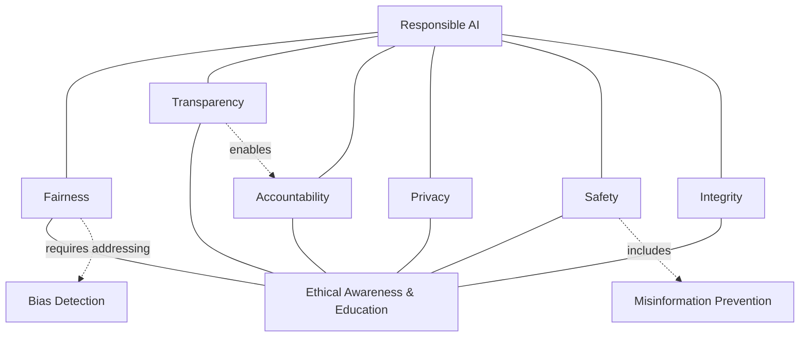
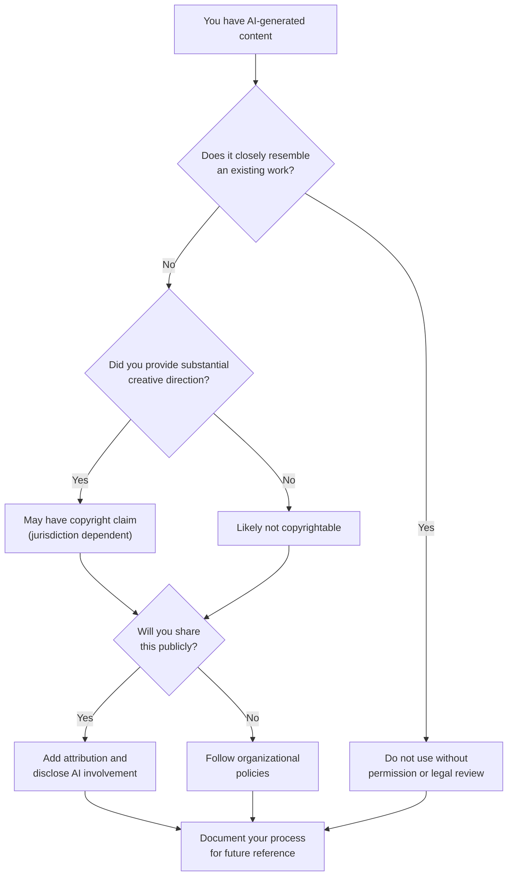

# Ethics and Responsible AI

!!! mascot-welcome "Welcome, Fellow Prompt Crafters!"
    
    Words matter — let's get them right! And in this chapter, that phrase takes on a whole new weight. The words we use in prompts, the outputs we share, and the decisions we make with AI all carry ethical consequences. Let's explore how to be responsible prompt engineers — because with great prompting power comes great responsibility.

## Why Ethics Matters in Prompt Engineering

If you've been following this course, you already know how powerful large language models can be. You can generate essays, write code, analyze data, create images, and summarize complex documents in seconds. That power is exciting. It's also a reason to pause and think carefully.

**AI Ethics** is the branch of applied ethics that examines moral questions raised by the development, deployment, and use of artificial intelligence systems. It covers everything from how training data is collected to how AI-generated content affects real people's lives. For prompt engineers, ethical awareness isn't optional — it's a core professional skill.

Consider this: a single poorly crafted prompt can generate biased hiring recommendations, produce misleading medical advice, or create convincing fake images of real people. None of these outcomes require malicious intent. They can happen through carelessness, ignorance, or simply not thinking through the consequences.

That's why this chapter exists. We're going to build a practical ethical framework you can apply every time you sit down to write a prompt.

## The Ethical Landscape: A Framework for Responsible AI

Before we dive into specific topics, it helps to see how the major ethical concepts relate to one another. Think of responsible AI as a building with several interconnected pillars. Each pillar supports the others, and if one is weak, the whole structure is at risk.

Show/Hide Diagram

#### Diagram: Pillars of Responsible AI

This diagram should be rendered as a Mermaid block diagram or conceptual architecture. At the top sits "Responsible AI" as the roof. Below it, six pillars stand side by side on a shared foundation:

- **Pillar 1: Fairness** — Ensuring equitable treatment across groups
- **Pillar 2: Transparency** — Making AI processes understandable
- **Pillar 3: Accountability** — Assigning responsibility for outcomes
- **Pillar 4: Privacy** — Protecting personal information
- **Pillar 5: Safety** — Preventing harm from AI outputs
- **Pillar 6: Integrity** — Honest use without deception

The foundation is labeled "Ethical Awareness and Education." Arrows connect the pillars to show interdependence — for example, transparency enables accountability, and fairness depends on addressing bias.

## Bias in AI: The Invisible Problem

**Bias in AI** refers to systematic errors in AI outputs that produce unfair or prejudiced results for particular groups of people. Bias doesn't always look like overt discrimination. Often, it's subtle — baked into the training data in ways that reflect the historical inequalities of the real world.

Here are the most common sources of bias in AI systems:

- **Training data bias** — If the data used to train a model over-represents certain demographics, viewpoints, or cultures, the model's outputs will reflect those imbalances. A model trained mostly on English-language internet text will have a Western-centric worldview.
- **Selection bias** — The choices about what data to include or exclude shape the model's understanding. If medical training data primarily includes studies conducted on men, the model may give less accurate health information for women.
- **Measurement bias** — The way information is categorized and labeled in training data can embed biased assumptions. Job performance ratings influenced by a manager's prejudice become "ground truth" for an AI learning what "good performance" looks like.
- **Confirmation bias in prompting** — Even you, the prompt engineer, can introduce bias by framing prompts in ways that steer the model toward confirming existing beliefs.

| Type of Bias | Where It Originates | Example |
|---|---|---|
| Training data bias | Data collection | Model associates "nurse" with female pronouns |
| Selection bias | Data curation | Underrepresentation of non-English medical literature |
| Measurement bias | Labeling process | Biased performance reviews used as training targets |
| Confirmation bias | Prompt design | "Why is technology X better?" assumes X is better |

!!! mascot-thinking "Key Insight"
    
    Here's a brain-teaser for you: an AI model can be biased even when nobody involved intended it. Bias can sneak in through the data, and nobody notices until the model is out in the world making decisions. That's why we test, audit, and question AI outputs — especially when those outputs affect people's lives.

## Fairness: More Than Just "Treating Everyone the Same"

**Fairness** in AI means ensuring that AI systems do not create or reinforce unjust outcomes for individuals or groups. It sounds simple, but defining fairness turns out to be surprisingly tricky.

Computer scientists have identified multiple mathematical definitions of fairness, and here's the kicker — some of them are mutually exclusive. You literally cannot satisfy all fairness criteria simultaneously in some situations. That's not a reason to give up. It's a reason to think carefully about which fairness criteria matter most for your specific use case.

As a prompt engineer, you can promote fairness by:

- Testing prompts with diverse scenarios and personas
- Asking the model to consider multiple perspectives explicitly
- Reviewing outputs for patterns of differential treatment
- Specifying inclusive language requirements in your prompts
- Using counter-examples to check whether the model's reasoning holds up across different groups

For example, if you're building a prompt to help draft job descriptions, test it by asking for descriptions in multiple fields. Check whether the language skews masculine or feminine. Ask the model to flag potentially exclusionary terms. These small steps compound into meaningfully fairer outcomes.

## Transparency and Explainability: Opening the Black Box

**Transparency** means being open and honest about how AI systems work, what data they were trained on, and what their limitations are. **Explainability** is the related concept of making AI decisions understandable to humans — being able to answer the question "Why did the AI say that?"

These two concepts matter enormously for trust. If someone receives a loan denial based partly on AI analysis, they deserve to understand why. If a student gets feedback from an AI tutor, the teacher should be able to verify the reasoning.

Large language models present a special transparency challenge. Unlike a simple decision tree where you can trace each branching point, an LLM with billions of parameters doesn't produce easily traceable reasoning. The model doesn't "know" why it said what it said — it generated the most probable next tokens based on patterns in its training data.

What can prompt engineers do about this? Quite a lot, actually:

- **Request reasoning chains** — Use chain-of-thought prompting (from Chapter 4) to make the model show its work
- **Ask for confidence levels** — Prompt the model to indicate how certain it is about its answers
- **Demand source attribution** — Ask the model to cite where its information comes from
- **Disclose AI involvement** — When sharing AI-generated content, be upfront that AI was involved in creating it

Being transparent isn't just ethically good — it's practically useful. When you can see the model's reasoning, you can spot errors faster and improve your prompts more effectively.

## Accountability: Who Is Responsible?

**Accountability** means establishing clear responsibility for AI-generated outcomes. When an AI system produces harmful content, who bears responsibility — the company that built the model, the developer who integrated it, the prompt engineer who crafted the instructions, or the user who deployed the output?

The honest answer is that accountability in AI is shared across many parties, and the legal and regulatory frameworks are still catching up. But here's what we know for certain: *you* are accountable for the prompts you write and the outputs you choose to use.

Consider this accountability chain:

- **Model developers** are responsible for training choices, safety guardrails, and known limitations
- **Platform operators** are responsible for usage policies and monitoring
- **Prompt engineers** are responsible for crafting prompts that promote helpful, honest, and harmless outputs
- **End users** are responsible for how they apply and distribute AI-generated content

As a prompt engineer, your accountability includes verifying outputs before sharing them, refusing to craft prompts designed to cause harm, and flagging problems when you discover them. "The AI did it" is never a complete defense — you pressed the button.

!!! mascot-warning "Important Warning"
    
    Never assume that because an AI model generated something, the content must be acceptable to use. You are the human in the loop. You are the quality check. Always review AI outputs critically, especially when they could affect other people's lives, livelihoods, or reputations.

## Privacy Considerations: Protecting What's Personal

**Privacy considerations** in AI encompass the protection of personal, sensitive, and confidential information throughout the AI interaction lifecycle. This means thinking about privacy before, during, and after your prompts.

Here's what many people don't realize: when you type information into an AI system, that information may be used to train future versions of the model (depending on the platform's policies). Pasting a colleague's private email into a chatbot to help you draft a response might mean that email content becomes part of the model's training data.

Key privacy principles for prompt engineers include:

- **Data minimization** — Share only the information the model needs to complete the task. Don't paste entire databases when a summary will do.
- **Anonymization** — Remove or replace personally identifiable information (PII) before including real data in prompts. Swap real names for placeholders. Replace actual addresses with fictional ones.
- **Awareness of retention policies** — Understand whether the platform stores your conversations and for how long. Enterprise AI deployments often have different data handling than free consumer tools.
- **Sensitivity classification** — Before prompting, ask yourself: "If this prompt and response were made public, would anyone be harmed?" If the answer is yes, reconsider your approach.

| Privacy Risk | Scenario | Mitigation |
|---|---|---|
| PII exposure | Pasting customer data into a prompt | Anonymize or use synthetic data |
| Confidential leakage | Sharing proprietary business strategies | Use enterprise AI tools with data protections |
| Third-party data | Including someone else's private communication | Get consent or remove identifying details |
| Aggregation risk | Combining multiple data points that reveal identity | Limit the granularity of information shared |

## Consent and Data Use: Asking Permission

**Consent and data use** concerns whether individuals have knowingly agreed to have their information used in AI systems. This concept extends beyond just privacy — it gets to the fundamental question of whether people had a meaningful choice in how their data is being used.

Most large language models were trained on vast amounts of internet text. The authors of that text — bloggers, journalists, forum participants, researchers — largely did not consent to their words being used to train AI. This raises profound ethical questions that the technology industry, legal systems, and society are still wrestling with.

As a prompt engineer, you can't fix the consent issues in how models were trained. But you *can* make ethical choices about consent in your own work:

- Get explicit permission before using someone's data, writing, or likeness in prompts
- Inform people when AI will be involved in processing their information
- Respect opt-out requests — if someone doesn't want their content used with AI tools, honor that
- Be especially careful with data from vulnerable populations (children, patients, students)

## Intellectual Property and Copyright Considerations

**Intellectual property** (IP) refers to creations of the mind — inventions, literary and artistic works, designs, and symbols — that are protected by law. **Copyright considerations** in the AI context involve determining who owns AI-generated content and whether AI outputs might infringe on existing copyrighted works.

These questions are genuinely unsettled. Courts around the world are actively ruling on cases that will shape the legal landscape for years to come. Here's what we know as of today:

- **AI-generated content ownership** — In most jurisdictions, copyright requires a human author. Purely AI-generated content with no meaningful human creative input may not be copyrightable. However, content where a human made substantial creative choices through prompt engineering may qualify for protection.
- **Training data copyright** — Multiple lawsuits are challenging whether training AI on copyrighted material constitutes fair use. The outcomes will significantly affect how future models are built.
- **Output similarity** — AI models can sometimes produce outputs that closely resemble specific copyrighted works from their training data. Using such outputs could expose you to copyright infringement claims.

**Attribution** is the practice of giving proper credit to the sources, creators, and tools that contributed to a work. Even when attribution isn't legally required, it's ethically good practice and professionally expected.

Practical guidelines for prompt engineers:

- Don't claim AI-generated content as entirely your own original work without disclosure
- When AI helps you create content, acknowledge that assistance appropriately
- If an AI output closely resembles an existing work, don't use it without checking
- Understand your organization's policies on AI-generated intellectual property
- When in doubt, add attribution — it costs nothing and builds trust

Show/Hide Diagram

#### Diagram: The Intellectual Property Decision Tree

This diagram should be rendered as a Mermaid flowchart showing a decision process for handling AI-generated content and IP concerns. The flow goes:

1. **Start**: "You have AI-generated content"
2. **Decision 1**: "Does the content closely resemble a specific existing work?" — If Yes, go to "Do not use without permission or legal review." If No, continue.
3. **Decision 2**: "Did you provide substantial creative direction via prompts?" — If Yes, go to "May have copyright claim (jurisdiction dependent)." If No, go to "Likely not copyrightable."
4. **Decision 3**: "Will you share this content publicly?" — If Yes, go to "Add attribution and disclose AI involvement." If No, go to "Follow organizational policies."
5. **End**: All paths converge on "Document your process for future reference."

!!! mascot-tip "Pro Tip"
    
    Use your words! When you use AI to help create something, keep a log of your prompts, the model's outputs, and your edits. This "prompt provenance" documentation can protect you if questions arise about authorship, and it helps you refine your techniques over time. Think of it as a lab notebook for prompt engineering.

## Misinformation Risk: When AI Gets It Wrong

**Misinformation risk** refers to the danger that AI systems will generate false, misleading, or unverifiable information that is then treated as fact. This is one of the most pressing ethical concerns in AI today.

Large language models are pattern-matching engines, not truth engines. They generate text that *sounds* plausible based on statistical patterns in their training data. They don't fact-check themselves. They don't consult databases of verified information (unless connected to RAG systems, as you learned in Chapter 8). They can state completely false things with perfect confidence and impeccable grammar.

Common misinformation scenarios include:

- **Hallucinations** — The model invents facts, citations, statistics, or quotes that don't exist. It might cite a paper by a real author with a plausible-sounding title that was never written.
- **Outdated information** — Models have training cutoff dates and may present obsolete information as current.
- **Confident errors** — The model states incorrect information with the same confident tone as correct information, making errors hard to detect.
- **Plausible but false narratives** — The model can weave together real and invented details into a coherent-sounding story that's partially or entirely wrong.

Prompt engineers have a responsibility to mitigate misinformation risk. Your strategies should include:

- Always verify factual claims in AI outputs through independent sources
- Use RAG (Retrieval-Augmented Generation) to ground responses in verified information
- Include instructions in prompts like "If you're unsure, say so" or "Only include information you can cite"
- Be especially cautious with AI outputs related to health, law, finance, and safety
- Never distribute AI-generated content as verified fact without checking it first

## Deepfake Awareness: Seeing Isn't Believing

**Deepfake awareness** is the understanding that AI can create highly convincing synthetic media — including fake images, videos, and audio — that can be nearly impossible to distinguish from authentic content. As you learned in Chapter 9 on multimodal prompting, modern AI systems can generate and manipulate images, audio, and video with remarkable fidelity.

Deepfakes present serious ethical challenges:

- **Impersonation** — AI can generate realistic video or audio of real people saying things they never said
- **Evidence fabrication** — Fake images or documents can be used to manufacture false evidence
- **Erosion of trust** — As deepfakes proliferate, people begin to distrust *all* media, including authentic content
- **Emotional manipulation** — Fake content can be designed to provoke outrage, fear, or other strong emotional responses

As a prompt engineer, your responsibilities around deepfakes include:

- Never creating synthetic media intended to deceive people about real events or real individuals
- Clearly labeling AI-generated images, audio, or video as synthetic
- Understanding the capabilities and limitations of multimodal AI tools
- Being a critical consumer of media — questioning the provenance of striking or inflammatory content
- Educating others about the existence and capabilities of deepfake technology

| Deepfake Type | Technology | Risk Level | Detection Difficulty |
|---|---|---|---|
| Face swap video | GAN-based generation | High | Moderate to difficult |
| Voice cloning | Text-to-speech synthesis | High | Difficult |
| AI-generated images | Diffusion models | Medium to High | Increasingly difficult |
| Text impersonation | Large language models | Medium | Very difficult |

## Building Your Personal Ethical Framework

Now that we've covered the major ethical concepts, let's bring it all together into a practical framework you can use in your daily work. Ethics isn't about memorizing rules — it's about developing the habit of thinking critically about consequences before you act.

Ask yourself these five questions before writing any high-stakes prompt:

1. **Who could be affected?** Think beyond the immediate user. Consider third parties, communities, and future users.
2. **Could this cause harm?** Imagine the worst-case scenario for your output. If it's serious, add safeguards.
3. **Am I being transparent?** Would you be comfortable if your prompts and the resulting outputs were made public?
4. **Have I checked for bias?** Test your prompts across different scenarios, names, demographics, and perspectives.
5. **Am I respecting others' rights?** Consider privacy, consent, intellectual property, and attribution.

!!! mascot-celebration "Great Progress!"
    
    Time to talk to AI — responsibly! You now have a solid ethical toolkit for prompt engineering. Remember, being an ethical prompt engineer doesn't mean avoiding AI. It means using AI thoughtfully, questioning outputs, respecting others, and continuously learning as the technology and its ethical implications evolve. That's something to celebrate.

## Key Takeaways

- **AI ethics** is a core skill for prompt engineers, not an optional add-on. Every prompt carries ethical implications.
- **Bias in AI** can enter through training data, data curation, labeling, and even through how you frame your prompts. Testing across diverse scenarios helps catch it.
- **Fairness** requires active effort and careful thinking about which fairness criteria matter for your specific use case.
- **Transparency and explainability** build trust. Use chain-of-thought prompting, request confidence levels, and always disclose AI involvement.
- **Accountability** is shared, but you are personally responsible for the prompts you write and the outputs you choose to use.
- **Privacy** demands data minimization, anonymization, and awareness of platform data policies before including sensitive information in prompts.
- **Consent** means respecting people's choices about how their data and content are used with AI systems.
- **Intellectual property and copyright** in AI are evolving legal areas. Document your creative process, attribute AI assistance, and avoid using outputs that closely resemble existing works.
- **Misinformation risk** is inherent in language models. Always verify factual claims independently before sharing AI-generated content.
- **Deepfake awareness** means understanding that AI-generated media can be convincingly fake, and taking responsibility to label synthetic content and consume media critically.

---

## Concepts

1. AI Ethics
2. Bias in AI
3. Fairness
4. Transparency
5. Explainability
6. Accountability
7. Privacy Considerations
8. Consent and Data Use
9. Intellectual Property
10. Copyright Considerations
11. Attribution
12. Misinformation Risk
13. Deepfake Awareness

## Prerequisites

- [Chapter 1: AI and Machine Learning Foundations](../01-ai-ml-foundations/index.md)
- [Chapter 8: Retrieval-Augmented Generation](../08-retrieval-augmented-generation/index.md)
- [Chapter 9: Multimodal Prompting](../09-multimodal-prompting/index.md)
