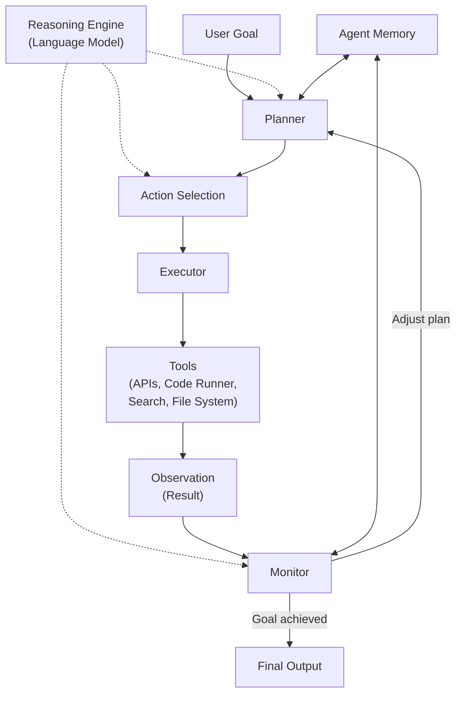
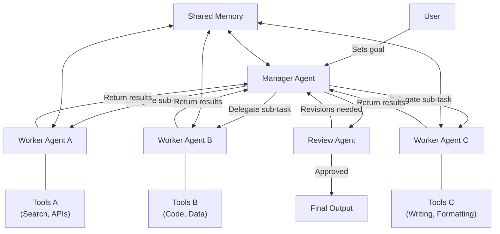

# Agentic AI

!!! mascot-welcome "Welcome, Fellow Prompt Crafters!"
    
    Let's craft the perfect prompt! Actually, in this chapter, we are going to craft prompts that craft *other* prompts, use tools, make plans, and even check their own work. Welcome to the world of agentic AI — where language models stop waiting for instructions and start *doing things*. Grab a seat and hold onto your feathers. This one is going to be a ride.

## From Chatbot to Agent

In the previous chapters, you learned how to write prompts that get great answers from language models. You ask a question, you get a response. You refine your prompt, you get a better response. That pattern — human asks, model answers — has been the foundation of everything so far. But what if the model could do more than just answer?

An **AI agent** is a software system that uses a language model as its reasoning engine to autonomously plan, decide, and take actions to achieve a goal. Instead of simply responding to a single prompt, an agent receives a high-level objective, breaks it into steps, selects tools to accomplish each step, executes them, evaluates the results, and adjusts its plan as needed. The human sets the destination; the agent figures out how to get there.

This is a fundamental shift. A chatbot is like a reference librarian — you ask questions and get helpful answers. An AI agent is more like a research assistant — you describe what you need, and it goes off to gather data, write drafts, check facts, and come back with a finished product. The difference is autonomy.

| Capability | Chatbot | AI Agent |
|---|---|---|
| Interaction style | Question and answer | Goal-driven, autonomous |
| Number of steps | Single turn or multi-turn conversation | Many steps, often dozens |
| Tool use | None (text only) | Can call APIs, run code, search the web |
| Planning | None | Decomposes goals into sub-tasks |
| Self-correction | Only if human asks for revision | Monitors results and adjusts automatically |
| Human involvement | Every step | Sets the goal, reviews the outcome |

Why does this matter for prompt engineering? Because the prompts that drive agents are fundamentally different from the prompts you write in a chat window. Agent prompts define *roles*, *capabilities*, *constraints*, and *decision-making frameworks*. Writing them well is one of the most valuable skills in AI today.

## Agent Architecture: The Blueprint

An **agent architecture** is the structural design that defines how an AI agent's components — its language model brain, its tools, its memory, and its control logic — are organized and interact with each other. Just as a building needs an architectural plan before construction begins, an agent needs a clear architecture before it can function reliably.

The simplest agent architecture follows a loop: the model receives a goal, generates a plan, executes one step, observes the result, and then decides what to do next. This is sometimes called the "reason-act-observe" loop, or ReAct for short. More sophisticated architectures add layers of planning, memory management, error handling, and safety checks.

!!! mascot-thinking "Key Insight"
    
    Here is a thought worth perching on: the language model inside an agent is not the whole agent. It is the *brain* of the agent, but the agent also includes tools, memory systems, safety guardrails, and orchestration logic. Thinking of the model as the entire agent is like thinking the CPU is the entire computer. The architecture around the model is what turns raw intelligence into reliable action.

Most agent architectures include these core components:

- **Reasoning engine** — The language model that interprets goals, makes decisions, and generates plans
- **Tool interface** — The mechanism that allows the agent to interact with external systems
- **Memory system** — Storage for conversation history, task state, and learned information
- **Planner** — Logic that decomposes high-level goals into executable steps
- **Executor** — The component that carries out individual actions
- **Monitor** — Logic that evaluates results and decides whether to continue, retry, or escalate

Show/Hide Diagram

#### Diagram: Core Agent Architecture

This diagram should be rendered as a Mermaid flowchart showing the fundamental components of an AI agent and how they interact in a loop.

**Structure:**
A "User Goal" node feeds into a "Planner" node. The Planner connects to an "Action Selection" node. Action Selection connects to an "Executor" node. The Executor connects to "Tools" (with sub-labels: APIs, Code Runner, Search, File System). Tools connect to an "Observation" node representing the result. Observation connects to a "Monitor" node. The Monitor has two paths: one loops back to the Planner (labeled "Adjust plan") and one goes to "Final Output" (labeled "Goal achieved"). An "Agent Memory" node sits to the side, connected bidirectionally to both the Planner and the Monitor. A "Reasoning Engine (LLM)" node sits at the top, connected to Planner, Action Selection, and Monitor to show it powers all three.

## Tool Use and Function Calling

An agent that can only generate text is like a carpenter who can only describe furniture. To be truly useful, agents need hands — they need the ability to interact with the world. This is where **tool use** comes in.

**Tool use** is the ability of an AI agent to invoke external tools — such as search engines, calculators, code interpreters, databases, or APIs — to accomplish tasks that go beyond text generation. When an agent needs current weather data, it calls a weather API. When it needs to solve a complex equation, it calls a calculator. When it needs to create a chart, it runs code in a sandbox.

**Function calling** is the specific technical mechanism by which a language model requests the execution of a predefined function. The model generates a structured output (typically JSON) that specifies which function to call and what arguments to pass. The system executes the function and returns the result to the model for further processing.

Here is what function calling looks like in practice:

1. The developer defines available functions with names, descriptions, and parameter schemas
2. The user gives the agent a task (e.g., "What is the weather in Minneapolis?")
3. The language model decides it needs the `get_weather` function and outputs: `{"function": "get_weather", "arguments": {"city": "Minneapolis"}}`
4. The system executes the function and gets: `{"temperature": 72, "condition": "sunny"}`
5. The model receives the result and incorporates it into its response: "It is currently 72 degrees and sunny in Minneapolis."

The key insight is that the model never actually runs the function itself. It *requests* that the function be run, and the surrounding system handles the execution. This separation is critical for security — it means you can control exactly which functions the agent can access and add safety checks before any function is executed.

Common categories of tools include:

- **Information retrieval** — Web search, database queries, document lookup
- **Computation** — Calculators, code execution, data analysis
- **Communication** — Sending emails, posting messages, creating tickets
- **File operations** — Reading, writing, and editing files
- **System control** — Managing configurations, deploying code, running tests

## Planning and Goal Decomposition

Give a human the task "organize a company retreat for 50 people" and they instinctively break it down: find a venue, set a date, plan activities, arrange catering, send invitations. AI agents need to do the same thing, and the quality of their planning directly determines the quality of their results.

**Planning** is the process by which an AI agent analyzes a high-level goal and creates a structured sequence of steps to achieve it. Good planning considers dependencies (you need a venue before you can send directions), resource constraints (budget limits, time limits), and potential obstacles (what if the first-choice venue is booked?).

**Goal decomposition** is the specific technique of breaking a large, complex goal into smaller, manageable sub-goals. Each sub-goal should be concrete enough that the agent can accomplish it with available tools in a reasonable number of steps.

Effective goal decomposition follows these principles:

- **Completeness** — The sub-goals, taken together, should fully achieve the original goal
- **Independence** — Where possible, sub-goals should be independent so they can be executed in parallel
- **Measurability** — Each sub-goal should have clear success criteria so the agent knows when it is done
- **Feasibility** — Each sub-goal should be achievable with the agent's available tools and capabilities

After decomposition comes **action selection** — the process by which an agent chooses which specific action to take next from among the available options. At each step, the agent considers the current state of the task, the remaining sub-goals, and the tools available, then selects the action most likely to make progress. This is where the language model's reasoning ability shines, weighing trade-offs and making judgment calls just as a human would.

!!! mascot-tip "Pro Tip"
    
    Use your words — specifically, tell your agent *how* to plan! Including planning instructions in your agent's system prompt dramatically improves performance. For example: "Before taking any action, write out your plan as a numbered list. After each step, evaluate whether the plan needs adjustment." Explicit planning prompts turn implicit reasoning into visible, debuggable strategy.

## The Feedback Loop: Monitor, Evaluate, Correct

The difference between a simple script and an intelligent agent is what happens when things go wrong. A script follows its instructions blindly. An agent notices problems and adapts.

**Execution monitoring** is the process by which an agent observes the results of its actions and evaluates whether they are moving toward the goal. After every tool call or action, the agent examines the output: Did the API return valid data? Did the code run without errors? Does the result make sense in context?

A **feedback loop** is the cyclical process of acting, observing results, evaluating performance, and adjusting future actions based on what was learned. This loop is what makes agents capable of handling real-world complexity, where unexpected situations are the norm rather than the exception.

**Self-correction** is the agent's ability to detect its own errors and take corrective action without human intervention. If a database query returns no results, the agent might reformulate the query. If generated code fails to compile, the agent reads the error message and fixes the bug. If a plan step turns out to be unnecessary, the agent skips it and moves on.

This ability to self-correct is one of the most powerful aspects of agentic AI. Consider this example of **multi-step reasoning** — the capacity to chain together multiple logical steps, maintaining coherence across a sequence of thoughts and actions that build on each other:

1. Agent receives goal: "Find the three most-cited papers on transformer architectures published in 2024"
2. Agent searches an academic database — gets 200 results
3. Agent sorts by citation count — notices the top result is from 2023, not 2024
4. Agent self-corrects: refines the date filter and re-queries
5. Agent gets clean results, extracts the top three, and summarizes each one
6. Agent verifies that all three are indeed from 2024 and about transformers
7. Agent presents the final answer with citations

Without self-correction, the agent would have returned incorrect results at step 3. The feedback loop caught the error and fixed it automatically. This is the essence of reliable agentic behavior.

## Autonomous Workflows and Task Automation

An **autonomous workflow** is a sequence of tasks that an AI agent executes from start to finish with minimal or no human intervention. Once initiated, the agent manages the entire process — making decisions, handling exceptions, and delivering results.

**Task automation** is the use of AI agents to perform repetitive or complex tasks that would otherwise require human effort. While traditional automation (scripts, macros, RPA bots) follows rigid rules, agent-based automation can handle variability, ambiguity, and novel situations because the language model provides flexible reasoning.

Here are examples of autonomous workflows that agents can handle today:

- **Code review automation** — An agent reads a pull request, checks for bugs, style violations, and security issues, writes review comments, and suggests fixes
- **Research synthesis** — An agent searches multiple databases, reads papers, extracts key findings, identifies contradictions, and writes a summary report
- **Data pipeline management** — An agent monitors data quality, detects anomalies, diagnoses root causes, and applies corrections
- **Customer support triage** — An agent reads incoming tickets, categorizes them, gathers relevant context, drafts responses, and routes complex issues to humans

The boundary between what agents can and should automate is constantly expanding. The general rule: automate tasks that are repetitive, well-defined, and low-risk first. (Telling an agent to "redesign the entire product strategy" on day one is how you end up in a LinkedIn cautionary tale.)

## Agent Orchestration and Workflow Design

When agents get complex, you need a conductor. **Agent orchestration** is the coordination and management of one or more AI agents as they execute tasks, ensuring proper sequencing, resource allocation, error handling, and communication between components.

**Workflow design** is the process of defining the structure, sequence, and decision points of an automated process before building it. Good workflow design is like good architecture — it makes the complex feel simple and the fragile feel robust.

**Pipeline construction** is the practice of assembling a series of processing stages — where the output of one stage becomes the input of the next — into a coherent automated pipeline. Pipelines are the backbone of most production agent systems.

A well-designed agent pipeline might look like this:

| Stage | Purpose | Tools Used |
|---|---|---|
| 1. Input Processing | Parse and validate the user's request | Text parser, schema validator |
| 2. Planning | Decompose the goal into sub-tasks | Language model reasoning |
| 3. Information Gathering | Collect necessary data | Search APIs, databases, file readers |
| 4. Processing | Transform and analyze the data | Code interpreter, calculators |
| 5. Quality Check | Verify results meet requirements | Validation rules, second model review |
| 6. Output Generation | Format and present results | Template engine, document generator |
| 7. Logging | Record the full execution trace | Logging system, audit trail |

!!! mascot-thinking "Key Insight"
    
    Words matter — let's get them right! When designing agent workflows, resist the temptation to build one giant, do-everything agent. Instead, design specialized agents for specific tasks and orchestrate them together. A focused agent that does one thing well is far more reliable than a generalist agent that tries to do everything. This is the same principle that makes microservices more robust than monolithic applications.

## Skills and Skill Libraries

A **skill** is a reusable, well-defined capability that an agent can invoke to accomplish a specific type of task. Skills encapsulate both the knowledge of *how* to do something and the tools needed to do it. Think of a skill as a recipe — it includes the ingredients (tools), the steps (logic), and the expected result (output format).

Examples of agent skills include:

- **Web research** — Search the web, evaluate source credibility, extract key information, and synthesize findings
- **Code generation** — Write code in a specified language, test it, and iterate until tests pass
- **Data analysis** — Load a dataset, compute statistics, generate visualizations, and write interpretive summaries
- **Document drafting** — Create structured documents with proper formatting, citations, and consistent style
- **Meeting scheduling** — Check calendars, find available times, propose options, and send invitations

A **skill library** is a curated collection of skills that an agent can draw from when deciding how to accomplish a task. The skill library defines what the agent *can* do, just as a toolbox defines what a carpenter *can* build. A larger, better-organized skill library makes the agent more capable and more flexible.

Well-designed skill libraries share these characteristics:

- **Discoverability** — Skills have clear names and descriptions so the agent can find the right one
- **Composability** — Skills can be combined to handle complex tasks (e.g., "web research" + "document drafting" = "write a research report")
- **Versioning** — Skills can be updated without breaking existing workflows
- **Testing** — Each skill has test cases that verify it works correctly

## Agent Memory and Context

How does an agent remember what it has done, what it has learned, and what it is supposed to be doing? This is the domain of **agent memory** and **agent context**, two concepts that are essential for agents that handle complex, long-running tasks.

**Agent memory** is the system that stores and retrieves information across an agent's actions and sessions. Agent memory typically operates at multiple levels:

- **Working memory** — The current context window contents: the active plan, recent tool results, and immediate task state. This is analogous to a human's short-term memory.
- **Episodic memory** — Records of past actions and their outcomes, allowing the agent to learn from experience. "Last time I searched this database with broad terms, I got too many results. I should use specific filters."
- **Semantic memory** — Long-term knowledge the agent has accumulated, such as user preferences, domain-specific facts, or organizational conventions.

**Agent context** is the complete set of information available to an agent at any given moment — including the current goal, the plan, the conversation history, tool results, and relevant memory. Managing context well is critical because language models have finite context windows. A 200-step task generates far more information than any model can hold at once, so the agent architecture must decide what to keep, what to summarize, and what to discard.

Effective context management strategies include:

- **Summarization** — Periodically compressing long histories into concise summaries
- **Relevance filtering** — Only loading memories and context that are relevant to the current step
- **External storage** — Offloading detailed records to databases and retrieving them on demand
- **Hierarchical context** — Maintaining a high-level summary of the overall task alongside detailed information about the current sub-task

## Human-in-the-Loop and Approval Workflows

Not everything should be automated. Some decisions are too important, too sensitive, or too ambiguous for an agent to make alone. This is where **human-in-the-loop** design comes in.

**Human-in-the-loop** (HITL) is a design pattern where an AI agent pauses at critical decision points to request human review, approval, or guidance before proceeding. The human is literally "in the loop" — part of the agent's execution cycle.

An **approval workflow** is a structured process that requires explicit human authorization before an agent takes certain high-impact actions. Approval workflows define which actions need approval, who can grant it, and what happens if approval is denied.

Actions that typically require human approval include:

- Sending communications (emails, messages, social media posts)
- Making financial transactions (purchases, payments, transfers)
- Modifying production systems (deploying code, changing configurations)
- Deleting or overwriting data
- Sharing confidential information
- Making commitments on behalf of the organization

The key design question is: where in the workflow do you place the human? Too early, and the agent cannot accomplish anything without constant hand-holding. Too late, and the agent might take irreversible actions before the human can intervene. The sweet spot is usually at the boundary between planning and execution — let the agent plan freely, but require approval before executing high-impact steps.

!!! mascot-warning "Important Warning"
    
    Time to talk to AI — but make sure you stay in the loop! Never deploy an agent with unrestricted authority in a production environment. Even the most capable agents can misinterpret goals, hallucinate facts, or take unexpected actions. Human-in-the-loop is not a sign that your agent is not good enough. It is a sign that your design is mature enough to account for real-world risk.

## Sandboxed Execution: Safety First

**Sandboxed execution** is the practice of running an AI agent's actions within a restricted, isolated environment that limits what the agent can access and affect. A sandbox is like a playpen for code — the agent can do whatever it wants inside the sandbox, but it cannot reach anything outside of it.

Sandboxing is essential for agent safety because agents that can run code, call APIs, and modify files have the potential to cause real damage. A coding agent that runs user-supplied code without a sandbox could delete files, exfiltrate data, or consume unlimited computing resources. A web-browsing agent without restrictions could visit malicious sites or inadvertently trigger harmful actions.

Effective sandboxing strategies include:

- **Container isolation** — Running agent code inside Docker containers or virtual machines with limited permissions
- **Network restrictions** — Controlling which external services the agent can communicate with
- **File system boundaries** — Restricting which directories the agent can read from and write to
- **Resource limits** — Capping CPU, memory, and disk usage to prevent runaway processes
- **Time limits** — Automatically terminating actions that run longer than expected
- **Permission scoping** — Giving the agent only the minimum permissions needed for its task (principle of least privilege)

## Agent Collaboration and Multi-Agent Systems

Some tasks are too complex or too broad for a single agent. Just as human organizations divide labor across teams, AI systems can divide work across multiple specialized agents.

**Agent collaboration** is the ability of multiple AI agents to work together on a shared task, dividing responsibilities, sharing information, and coordinating their actions. Collaboration can take many forms — agents might work sequentially (one finishes, the next begins), in parallel (multiple agents work simultaneously on different sub-tasks), or in a hierarchical structure (a manager agent delegates to worker agents).

**Multi-agent systems** are architectures in which two or more AI agents interact to accomplish goals that would be difficult or impossible for a single agent. Each agent in the system has its own specialization, tools, and area of responsibility.

Common multi-agent patterns include:

- **Manager-worker** — One agent plans and delegates; worker agents execute specific tasks and report back
- **Pipeline** — Agents are arranged in sequence, each one processing and passing along its output
- **Debate** — Two agents argue opposing perspectives, and a third agent synthesizes the best answer
- **Review** — One agent produces work, another agent critiques it, and the first agent revises based on feedback
- **Ensemble** — Multiple agents independently solve the same problem, and their answers are combined (majority vote, best-of-N, etc.)

Here is a concrete example of a multi-agent research system:

| Agent | Role | Tools |
|---|---|---|
| Research Manager | Decomposes research question, delegates sub-questions, synthesizes final report | Planning tools, communication with other agents |
| Literature Agent | Searches academic databases, retrieves and summarizes papers | Search APIs, PDF reader, citation manager |
| Data Agent | Finds and analyzes relevant datasets | Database connectors, code interpreter, statistics tools |
| Writing Agent | Drafts sections of the report based on gathered findings | Document templates, grammar checker, formatting tools |
| Review Agent | Critiques drafts for accuracy, coherence, and completeness | Fact-checking tools, style guide reference |

Show/Hide Diagram

#### Diagram: Multi-Agent System Architecture

This diagram should be rendered as a Mermaid flowchart showing a manager-worker multi-agent pattern with a feedback review cycle.

**Structure:**
A "User" node sends a goal to a "Manager Agent" node. The Manager Agent connects to three "Worker Agent" nodes (labeled Worker Agent A, Worker Agent B, Worker Agent C) with arrows labeled "Delegate sub-task." Each Worker Agent has its own "Tools" node attached. All three Worker Agents send their results back to the Manager Agent (arrows labeled "Return results"). The Manager Agent then sends the combined output to a "Review Agent" node. The Review Agent has two paths: one labeled "Approved" goes to "Final Output" and one labeled "Revisions needed" loops back to the Manager Agent. A "Shared Memory" node sits at the bottom, connected to the Manager Agent and all Worker Agents.

## Agent Safety: The Non-Negotiable Foundation

All the capabilities we have discussed in this chapter — tool use, autonomous workflows, multi-agent collaboration — are powerful. And with great power comes... well, you know the rest. **Agent safety** is the comprehensive set of practices, constraints, and design principles that ensure AI agents operate reliably, predictably, and without causing harm.

Agent safety is not a feature you bolt on at the end. It is a design principle you embed from the beginning. The most common safety failures happen not because agents are malicious but because they are *too eager to help*. An agent asked to "clean up the test database" might interpret that as "delete everything." An agent told to "reduce costs" might cancel essential services. Agents do what you tell them — the problem is that what you *tell* them and what you *mean* often differ.

Core agent safety principles include:

- **Least privilege** — Give agents only the minimum permissions needed for their task. A research agent does not need write access to production databases.
- **Reversibility** — Prefer reversible actions over irreversible ones. An agent should create a draft email, not send it immediately.
- **Transparency** — Agents should log every action they take and every decision they make, creating an audit trail that humans can review.
- **Graceful degradation** — When something goes wrong, agents should fail safely — pause, alert a human, and preserve the current state rather than plowing forward.
- **Scope limitation** — Clearly define the boundaries of what an agent can and cannot do. Ambiguous scope leads to unexpected behavior.
- **Testing and monitoring** — Continuously test agent behavior in safe environments before deploying to production, and monitor production agents for anomalies.

!!! mascot-encourage "You Can Do This!"
    
    Agentic AI can feel overwhelming — there are a lot of moving parts! But remember, you do not need to build a multi-agent research system on day one. Start with a simple agent that uses one or two tools, add a feedback loop, test it thoroughly, and grow from there. Every expert agent builder started by making a bot that could call a single API. You have already learned the hardest part: how to write clear, effective prompts. Everything else is architecture.

## The Prompt Engineer's Role in the Agentic Era

Here is something that might surprise you: as AI systems become more autonomous, prompt engineering becomes *more* important, not less. Why? Because in the agentic era, prompts are not just questions — they are *instructions for autonomous behavior*. The system prompt for an agent defines its personality, its capabilities, its constraints, its decision-making framework, and its safety boundaries. Getting those prompts wrong does not just produce a bad answer — it produces a bad *agent* that takes bad *actions*.

The skills you have built throughout this course — clear communication, structured thinking, context management, output formatting — are exactly the skills you need to design effective agents. You know how to write role assignments (Chapter 4). You know how to manage context windows (Chapter 7). You know how to think about security (Chapter 11). Agent design is the synthesis of everything you have learned, applied to a system that acts on its own.

The future of work with AI is not "humans vs. agents." It is humans and agents working together, each contributing what they do best. Humans provide judgment, values, creativity, and accountability. Agents provide speed, consistency, tirelessness, and the ability to juggle a hundred tasks at once. Great prompt engineering is the bridge between the two.

!!! mascot-celebration "Outstanding Progress!"
    
    Let's craft the perfect prompt — for your first agent! You now understand how AI agents plan, reason, act, and learn from their results. You know about tool use, function calling, skill libraries, multi-agent systems, and the critical safety principles that keep everything on track. You are not just writing prompts anymore — you are designing autonomous systems. And that, fellow prompt crafters, is a superpower worth squawking about.

## Key Takeaways

- An **AI agent** uses a language model as its reasoning engine to autonomously plan, decide, and act toward a goal, going far beyond simple question-and-answer interactions.
- **Agent architecture** defines how the reasoning engine, tools, memory, planner, executor, and monitor work together in a structured loop.
- **Tool use** gives agents the ability to interact with the world through APIs, code interpreters, search engines, and file systems, while **function calling** is the structured mechanism models use to request tool execution.
- **Planning** and **goal decomposition** allow agents to break complex objectives into manageable sub-tasks with clear success criteria.
- **Action selection** is the decision process where an agent chooses its next step based on current state, remaining goals, and available tools.
- **Execution monitoring**, **feedback loops**, and **self-correction** enable agents to detect errors and adapt their approach without human intervention.
- **Multi-step reasoning** allows agents to chain logical steps together while maintaining coherence across extended task sequences.
- **Autonomous workflows** and **task automation** apply agent capabilities to real-world processes, from code review to research synthesis.
- **Agent orchestration**, **workflow design**, and **pipeline construction** are the disciplines of coordinating complex agent systems with proper sequencing and error handling.
- **Skills** are reusable agent capabilities, and **skill libraries** are curated collections that define what an agent can do.
- **Agent memory** (working, episodic, semantic) and **agent context** management are essential for agents handling long-running, complex tasks.
- **Human-in-the-loop** design and **approval workflows** ensure that high-impact decisions receive human review before execution.
- **Sandboxed execution** isolates agent actions in restricted environments to prevent unintended damage.
- **Agent collaboration** and **multi-agent systems** divide complex work across specialized agents using patterns like manager-worker, pipeline, debate, and review.
- **Agent safety** is a foundational design principle encompassing least privilege, reversibility, transparency, graceful degradation, scope limitation, and continuous monitoring.

---

## Concepts

1. AI Agent
2. Agent Architecture
3. Tool Use
4. Function Calling
5. Planning
6. Goal Decomposition
7. Action Selection
8. Execution Monitoring
9. Feedback Loop
10. Self-Correction
11. Autonomous Workflow
12. Multi-Step Reasoning
13. Agent Orchestration
14. Skill
15. Skill Library
16. Agent Memory
17. Agent Context
18. Human-in-the-Loop
19. Approval Workflow
20. Sandboxed Execution
21. Task Automation
22. Workflow Design
23. Pipeline Construction
24. Agent Collaboration
25. Multi-Agent Systems
26. Agent Safety

## Prerequisites

- [Chapter 1: AI and Machine Learning Foundations](../01-ai-ml-foundations/index.md)
- [Chapter 2: Prompt Fundamentals](../02-prompt-fundamentals/index.md)
- [Chapter 3: Prompt Types and Model Parameters](../03-prompt-types-parameters/index.md)
