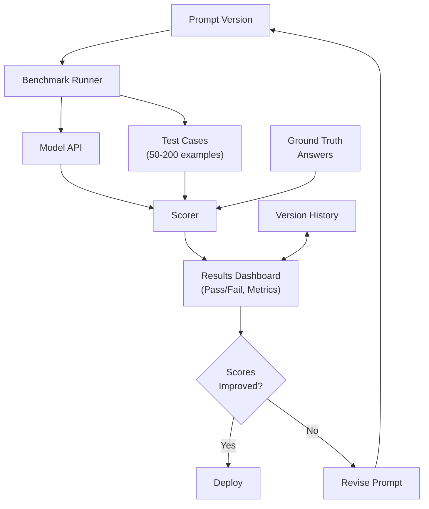
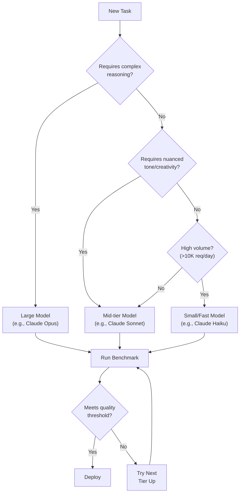

# Evaluation and Optimization

!!! mascot-welcome "Welcome, Fellow Prompt Crafters!"
    
    Words matter — let's get them right! And in this chapter, we are going to find out exactly *how right* our words are. Welcome to the science of evaluation and optimization — where we stop guessing whether our prompts are good and start *measuring* it. Polly has her clipboard ready. Let's go!

## Why Evaluation Matters

You have spent the previous chapters learning to write effective prompts, build multi-step chains, and even design autonomous agents. But here is a question that separates hobbyists from professionals: *How do you know your prompts actually work well?*

"It seemed pretty good" is not a measurement strategy. In any engineering discipline, if you cannot measure it, you cannot improve it. Prompt engineering is no different. A prompt that works beautifully for one example might fail spectacularly on the next ten. A chatbot that seems helpful in casual testing might produce embarrassing errors when real users interact with it. An agent that completes tasks in your demo might stall, loop, or hallucinate in production.

**Prompt evaluation** is the systematic process of measuring the quality, accuracy, consistency, and usefulness of outputs generated by a language model in response to specific prompts. It is the bridge between "I think this works" and "I have evidence this works." Without evaluation, you are flying blind — and in a field where a single poorly worded prompt can produce confidently wrong answers, flying blind is not an option.

| What You Think | What Evaluation Reveals |
|---|---|
| "My prompt gives great answers" | It gives great answers 73% of the time; 27% have factual errors |
| "Version B is better" | Version A actually scores higher on clarity and accuracy metrics |
| "The agent handles errors fine" | The agent recovers from 4 of 7 common error types but crashes on the other 3 |
| "This model is the best choice" | A cheaper model produces equivalent quality at 40% of the cost |

The good news? Evaluation does not have to be complicated. You can start with simple side-by-side comparisons and build up to automated testing pipelines as your needs grow. The key is to start measuring *something* — because any measurement is better than none.

## Prompt Evaluation: The Foundation

**Prompt evaluation** is the practice of systematically assessing how well a prompt performs across a range of inputs, using defined criteria and repeatable methods. Think of it like quality control in a factory. You would not ship a product without testing it, and you should not deploy a prompt without evaluating it.

The simplest form of prompt evaluation is to run your prompt against a set of test inputs and examine the outputs. Did the model follow the instructions? Was the output accurate? Was it formatted correctly? Was the tone appropriate? These questions seem obvious, but you would be surprised how many people skip this step entirely and wonder why their AI application produces inconsistent results.

A good evaluation process has three components:

- **Test inputs** — A diverse set of representative inputs that cover normal cases, edge cases, and adversarial cases
- **Expected outputs** — Clear definitions of what a correct or acceptable response looks like
- **Scoring criteria** — Specific dimensions along which you will judge the outputs

!!! mascot-thinking "Key Insight"
    
    Here is something to think about: you cannot evaluate a prompt with a single test case. That is like taste-testing one cookie and declaring the entire batch perfect. You need variety in your test inputs — typical cases, tricky cases, cases that are designed to break things. The more diverse your test set, the more confident you can be in your results.

## Evaluation Metrics: What to Measure

**Evaluation metrics** are specific, quantifiable dimensions used to score and compare the quality of language model outputs. Choosing the right metrics is critical because what you measure determines what you optimize. Measure the wrong thing, and you will improve the wrong thing.

Common evaluation metrics for prompt outputs include:

- **Accuracy** — Does the output contain factually correct information?
- **Relevance** — Does the output address what was actually asked?
- **Completeness** — Does the output cover all required aspects of the task?
- **Consistency** — Does the prompt produce similar quality results across multiple runs?
- **Formatting compliance** — Does the output match the requested structure and format?
- **Tone and style** — Does the output match the desired voice and reading level?
- **Latency** — How long does the model take to generate the response?
- **Token usage** — How many tokens does the prompt and response consume?

Not every metric matters for every use case. A creative writing prompt might prioritize tone and style, while a data extraction prompt might prioritize accuracy and formatting compliance. The art is in selecting the metrics that align with your specific goals.

Here is a practical scoring rubric for a customer service chatbot prompt:

| Metric | Score 1 (Poor) | Score 3 (Acceptable) | Score 5 (Excellent) |
|---|---|---|---|
| Accuracy | Contains factual errors | Mostly correct, minor gaps | Fully accurate, well-sourced |
| Tone | Robotic or rude | Professional but generic | Warm, helpful, brand-aligned |
| Completeness | Misses key information | Addresses main question | Addresses question plus anticipates follow-ups |
| Formatting | Wall of text | Basic structure | Clear headings, bullet points, easy to scan |

## A/B Testing Prompts

**A/B testing prompts** is the practice of comparing two or more prompt variations against the same set of inputs to determine which version produces better results according to defined metrics. This is the single most practical evaluation technique you can learn, and it works whether you are a solo developer or part of a large team.

The process is straightforward:

1. Write two versions of your prompt (Prompt A and Prompt B)
2. Run both prompts against the same set of test inputs
3. Score the outputs using your evaluation metrics
4. Compare the scores to determine which prompt performs better
5. Keep the winner, iterate, and test again

Here is an example. Suppose you are building a prompt that summarizes news articles. You might test these two variations:

**Prompt A:** "Summarize the following article in 3 bullet points."

**Prompt B:** "You are a news editor. Summarize the following article in exactly 3 bullet points. Each bullet should be one sentence. Focus on the most newsworthy facts."

You run both against 20 test articles, score each output for accuracy, completeness, and formatting compliance, and discover that Prompt B scores 4.2 out of 5 on average while Prompt A scores 3.1. Prompt B wins — and you have data to prove it.

The key insight is that small changes in prompt wording can produce surprisingly large differences in output quality. Adding a role ("You are a news editor"), adding constraints ("exactly 3 bullet points, one sentence each"), and adding focus instructions ("most newsworthy facts") each contributes to better performance. But you would never know *how much* each change helps without testing.

| A/B Testing Step | What to Do | Common Mistake |
|---|---|---|
| Create variations | Change one element at a time | Changing too many things at once |
| Select test inputs | Use 15-30 diverse examples | Using only 2-3 easy examples |
| Define metrics | Pick 3-5 specific, measurable dimensions | Using vague criteria like "better" |
| Score outputs | Use a consistent rubric | Scoring based on gut feeling |
| Analyze results | Calculate averages and look at variance | Declaring a winner based on one test case |

## Human Evaluation vs. Automated Evaluation

There are two fundamental approaches to scoring outputs, and understanding when to use each one is essential.

**Human evaluation** is the process of having people read and score language model outputs against defined criteria. Humans are excellent at judging nuance, tone, creativity, helpfulness, and cultural appropriateness — all things that are difficult to quantify with automated tools. When you need to know whether an output "feels right" or whether it would actually help a real user, human evaluation is the gold standard.

However, human evaluation is slow, expensive, and inconsistent. Different evaluators may score the same output differently, and even the same evaluator may score differently depending on fatigue, mood, or the time of day. (Before you laugh, this is a well-documented problem in research. It turns out that humans are not as objective as we like to think — who knew?)

**Automated evaluation** uses algorithms, scoring functions, or even other language models to assess outputs programmatically. Automated methods are fast, consistent, and scalable. You can evaluate thousands of outputs in minutes rather than days. Common automated approaches include:

- **String matching** — Checking whether the output contains required keywords or phrases
- **Regex validation** — Verifying that the output matches a specific pattern or format
- **Semantic similarity** — Using embeddings to measure how close the output is to a reference answer
- **LLM-as-judge** — Using a language model to score another model's output against a rubric

The LLM-as-judge approach deserves special attention because it is rapidly becoming the most popular automated evaluation method. You give a language model a rubric, the original prompt, and the output to evaluate, and ask it to score the output. Research shows that LLM judges correlate surprisingly well with human evaluators — typically 80-90% agreement on well-defined rubrics.

!!! mascot-tip "Pro Tip"
    
    Use your words — specifically, use *both* evaluation methods! Start with human evaluation to develop your rubric and calibrate your expectations. Then build automated evaluation to scale your testing. Use human evaluation as a periodic check to make sure your automated scores still align with real-world quality. The best evaluation pipelines combine both approaches.

## Quality Rubric Design

A **quality rubric** is a structured scoring guide that defines specific criteria, performance levels, and score values for evaluating language model outputs. A well-designed rubric transforms evaluation from a subjective opinion into a repeatable measurement process.

Good rubrics share several characteristics:

- **Specific** — Each criterion describes an observable quality, not a vague impression
- **Graduated** — Each score level has a clear, distinct description
- **Independent** — Criteria do not overlap or double-count the same quality
- **Actionable** — Low scores point toward specific improvements

Designing a rubric forces you to articulate exactly what "good" means for your use case. This clarity is valuable far beyond evaluation — it also improves your prompt writing because you now have a concrete target to aim for.

Here is a rubric template you can adapt for almost any prompt evaluation:

| Criterion | 1 | 2 | 3 | 4 | 5 |
|---|---|---|---|---|---|
| Task completion | Ignores the task | Partially addresses it | Completes main task | Completes task thoroughly | Exceeds expectations |
| Factual accuracy | Multiple errors | Some errors | Mostly accurate | Fully accurate | Accurate with citations |
| Clarity | Confusing | Somewhat unclear | Understandable | Clear and well-organized | Exceptionally clear |
| Instruction following | Ignores constraints | Follows some | Follows most | Follows all | Follows all, plus anticipates intent |

## Benchmark Testing

**Benchmark testing** is the practice of evaluating a prompt or model against a standardized set of test cases with known correct answers, enabling objective comparison across prompts, models, or configurations. Benchmarks are the yardsticks of the AI world.

While A/B testing compares two prompt versions, benchmark testing establishes a baseline that you can compare against over time. When you update your prompt, you run it against your benchmark and check whether performance improved, stayed the same, or regressed. When a new model is released, you run your benchmark and see how it compares.

Building a useful benchmark requires:

1. **Curate test cases** — Collect 50-200 representative inputs covering your full range of use cases
2. **Define ground truth** — For each test case, specify what a correct or ideal output looks like
3. **Automate scoring** — Build scripts that can run all test cases and score them automatically
4. **Version control** — Track your benchmark alongside your prompts so you can reproduce results
5. **Update periodically** — As your use cases evolve, add new test cases and retire outdated ones

Show/Hide Diagram

#### Diagram: Benchmark Testing Workflow

This diagram should be rendered as a Mermaid flowchart showing the lifecycle of benchmark-driven prompt evaluation and iteration.

**Structure:**
A "Prompt Version" node feeds into a "Benchmark Runner" node. The Benchmark Runner connects to a "Test Cases (50-200)" data store. The Benchmark Runner also connects to "Model API" to execute tests. Results flow to a "Scorer" node that compares outputs against "Ground Truth" answers. The Scorer produces a "Results Dashboard" showing pass/fail rates and metric scores. The Results Dashboard feeds into a "Decision" diamond: if scores improved, the flow goes to "Deploy"; if scores regressed, the flow loops back to "Revise Prompt" which connects back to "Prompt Version." A "Version History" data store connects to the Results Dashboard for tracking trends over time.

## Agent Evaluation: Beyond Single Prompts

When you move from evaluating individual prompts to evaluating AI agents, the complexity increases significantly. An agent does not just generate a single output — it plans, takes multiple actions, uses tools, handles errors, and produces a final result. Evaluating an agent means assessing the entire workflow, not just the final answer.

**Agent evaluation** is the process of measuring the performance, reliability, and safety of an AI agent across the full lifecycle of goal-directed task execution. It encompasses not only the quality of the final output but also the efficiency of the path taken, the agent's ability to recover from errors, and its adherence to safety constraints.

Key dimensions of agent evaluation include:

- **Task completion rate** — What percentage of assigned tasks does the agent complete successfully?
- **Path efficiency** — Does the agent take a reasonable number of steps, or does it wander?
- **Error handling** — How does the agent respond when tools fail or unexpected situations arise?
- **Safety compliance** — Does the agent respect defined boundaries and escalate appropriately?
- **Cost** — How much does the full agent run cost in terms of tokens and API calls?
- **Latency** — How long does the agent take from goal assignment to final output?

## Reliability, Error Recovery, and Retry Logic

Three closely related concepts are critical for production-ready agents and prompt-based systems.

**Reliability** is the measure of how consistently a system produces correct results over repeated runs and varied inputs. A reliable prompt gives you the same quality output whether you run it at 9 AM on Monday or 3 AM on Saturday. A reliable agent completes its assigned tasks without crashing, looping, or producing garbage.

Reliability is harder to achieve than most people expect. Language models are inherently probabilistic — the same prompt can produce different outputs on each run. Temperature settings, model updates, and even server load can affect results. Building reliable systems requires defensive design: clear instructions, output validation, fallback strategies, and monitoring.

**Error recovery** is the ability of a system to detect when something has gone wrong and take corrective action. For prompts, error recovery might mean including instructions like "If you cannot find the answer, say so explicitly rather than guessing." For agents, error recovery means detecting tool failures, malformed outputs, or dead-end plans and adjusting course.

**Retry logic** is the specific mechanism by which a system automatically re-attempts a failed operation, often with modified parameters. In prompt engineering, retry logic might mean re-running a prompt with a lower temperature if the first output was incoherent, or re-sending an API call with exponential backoff if the server returns a rate limit error.

Here is a practical retry strategy for agent tool calls:

| Attempt | Wait Time | Strategy |
|---|---|---|
| 1st try | 0 seconds | Execute normally |
| 2nd try | 2 seconds | Retry with same parameters |
| 3rd try | 8 seconds | Retry with simplified parameters |
| 4th try | 30 seconds | Try alternative tool or approach |
| 5th try | — | Escalate to human or report failure |

!!! mascot-warning "Watch Out!"
    
    Retry logic without a maximum retry limit is a recipe for disaster. An agent stuck in an infinite retry loop will burn through your API budget faster than you can say "token limit exceeded." Always set a maximum number of retries and define what happens when all retries are exhausted. Graceful failure is a feature, not a bug.

## Token Efficiency

**Token efficiency** is the practice of minimizing the number of input and output tokens consumed by a prompt while maintaining or improving output quality. Tokens cost money, and in production systems that handle thousands or millions of requests, even small efficiency gains translate into significant savings.

Token efficiency is not about being cheap — it is about being smart. A prompt that uses 500 tokens to achieve the same result as a 2,000-token prompt is not worse; it is better engineered. Here are practical strategies for improving token efficiency:

- **Remove redundant instructions** — If the model already knows how to format JSON, you do not need three paragraphs explaining JSON formatting
- **Use concise role descriptions** — "You are a medical summarizer" works as well as a 200-word backstory
- **Leverage examples wisely** — One or two well-chosen few-shot examples often outperform five mediocre ones
- **Specify output length** — Telling the model to "respond in 2-3 sentences" prevents rambling and saves output tokens
- **Use system prompts effectively** — Move stable instructions to the system prompt rather than repeating them in every user message

A 30% reduction in token usage across a system handling 100,000 requests per day does not just save money — it also reduces latency, because shorter prompts and responses are faster to process.

## Batch Processing

**Batch processing** is the technique of sending multiple prompts or tasks to a language model in a grouped, asynchronous manner rather than one at a time. Most major AI providers offer batch APIs that process large volumes of requests at reduced cost — typically 50% cheaper than real-time API calls.

Batch processing is ideal for:

- Evaluating prompts against large test sets
- Processing datasets where results are not needed immediately
- Running nightly evaluation pipelines
- Generating content in bulk (product descriptions, summaries, translations)

The trade-off is latency. Batch jobs may take minutes or hours to complete, so they are not suitable for real-time applications. But for evaluation and optimization workflows, batch processing is often the best approach because you can run hundreds of test cases affordably.

## Model Selection and Model Comparison

**Model selection** is the process of choosing the most appropriate language model for a specific task based on factors including quality, speed, cost, and capability requirements. Not every task needs the most powerful (and expensive) model available.

**Model comparison** is the systematic evaluation of multiple models against the same benchmark to identify performance differences across relevant metrics. This is where your evaluation infrastructure really pays off — once you have a benchmark and a rubric, comparing models is as simple as running each model through the same tests.

Here is a decision framework for model selection:

| Factor | Use a Larger Model | Use a Smaller Model |
|---|---|---|
| Task complexity | Multi-step reasoning, nuanced writing | Classification, extraction, formatting |
| Accuracy requirements | Medical, legal, financial content | Internal tools, drafts, brainstorming |
| Latency requirements | Batch processing, offline tasks | Real-time chat, autocomplete |
| Budget | Low volume, high value | High volume, moderate value |
| Context window needs | Long documents, complex instructions | Short inputs, simple outputs |

The surprising finding in many model comparison studies is that smaller, cheaper models often perform comparably to flagship models on well-structured tasks. A clear, well-engineered prompt can often close the quality gap between model tiers. This is one of the most powerful arguments for investing in prompt engineering — a great prompt on a mid-tier model can outperform a lazy prompt on the best model.

Show/Hide Diagram

#### Diagram: Model Selection Decision Tree

This diagram should be rendered as a Mermaid flowchart showing a decision process for selecting the right model tier based on task characteristics.

**Structure:**
Start with a "New Task" node. First decision diamond: "Requires complex reasoning?" If Yes, go to "Large Model (e.g., GPT-4, Claude Opus)." If No, next decision: "Requires nuanced tone/creativity?" If Yes, go to "Mid-tier Model (e.g., Claude Sonnet)." If No, next decision: "High volume (>10K requests/day)?" If Yes, go to "Small/Fast Model (e.g., Claude Haiku)." If No, go to "Mid-tier Model." Each model selection node connects to a "Run Benchmark" node, which connects to a "Meets Quality Threshold?" diamond. If Yes, "Deploy." If No, "Try Next Tier Up" which loops back to the model options.

## Performance Monitoring

**Performance monitoring** is the ongoing practice of tracking the quality, reliability, speed, and cost of a deployed prompt or agent system over time. Evaluation is not a one-time activity — it is a continuous process. Models get updated, user patterns shift, data distributions change, and what worked last month may not work next month.

A practical monitoring system tracks:

- **Output quality scores** — Sampled and scored on a regular cadence (daily or weekly)
- **Error rates** — Percentage of requests that produce failures, timeouts, or incoherent outputs
- **Latency percentiles** — Not just average response time, but p50, p95, and p99
- **Token consumption** — Trends in input and output token usage
- **Cost per request** — Total API cost divided by number of successful completions
- **User feedback signals** — Thumbs up/down, complaint rates, escalation rates

When monitoring reveals a drop in quality — sometimes called "prompt drift" or "model regression" — you re-run your benchmarks, compare against your baseline, and investigate. Sometimes the fix is a prompt update. Sometimes the fix is switching models. Sometimes the fix is a conversation with the model provider. But you cannot fix what you do not see, which is why monitoring matters.

!!! mascot-celebration "Nice Work!"
    
    Time to talk to AI! You have now learned the complete evaluation and optimization toolkit — from rubric design and A/B testing to benchmark pipelines and production monitoring. That is a serious set of skills. Most people never get past "it looks good to me," but you now know how to actually *prove* that your prompts work. Go forth and measure!

## Putting It All Together: The Evaluation Lifecycle

Here is a practical workflow that ties all the concepts in this chapter together:

1. **Design your rubric** — Define what "good" means for your specific use case
2. **Build a benchmark** — Curate 50-200 test cases with ground truth answers
3. **A/B test prompt variations** — Compare versions using your rubric and benchmark
4. **Evaluate with humans and automation** — Use human judges for calibration, automated scoring for scale
5. **Optimize for efficiency** — Reduce tokens, select the right model, use batch processing where appropriate
6. **Deploy with monitoring** — Track quality, cost, and reliability in production
7. **Iterate** — When monitoring reveals issues, return to step 3 and improve

This lifecycle is not a one-time process. It is a continuous loop of measurement and improvement. The best prompt engineers treat evaluation as a core part of their workflow, not an afterthought. Every prompt revision should be tested, every agent update should be benchmarked, and every production system should be monitored.

## Key Takeaways

- Prompt evaluation transforms "I think this works" into "I have evidence this works" through systematic measurement
- A/B testing is the most practical evaluation technique — compare two prompt versions against the same test inputs using defined metrics
- Quality rubrics make evaluation repeatable by defining specific criteria and score levels
- Human evaluation excels at nuance and tone; automated evaluation excels at scale and consistency — use both
- Benchmark testing establishes baselines for tracking performance over time and across model versions
- Agent evaluation goes beyond single outputs to assess reliability, error recovery, and retry logic across multi-step workflows
- Token efficiency saves money and reduces latency without sacrificing quality when done thoughtfully
- Model selection should match task requirements to model capabilities — the most expensive model is not always the best choice
- Performance monitoring is not optional in production — models change, users change, and prompt drift is real
- The evaluation lifecycle is continuous: design, test, deploy, monitor, iterate

## Concepts

1. Agent Evaluation
2. Reliability
3. Error Recovery
4. Retry Logic
5. Prompt Evaluation
6. A/B Testing Prompts
7. Evaluation Metrics
8. Human Evaluation
9. Automated Evaluation
10. Benchmark Testing
11. Quality Rubric Design
12. Token Efficiency
13. Batch Processing
14. Model Selection
15. Model Comparison
16. Performance Monitoring

## Prerequisites

- [Chapter 1: AI and Machine Learning Foundations](../01-ai-ml-foundations/index.md)
- [Chapter 2: Prompt Fundamentals](../02-prompt-fundamentals/index.md)
- [Chapter 3: Prompt Types and Model Parameters](../03-prompt-types-parameters/index.md)
- [Chapter 4: Core Prompt Techniques](../04-core-prompt-techniques/index.md)
- [Chapter 5: Advanced Prompt Techniques](../05-advanced-prompt-techniques/index.md)
- [Chapter 6: Output Format Control](../06-output-format-control/index.md)
- [Chapter 7: Context, Memory, and Information Management](../07-context-memory-management/index.md)
- [Chapter 12: Agentic AI](../12-agentic-ai/index.md)
