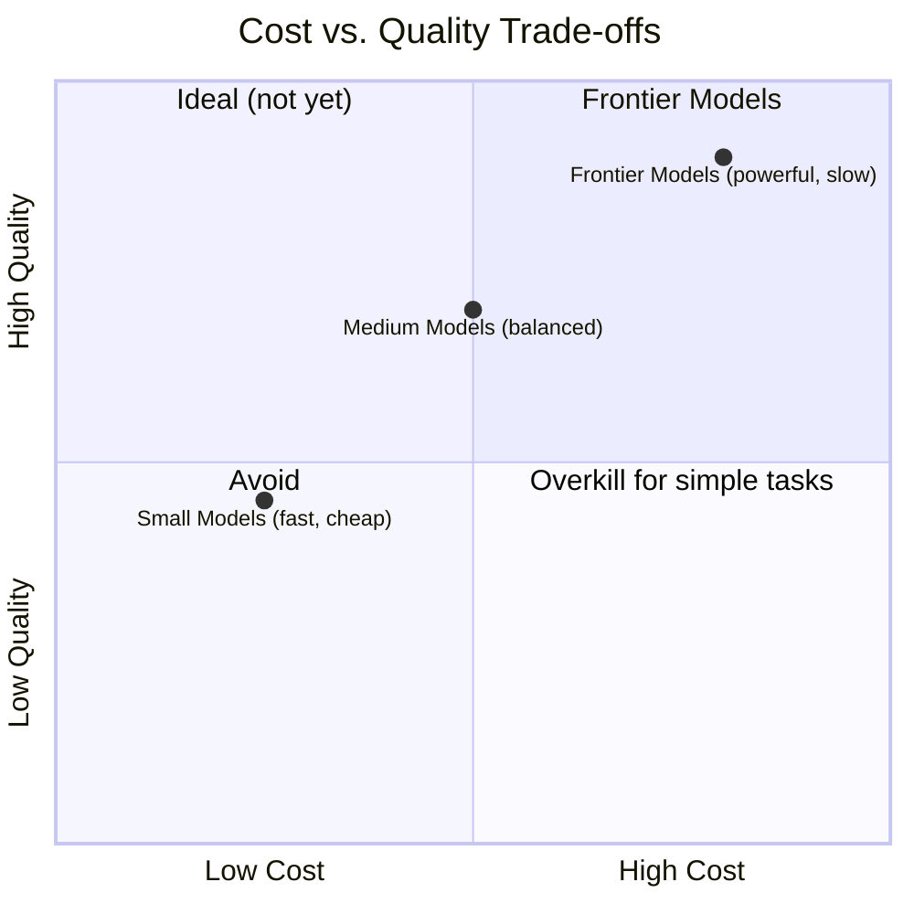

# Usage Limits and Token Economics

!!! mascot-welcome "Welcome, Fellow Prompt Crafters!"
    
    Time to talk to AI! But first — let's talk about what it *costs* to talk to AI. In this chapter, we pull back the curtain on the economics of large language models. Polly has her calculator and her reading glasses. Let's make every token count!

## Why Token Economics Matters

You have spent the past several chapters learning how to write prompts that produce accurate, well-formatted, and useful outputs. But here is a question that many beginners never think to ask: *How much did that prompt just cost me?*

If you are using a free chatbot interface for personal projects, the answer might be "nothing out of pocket." But behind the scenes, every prompt you send and every response you receive costs real money — in compute, in electricity, and in infrastructure. When you move from casual experimentation to professional or production use, understanding these costs becomes essential.

**Token economics** is the study of how tokens — the fundamental units that language models process — translate into real-world costs, resource limits, and operational constraints. Mastering token economics means you can build AI-powered applications that are not only effective but also financially sustainable and environmentally responsible.

| Beginner Mindset | Professional Mindset |
|---|---|
| "I'll just send the whole document" | "I'll send only the relevant sections to reduce token costs" |
| "I want the longest, most detailed response" | "I want the right level of detail for the task at hand" |
| "I'll use the most powerful model for everything" | "I'll match model capability to task complexity" |
| "Costs don't matter, it's just AI" | "Every token has a price — let's optimize" |

The good news is that understanding token economics is not complicated. It mostly comes down to knowing what you are paying for, how much of it you are using, and how to use less of it without sacrificing quality. Think of it like learning to read your electricity bill — once you understand the line items, you can make smarter choices.

## How API Pricing Models Work

An **API pricing model** is the structure that an AI provider uses to charge customers for access to its language models through an Application Programming Interface (API). Unlike subscription plans for chat interfaces, API pricing is almost always usage-based, meaning you pay for what you consume.

Most major AI providers — including OpenAI, Anthropic, Google, and others — charge based on token volume. The fundamental unit of cost is the token, and pricing is typically quoted in dollars per million tokens. However, there is an important distinction that catches many newcomers off guard: input tokens and output tokens are priced differently.

!!! mascot-thinking "Key Insight"
    
    Here is something worth pondering: output tokens almost always cost more than input tokens — often three to five times more. Why? Because generating new text requires more computation than simply reading and processing existing text. This single fact should change how you design your prompts. Every unnecessary word you ask the model to *generate* costs more than every unnecessary word you *send* it.

### Input Token Count and Output Token Count

The **input token count** is the total number of tokens in your prompt, including the system message, user message, any included context, and conversation history. The **output token count** is the total number of tokens the model generates in its response.

Understanding the split between input and output tokens is critical for cost management. Consider this example:

| Component | Tokens | Cost at $3/M input, $15/M output |
|---|---|---|
| System prompt | 200 | $0.0006 |
| User question | 50 | $0.00015 |
| Context document | 2,000 | $0.006 |
| **Total input** | **2,250** | **$0.00675** |
| Model response | 500 | $0.0075 |
| **Total cost per request** | **2,750** | **$0.01425** |

That is about 1.4 cents per request. It might sound trivial, but if your application handles 10,000 requests per day, that is $142.50 daily or roughly $4,275 per month. At 100,000 requests per day — a modest scale for a popular application — you are looking at $42,750 per month. Suddenly, shaving a few hundred tokens off each request matters a great deal.

### Pricing Tiers by Model

Different models have dramatically different price points. Here is a representative comparison (prices are illustrative and change frequently):

| Model Class | Input Cost (per 1M tokens) | Output Cost (per 1M tokens) | Best For |
|---|---|---|---|
| Small / Fast | $0.25 | $1.25 | Simple classification, routing, extraction |
| Medium / Balanced | $3.00 | $15.00 | General-purpose tasks, writing, analysis |
| Large / Frontier | $15.00 | $75.00 | Complex reasoning, coding, research |
| Reasoning / Extended | $15.00 | $60.00+ | Multi-step math, logic, planning |

The key takeaway is that using a frontier model for a task that a small model can handle equally well is like hiring a brain surgeon to put on a bandage. It works, but it is a spectacular waste of money.

## Token Cost Estimation

**Token cost estimation** is the practice of calculating the expected cost of a prompt interaction before running it, based on the estimated input and output token counts and the model's pricing. This is a fundamental skill for anyone building AI-powered applications.

The formula is straightforward:

**Total Cost = (Input Tokens × Input Price per Token) + (Output Tokens × Output Price per Token)**

In practice, you know your input token count precisely because you control the prompt. The output token count requires estimation based on the task — a short classification might produce 10 tokens, while a detailed report might produce 2,000 tokens. You can also set a maximum output token limit in your API call to cap costs.

Here is a quick estimation worksheet:

1. Count or estimate your input tokens (system prompt + user input + context)
2. Estimate your expected output tokens based on the task type
3. Look up the per-token price for your chosen model
4. Multiply and add

For rough estimation, remember that one token is approximately three-quarters of a word in English. So a 1,000-word document is roughly 1,333 tokens, and a 500-word response is roughly 667 tokens.

## Prompt Cost Calculation in Practice

**Prompt cost calculation** is the process of computing the actual dollar cost of a specific prompt-response pair after it has been executed, using the exact token counts reported by the API. While estimation helps you plan, calculation helps you track and optimize.

Most API responses include a `usage` field that reports exactly how many tokens were consumed:

```json
{
  "usage": {
    "prompt_tokens": 1847,
    "completion_tokens": 423,
    "total_tokens": 2270
  }
}
```

By logging this data for every request, you can build a detailed picture of your actual costs over time. This is far more valuable than estimation alone because it captures real-world patterns — some users ask short questions, others paste in entire documents, and your actual cost distribution will reflect this variety.

## Token Budget: Planning for Scale

A **token budget** is a predefined allocation of tokens (and their associated costs) for a specific project, application, or time period. Setting a token budget is how you prevent a promising AI project from turning into a financial black hole.

Token budgets work at multiple levels:

- **Per-request budget** — Maximum tokens allowed for a single API call (e.g., 4,000 output tokens)
- **Per-user budget** — Maximum tokens a single user can consume per day or month
- **Per-application budget** — Total token allocation for an entire application per billing period
- **Per-department budget** — Organizational allocation across teams

The per-request budget is the most immediately actionable. By setting `max_tokens` in your API calls, you create a hard ceiling on output costs. If you know a task should never require more than 500 tokens of output, setting `max_tokens: 500` prevents runaway responses that consume thousands of tokens telling you things you did not ask for.

!!! mascot-tip "Pro Tip"
    
    Here is a trick that saves real money: set your `max_tokens` to match the task, not the model's maximum. If you need a yes-or-no answer, set it to 10. If you need a paragraph, set it to 200. If you need an essay, set it to 2,000. Never leave it at the default maximum unless you genuinely need unlimited output. Your wallet will thank you.

## Token Usage Monitoring and the Usage Dashboard

**Token usage monitoring** is the ongoing process of tracking, recording, and analyzing your token consumption patterns over time. A **usage dashboard** is the visual interface — provided by your AI provider or built by your team — that displays these consumption metrics in an accessible format.

Every major AI provider offers a usage dashboard. These dashboards typically show:

- Total tokens consumed per day, week, and month
- Breakdown by model (which models are consuming the most tokens)
- Cost trends over time
- Current usage relative to your plan limits
- Per-API-key breakdowns (useful for tracking different applications)

Monitoring is not optional for production use. Without it, you are driving without a speedometer. You might be fine, or you might be burning through your budget at three times the expected rate because a bug in your application is sending redundant requests.

A healthy monitoring practice includes:

1. **Daily check** — Glance at your dashboard to spot anomalies
2. **Weekly review** — Compare usage to budget and investigate spikes
3. **Monthly analysis** — Evaluate trends and adjust budgets or architectures
4. **Alerts** — Set up automated notifications when usage exceeds thresholds

## The Five-Hour Token Window

The **five-hour token window** is a rolling time period used by some AI providers to measure and limit token consumption for subscription-based access. Instead of a simple daily or monthly cap, the provider tracks how many tokens you have used in the most recent five-hour rolling window and throttles or blocks access when you exceed the limit.

This mechanism exists because AI providers need to manage server capacity in real time. A simple monthly cap would allow users to consume their entire month's allocation in a single burst, overwhelming the servers. The rolling window distributes consumption more evenly across time.

Here is how it works in practice:

1. You start using the AI service at 9:00 AM
2. By 10:30 AM, you have consumed 75% of your five-hour window allocation
3. The system warns you that you are approaching your limit
4. If you continue at the same rate, you may be throttled or temporarily blocked
5. As time passes, your oldest usage "falls off" the window — tokens consumed at 9:00 AM no longer count against you after 2:00 PM
6. Your available capacity gradually replenishes

The five-hour window is particularly relevant for heavy interactive use — such as long coding sessions, extensive research, or rapid-fire conversations. If you find yourself hitting the limit regularly, it is a signal to either upgrade your plan tier or adopt more token-efficient habits.

<details markdown="1">
<summary>Diagram: Five-Hour Rolling Token Window</summary>

#### Diagram: Five-Hour Rolling Token Window

<!-- ASCII art original:
Time:    9AM    10AM    11AM    12PM    1PM     2PM     3PM
         |-------|-------|-------|-------|-------|-------|
Window 1:|◄─────────── 5 hours ──────────►|
Window 2:         |◄─────────── 5 hours ──────────►|
Window 3:                 |◄─────────── 5 hours ──────────►|

Token Usage:
9-10AM:  ████████░░  (80% of hourly pace)
10-11AM: ██████████  (100% - heavy use)
11-12PM: ███░░░░░░░  (30% - throttled, slowed down)
12-1PM:  ██░░░░░░░░  (20% - light use, recovering)
1-2PM:   ████░░░░░░  (40% - moderate, 9AM usage dropped off)
2-3PM:   ████████░░  (80% - capacity restored as early usage expires)

Key: █ = tokens consumed, ░ = available capacity
-->



```mermaid
gantt
    title Five-Hour Rolling Token Window
    dateFormat HH:mm
    axisFormat %I %p

    section Windows
    Window 1 (9AM–2PM)     :w1, 09:00, 5h
    Window 2 (10AM–3PM)    :w2, 10:00, 5h
    Window 3 (11AM–4PM)    :w3, 11:00, 5h

    section Token Usage
    80% Heavy use           :active, t1, 09:00, 1h
    100% Very heavy         :crit,   t2, 10:00, 1h
    30% Throttled           :         t3, 11:00, 1h
    20% Light (recovering)  :         t4, 12:00, 1h
    40% Moderate (9AM freed):         t5, 13:00, 1h
    80% Capacity restored   :active,  t6, 14:00, 1h
```

As older usage ages out of the window, capacity is restored — even without a hard reset. The 9AM usage drops off at 2PM, freeing up tokens.

This diagram illustrates how the rolling window continuously recalculates your available capacity. As older usage ages out of the window, your capacity is restored even without a hard reset.

</details>

## Rate Limiting

**Rate limiting** is the practice of restricting the number of API requests a user or application can make within a specific time period. While token limits control how much data you can process, rate limits control how frequently you can make requests — regardless of how large or small each request is.

Rate limits are typically expressed in two ways:

- **Requests per minute (RPM)** — The maximum number of individual API calls allowed per minute
- **Tokens per minute (TPM)** — The maximum number of tokens that can be processed per minute

You can hit either limit independently. You might have capacity for 100,000 tokens per minute but only 60 requests per minute. If you send 61 tiny requests in a minute, you hit the request limit even though you have barely used any tokens. Conversely, you could send just 5 requests but stuff each one with 25,000 tokens of context and hit the token-per-minute limit.

## Throttling and Cooldown Periods

**Throttling** is the deliberate reduction of service speed or availability applied by the provider when a user approaches or exceeds their usage limits. Rather than cutting you off entirely, the system slows you down — like a speed governor on a vehicle.

When you are throttled, your requests still go through, but they may take longer to process or you may receive fewer tokens per response. Some providers implement throttling as a gradual degradation: the closer you are to your limit, the slower the service becomes.

A **cooldown period** is a mandatory waiting time imposed after you have exceeded a usage limit, during which you cannot make new requests or can only make them at a reduced rate. Think of it as a timeout — the system forces you to wait until your usage drops back within acceptable bounds.

Cooldown periods are distinct from throttling in an important way: throttling slows you down gradually, while a cooldown is a hard stop followed by a mandatory wait. In practice, you might experience throttling first (as a warning) and then a cooldown period if you continue to push past limits.

The best strategy for handling both throttling and cooldown periods is to avoid triggering them in the first place:

- Monitor your usage rate in real time
- Implement exponential backoff in your code (wait longer between retries)
- Spread batch processing across time rather than running it all at once
- Use queuing systems to smooth out request bursts

## Usage Quotas

A **usage quota** is the maximum amount of a resource — tokens, requests, or compute time — that you are allocated within a specific period under your current plan. Quotas are the hard boundaries of your AI consumption, and exceeding them triggers either overage charges, service suspension, or forced upgrades.

Quotas differ from rate limits in scope. Rate limits are about *speed* (how fast you consume), while quotas are about *volume* (how much you consume in total). You can stay within your rate limits all month and still exhaust your quota if you use the service steadily enough.

Common quota structures include:

- **Monthly token quota** — Total tokens available per billing month (e.g., 10 million tokens per month)
- **Daily token quota** — Subset of the monthly quota allocated per day
- **Model-specific quotas** — Different limits for different model tiers
- **Feature-specific quotas** — Separate limits for features like image generation or fine-tuning

## Plan Tiers and Limits

**Plan tiers** are the different subscription levels offered by AI providers, each with its own set of usage limits, rate limits, pricing, and features. Most providers offer three to five tiers designed for different user profiles, from individual hobbyists to enterprise organizations.

Here is a representative tier comparison:

| Feature | Free Tier | Pro Tier | Team Tier | Enterprise Tier |
|---|---|---|---|---|
| Monthly cost | $0 | $20/month | $25/user/month | Custom pricing |
| Model access | Limited models | All models | All models + priority | All models + dedicated |
| Rate limit (RPM) | 20 | 60 | 120 | Custom |
| Token quota (monthly) | 500K | 5M | 10M/user | Unlimited |
| Five-hour window | Strict | Moderate | Generous | Custom |
| Support | Community | Email | Priority email | Dedicated account team |

The jump from free to pro is usually the best value — you get dramatically more capacity for a modest monthly fee. The jump from pro to team adds collaboration features and higher limits. Enterprise tiers are for organizations that need custom agreements, dedicated infrastructure, or compliance guarantees.

!!! mascot-warning "Watch Out!"
    
    A common mistake is assuming that the plan you chose for experimentation will work for production. That free tier that was perfect for your prototype will crumble the moment real users show up. Always project your production token needs *before* launch and select a plan tier that provides headroom. Running out of quota during a product demo is the AI equivalent of running out of gas on the highway — technically survivable, but deeply embarrassing.

## Overage Handling

**Overage handling** refers to the policies and mechanisms that govern what happens when you exceed your plan's allocated quotas. Different providers handle overages differently, and understanding your provider's policy is essential for avoiding surprises on your bill.

Common overage policies include:

- **Hard cutoff** — Access is suspended until the next billing period or until you upgrade. No additional charges, but your service stops.
- **Automatic upgrade** — You are automatically moved to the next tier, with the associated price increase.
- **Pay-as-you-go overage** — You continue to use the service, but excess usage is billed at a per-token rate, often at a premium.
- **Soft warning** — You receive a notification but service continues for a grace period.

The most dangerous policy for your budget is pay-as-you-go overage without spending caps. A bug in your code that creates an infinite loop of API calls could rack up thousands of dollars in charges before anyone notices. Always set spending limits or alerts with your provider.

## Cost Optimization Strategies

**Cost optimization** is the systematic practice of reducing token consumption and associated costs without degrading the quality of outputs. This is where prompt engineering meets financial engineering, and it is one of the most valuable skills you can develop.

Here are proven cost optimization techniques:

### 1. Right-Size Your Model

Use the smallest model that can handle the task effectively. A simple classification task does not need a frontier model. Test your prompts on smaller models first and only scale up if quality is insufficient.

### 2. Minimize Input Tokens

- Trim unnecessary context from your prompts
- Use summarization to compress long documents before including them
- Remove redundant instructions that the model already understands
- Use shorthand and abbreviations in system prompts (the model understands them just fine)

### 3. Control Output Length

- Set explicit `max_tokens` values
- Ask for concise responses: "Answer in one sentence" or "Respond in under 100 words"
- Use structured output formats (JSON, lists) that are naturally more concise than prose

### 4. Cache and Reuse

- Cache responses for identical or near-identical queries
- Store system prompt tokens using prompt caching features (offered by some providers at reduced rates)
- Avoid re-sending conversation history that has not changed

### 5. Batch Processing

- Group multiple small tasks into a single prompt where possible
- Use batch API endpoints that offer discounted pricing for non-real-time work

## Cost-Effective Prompting

**Cost-effective prompting** is the art of writing prompts that achieve the desired output quality while consuming the minimum necessary tokens. It is the intersection of good prompt engineering and good token economics.

Here is a before-and-after example:

**Expensive Prompt (387 tokens):**

> You are a helpful assistant. I would like you to carefully analyze the following customer review and provide me with a detailed assessment of the customer's sentiment. Please consider the overall tone, specific positive and negative mentions, and provide your analysis in a comprehensive paragraph format. Here is the review: "The product arrived on time and works great. Love it!"

**Cost-Effective Prompt (42 tokens):**

> Classify the sentiment of this review as positive, negative, or mixed. Reply with only the classification and one reason.
> Review: "The product arrived on time and works great. Love it!"

Both prompts get you a sentiment analysis. The first costs roughly nine times more in input tokens and will generate a much longer (more expensive) output. The second is direct, constrained, and produces exactly what you need.

## Latency Optimization

**Latency optimization** is the practice of reducing the time between sending a prompt and receiving a complete response. While latency and cost are related (both involve token volume), latency optimization specifically focuses on speed — making your AI interactions feel responsive and snappy.

Key latency optimization techniques include:

- **Reduce output tokens** — Fewer tokens to generate means faster responses
- **Use streaming** — Display tokens as they arrive rather than waiting for the full response
- **Choose faster models** — Smaller models generally have lower latency
- **Minimize context length** — Less input to process means faster time to first token
- **Use regional endpoints** — Choose API endpoints geographically close to your users
- **Parallelize independent requests** — Send multiple API calls simultaneously instead of sequentially

Latency matters more than you might think. Research consistently shows that users perceive AI tools as more intelligent and trustworthy when they respond quickly. A two-second response feels smart. A ten-second response feels broken — even if the ten-second response is objectively better.

<details markdown="1">
<summary>Diagram: Cost vs. Latency vs. Quality Trade-offs</summary>

#### Diagram: Cost vs. Latency vs. Quality Trade-offs

<!-- ASCII art original:
                          HIGH QUALITY
                              ▲
                              │
                   ┌──────────┼──────────┐
                   │  Frontier │ Models   │
                   │  (High $, │ Slow)    │
                   │          ●│          │
                   │         / │\         │
                   │        /  │ \        │
        LOW COST ──┼───────/───┼──\───────┼── HIGH COST
                   │      /    │   \      │
                   │     ●     │    ●     │
                   │  Small    │  Medium  │
                   │  Models   │  Models  │
                   │ (Low $,   │ (Med $,  │
                   │  Fast)    │  Med)    │
                   └──────────┼──────────┘
                              │
                              ▼
                         LOW QUALITY

        Sweet Spot Strategy:
        ┌─────────────────────────────────────┐
        │  Task Complexity → Model Selection  │
        │  Simple tasks   → Small model  ($)  │
        │  Medium tasks   → Medium model ($$) │
        │  Complex tasks  → Frontier    ($$$) │
        └─────────────────────────────────────┘
-->



**Sweet Spot Strategy:** Match model capability to task complexity.

| Task Complexity | Model Selection | Cost |
|---|---|---|
| Simple tasks | Small model | $ |
| Medium tasks | Medium model | $$ |
| Complex tasks | Frontier model | $$$ |

This diagram shows the three-way trade-off between cost, latency, and quality. The optimal strategy is to match model capability to task complexity rather than using a single model for everything.

</details>

## Environmental Impact

The **environmental impact** of AI usage refers to the energy consumption, carbon emissions, and natural resource usage associated with training, hosting, and running large language models. This is the cost that does not appear on your invoice but affects everyone.

Training a large language model can consume as much electricity as hundreds of homes use in a year. Running inference — the process of generating responses to your prompts — is less intensive per query but adds up at scale. Data centers require enormous amounts of water for cooling, and the electricity they consume often comes from fossil fuel sources.

As prompt engineers, we have a responsibility to consider the environmental cost of our work. Every unnecessary API call, every bloated prompt, every redundant request wastes energy. The good news is that the same practices that reduce your token costs also reduce your environmental footprint:

- Efficient prompts consume less compute
- Right-sized models use less energy per request
- Caching prevents redundant computation
- Batch processing reduces overhead

This is one of those rare situations where doing the right thing for the planet and doing the right thing for your budget are the same thing. (If only all environmental problems were this convenient.)

## Putting It All Together: A Cost Management Workflow

Here is a practical workflow for managing AI costs in a production application:

1. **Estimate** — Before building, estimate your token needs based on expected request volume and typical prompt sizes
2. **Budget** — Set a monthly token budget with per-request and per-user caps
3. **Select** — Choose the appropriate model tier and plan based on your estimates
4. **Monitor** — Track actual usage daily through your usage dashboard
5. **Optimize** — Identify high-cost prompts and apply cost-effective prompting techniques
6. **Alert** — Set up automated alerts for unusual usage spikes
7. **Review** — Monthly review of costs vs. budget, with adjustments as needed

!!! mascot-celebration "Nice Work!"
    
    You have just leveled up from "person who uses AI" to "person who uses AI *wisely and sustainably*." Understanding token economics is what separates someone who builds a cool demo from someone who builds a product that can actually survive contact with real users and real budgets. Polly is proud of you — and so is your finance department.

## Key Takeaways

- Every token has a cost — **input tokens** and **output tokens** are priced differently, with output tokens typically costing three to five times more
- **API pricing models** are usage-based; understanding the per-token cost for your chosen model is essential for financial planning
- The **five-hour token window** is a rolling limit that replenishes over time — pace your usage to avoid hitting it
- **Rate limiting** controls request frequency, while **usage quotas** control total volume — you can hit either one independently
- **Throttling** slows you down gradually; **cooldown periods** impose hard stops — both are signals to optimize your usage patterns
- **Token budgets** should be set at multiple levels: per-request, per-user, and per-application
- **Cost-effective prompting** means achieving the same quality output with fewer tokens — right-size your model, minimize input, control output length, and cache aggressively
- Use your **usage dashboard** regularly and set up alerts to catch runaway costs before they become budget disasters
- **Latency optimization** and **cost optimization** are closely related — reducing tokens improves both speed and cost
- The same practices that save money also reduce **environmental impact** — efficient prompting is responsible prompting

---

## Concepts

1. Environmental Impact
2. Cost Optimization
3. Latency Optimization
4. API Pricing Models
5. Rate Limiting
6. Usage Quota
7. Five-Hour Token Window
8. Token Budget
9. Token Cost Estimation
10. Token Usage Monitoring
11. Input Token Count
12. Output Token Count
13. Prompt Cost Calculation
14. Usage Dashboard
15. Throttling
16. Cooldown Period
17. Plan Tiers and Limits
18. Overage Handling
19. Cost-Effective Prompting

## Prerequisites

- [Chapter 1: AI and Machine Learning Foundations](../01-ai-ml-foundations/index.md)
- [Chapter 2: Prompt Fundamentals](../02-prompt-fundamentals/index.md)
- [Chapter 3: Prompt Types and Model Parameters](../03-prompt-types-parameters/index.md)
- [Chapter 4: Core Prompt Techniques](../04-core-prompt-techniques/index.md)
- [Chapter 5: Advanced Prompt Techniques](../05-advanced-prompt-techniques/index.md)
- [Chapter 6: Output Format Control](../06-output-format-control/index.md)
- [Chapter 7: Context, Memory, and Information Management](../07-context-memory-management/index.md)
- [Chapter 13: Evaluation and Optimization](../13-evaluation-optimization/index.md)
