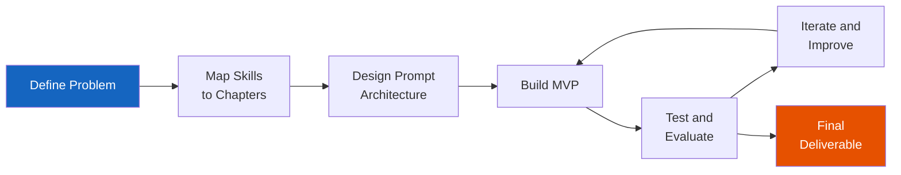
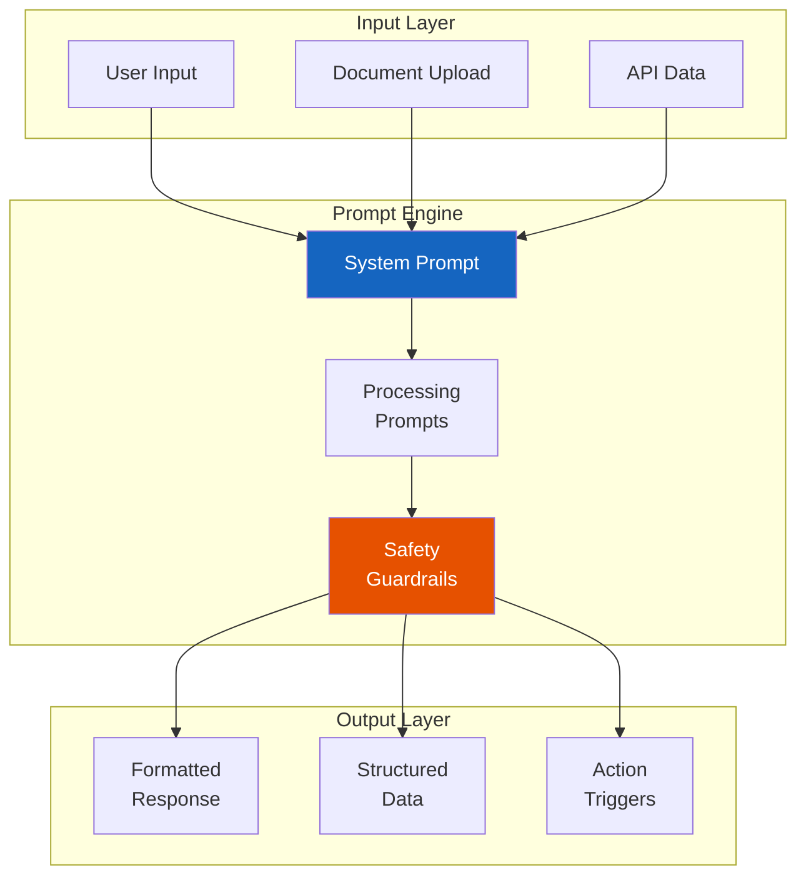

# Capstone Projects

!!! mascot-celebration "Congratulations, Word Wizards!"
    
    You made it to the final chapter! Every prompt pattern, every technique, every ethical principle you have learned across sixteen chapters has been building toward this moment. Now it is time to put it all together and build something real. Let's craft the perfect prompt — and then craft an entire *system* of prompts! Polly is so proud of you.

## Introduction

Welcome to the capstone. This chapter is different from every chapter that came before it. There are no new techniques to learn here, no unfamiliar vocabulary to memorize. Instead, this chapter is a **project catalog** — a curated collection of 32 real-world projects that challenge you to combine prompt engineering, security, ethics, evaluation, and agentic AI into complete, polished systems.

Each project description includes a brief overview, the key skills it exercises, a starter prompt or approach hint to help you get going, and a difficulty rating. Think of this chapter as your launchpad. Pick one project that excites you, or pick several. Work alone or with a team. The goal is the same: demonstrate mastery by building something meaningful.

Why capstone projects? Because prompt engineering is not a spectator sport. Reading about few-shot prompting is one thing. Designing a multi-agent research assistant that retrieves, summarizes, evaluates, and cites sources across multiple domains — that is where the learning really sticks.

| Difficulty Level | What It Means | Typical Scope |
|---|---|---|
| Beginner | Uses skills from Chapters 1-6 primarily | Single-purpose prompt system with basic input/output |
| Intermediate | Integrates Chapters 7-11 skills | Multi-step workflow with context management and safety |
| Advanced | Requires Chapters 12-16 mastery | Agentic systems, evaluation loops, and production-quality design |

## How to Approach Your Capstone

Before diving into the project catalog, here are some guidelines for success. A good capstone project is not just a fancy prompt — it is a *system* that demonstrates thoughtful design, responsible AI practices, and practical value.

!!! mascot-thinking "Think Before You Prompt"
    
    Words matter — let's get them right! Before you write a single prompt, sketch out your system on paper. What are the inputs? What are the outputs? Where could things go wrong? The best capstone projects start with a clear plan.

**Step 1: Define the problem.** Who is the user? What do they need? What does success look like?

**Step 2: Map the skills.** Which chapters provide the techniques you need? Chain-of-thought reasoning from Chapter 4? RAG from Chapter 8? Security guardrails from Chapter 11?

**Step 3: Design the prompt architecture.** Most capstone projects require multiple prompts working together — a system prompt, processing prompts, and output formatting prompts.

**Step 4: Build iteratively.** Start with the simplest version that works, then add complexity.

**Step 5: Evaluate rigorously.** Use the evaluation techniques from Chapter 13 to measure quality, and the ethical frameworks from Chapter 10 to check for harm.

<details markdown="1">
<summary>#### Diagram: Capstone Project Development Lifecycle</summary>



This diagram shows the iterative development cycle for any capstone project. Notice the loop between Build, Test, and Iterate — real-world prompt engineering is always an iterative process.
</details>

## Knowledge Management and Design

These first two projects establish the foundational skills of organizing knowledge and designing capstone-level systems. They are excellent starting points for students who want to plan before they build.

### 1. Knowledge Management

**Description:** Build a system that captures, organizes, retrieves, and surfaces institutional knowledge using prompt engineering techniques. The system should take unstructured information — meeting notes, emails, documents, chat logs — and transform it into a searchable, structured knowledge base that answers natural language questions.

**Key Skills:** Context management (Chapter 7), RAG fundamentals (Chapter 8), output format control (Chapter 6), prompt fundamentals (Chapter 2)

**Starter Prompt:**

```text
You are a knowledge management assistant. Given the following
unstructured document, extract:
1. Key facts (as structured JSON)
2. Named entities (people, projects, dates, decisions)
3. Action items with owners and deadlines
4. Relationships between entities

Document:
[paste document here]
```

**Difficulty:** Intermediate

---

### 2. Capstone Project Design

**Description:** Create a meta-project — a prompt-powered system that helps other students design their own capstone projects. Given a student's interests, skill level, and available time, the system recommends suitable projects, outlines milestones, and generates starter prompts. This is prompt engineering about prompt engineering!

**Key Skills:** Meta-prompting (Chapter 5), prompt types and parameters (Chapter 3), educational applications (Chapter 16), business context (Chapter 15)

**Starter Prompt:**

```text
Act as a capstone project advisor for a prompt engineering course.
Ask the student about their interests, comfort level with AI tools,
and time commitment. Then recommend 3 suitable projects with:
- A difficulty rating
- A 4-week milestone plan
- The top 3 prompt techniques they will need
- A starter prompt for week 1
```

**Difficulty:** Beginner

---

## Business Communication and Productivity

These projects focus on the everyday business tasks that prompt engineering can dramatically accelerate — from handling customer inquiries to triaging email and summarizing meetings.

### 3. Customer Support Bot

**Description:** Design a complete customer support chatbot that handles common inquiries, escalates complex issues to human agents, maintains conversation context across multiple turns, and stays within brand guidelines. This project tests your ability to build safe, reliable, production-quality prompt systems.

**Key Skills:** System prompts (Chapter 2), context and memory management (Chapter 7), prompt security (Chapter 11), ethics (Chapter 10), few-shot examples (Chapter 4)

**Starter Prompt:**

```text
You are a customer support agent for [Company Name].

Rules:
- Always greet the customer warmly
- Never make up information about products or policies
- If you cannot resolve an issue, say: "Let me connect you with a
  specialist who can help"
- Never share internal pricing or discount structures
- Maintain a friendly, professional tone

Knowledge base:
[Insert FAQ content here]
```

**Difficulty:** Intermediate

---

### 4. FAQ Generator System

**Description:** Build a system that analyzes product documentation, support tickets, and user feedback to automatically generate and maintain an FAQ document. The system should identify the most common questions, write clear answers, group them by topic, and flag outdated entries when source material changes.

**Key Skills:** Output format control (Chapter 6), content summarization (Chapter 4), context management (Chapter 7), evaluation (Chapter 13)

**Starter Prompt:**

```text
Analyze the following collection of support tickets and identify
the 20 most frequently asked questions. For each question, provide:
1. The question in clear, user-friendly language
2. A concise answer (2-4 sentences)
3. The category (billing, technical, account, product)
4. Confidence score (how certain you are this is accurate)
```

**Difficulty:** Beginner

---

### 5. Content Pipeline

**Description:** Create an end-to-end content production pipeline that takes a topic brief and produces a complete content package — blog post draft, social media snippets, email newsletter section, and SEO metadata. Each output should maintain a consistent voice while adapting format and length for each channel.

**Key Skills:** Output format control (Chapter 6), prompt chaining (Chapter 5), brand voice management (Chapter 15), few-shot examples (Chapter 4)

**Starter Prompt:**

```text
You are a content pipeline system. Given a topic brief, produce
all outputs in sequence. Maintain a consistent brand voice
throughout. The voice is: [describe voice characteristics].

Topic brief: [topic]

Produce:
1. Blog post (800-1200 words, SEO-optimized)
2. Three social media posts (Twitter, LinkedIn, Instagram)
3. Email newsletter paragraph (150 words)
4. SEO metadata (title tag, meta description, 5 keywords)
```

**Difficulty:** Intermediate

---

!!! mascot-tip "Pro Tip from Polly"
    
    Use your words! When building any of these projects, start by writing out what the *perfect* output looks like. Then work backward to figure out what prompt produced it. This technique — called **output-first design** — is one of the most effective approaches for complex systems.

### 6. Meeting Notes System

**Description:** Build a system that takes raw meeting transcripts (or even rough notes) and produces structured meeting summaries including decisions made, action items with owners, key discussion points, and follow-up questions. Bonus: generate different summary formats for attendees versus non-attendees.

**Key Skills:** Summarization (Chapter 4), output format control (Chapter 6), context management (Chapter 7), structured output (Chapter 6)

**Starter Prompt:**

```text
Summarize the following meeting transcript into a structured format:

## Meeting Summary
- Date:
- Attendees:
- Duration:

## Key Decisions
[numbered list]

## Action Items
| Owner | Task | Deadline |
|---|---|---|

## Discussion Highlights
[3-5 bullet points]

## Open Questions
[items needing follow-up]

Transcript:
[paste transcript]
```

**Difficulty:** Beginner

---

### 7. Email Triage System

**Description:** Design a prompt system that analyzes incoming emails and categorizes them by urgency, topic, required action, and suggested response. The system should draft reply templates for common categories and flag emails that require human judgment — such as complaints, legal matters, or sensitive personnel issues.

**Key Skills:** Classification (Chapter 4), prompt security (Chapter 11), ethics and privacy (Chapter 10), output format control (Chapter 6)

**Starter Prompt:**

```text
Analyze the following email and provide:
1. Urgency: [Critical / High / Medium / Low]
2. Category: [Sales / Support / Internal / Legal / Personal]
3. Required action: [Reply / Forward / Archive / Escalate]
4. Suggested response (draft, 2-3 sentences)
5. Sensitive content flag: [Yes/No, with explanation if Yes]

Email:
[paste email]
```

**Difficulty:** Intermediate

---

## Research and Technical Tools

These projects build sophisticated tools for developers, researchers, and technical writers who need AI assistance with complex analytical tasks.

### 8. Research Assistant

**Description:** Build a multi-step research assistant that takes a research question, breaks it into sub-questions, gathers information from provided sources, synthesizes findings, identifies contradictions or gaps, and produces a structured research brief with citations. This project is a natural fit for RAG techniques.

**Key Skills:** RAG (Chapter 8), chain-of-thought reasoning (Chapter 4), advanced prompting (Chapter 5), evaluation (Chapter 13), context management (Chapter 7)

**Starter Prompt:**

```text
You are a research assistant. Given a research question, follow
this process:
1. Break the question into 3-5 specific sub-questions
2. For each sub-question, analyze the provided sources
3. Synthesize findings, noting agreements and contradictions
4. Rate the evidence quality for each finding
5. Produce a research brief with inline citations

Research question: [question]
Sources: [provide sources]
```

**Difficulty:** Advanced

---

### 9. Code Review Assistant

**Description:** Create a code review system that analyzes code submissions for bugs, security vulnerabilities, style violations, performance issues, and maintainability concerns. The system should provide specific, actionable feedback with code suggestions and prioritize issues by severity.

**Key Skills:** Structured output (Chapter 6), few-shot examples (Chapter 4), evaluation criteria (Chapter 13), prompt security (Chapter 11)

**Starter Prompt:**

```text
Review the following code for:
1. Bugs and logical errors (Critical)
2. Security vulnerabilities (Critical)
3. Performance issues (High)
4. Style and readability (Medium)
5. Documentation gaps (Low)

For each issue found, provide:
- Line number(s)
- Severity rating
- Description of the problem
- Suggested fix with code example

Code:
[paste code]
```

**Difficulty:** Intermediate

---

### 10. Technical Doc Generator

**Description:** Build a system that generates comprehensive technical documentation from code, API endpoints, or system architecture descriptions. The system should produce user guides, API references, getting-started tutorials, and troubleshooting guides — all maintaining consistent terminology and structure.

**Key Skills:** Output format control (Chapter 6), context management (Chapter 7), audience adaptation (Chapter 2), prompt chaining (Chapter 5)

**Starter Prompt:**

```text
Generate technical documentation for the following API endpoint.
Write for a developer audience with 2-3 years of experience.

Include:
1. Endpoint overview (1 paragraph)
2. Request format (with example)
3. Response format (with example)
4. Error codes and handling
5. Rate limits and best practices
6. Code examples in Python and JavaScript

API specification:
[paste spec]
```

**Difficulty:** Intermediate

---

### 11. Data Dashboard Narrator

**Description:** Create a system that takes data visualizations or raw datasets and generates natural language narratives explaining the data — trends, outliers, comparisons, and actionable insights. The narrator should adjust its language for different audiences (executives, analysts, general public).

**Key Skills:** Multimodal prompting (Chapter 9), audience adaptation (Chapter 2), output format control (Chapter 6), chain-of-thought reasoning (Chapter 4)

**Starter Prompt:**

```text
Analyze the following dataset and produce three narrative versions:

1. Executive summary (3-4 sentences, focus on business impact)
2. Analyst report (detailed, with statistical observations)
3. Public-facing summary (plain language, no jargon)

For each version, highlight:
- The most significant trend
- Any notable outliers
- One actionable recommendation

Dataset:
[paste data or describe visualization]
```

**Difficulty:** Intermediate

---

## Education and Career Development

These projects apply prompt engineering to teaching, learning, and career advancement — areas where personalization creates enormous value.

!!! mascot-encourage "You've Got This!"
    
    These education projects are some of the most rewarding to build because you can see the impact immediately. Whether you are helping students learn or helping professionals advance their careers, your prompt engineering skills can genuinely make a difference. Let's craft the perfect prompt!

### 12. Personalized Tutor App

**Description:** Design an AI tutoring system that adapts to individual learners. The system should assess the student's current knowledge level, present material at an appropriate difficulty, provide practice problems, give detailed feedback, and track progress over time. Focus on one subject area for your capstone.

**Key Skills:** Educational applications (Chapter 16), context and memory management (Chapter 7), few-shot prompting (Chapter 4), evaluation (Chapter 13)

**Difficulty:** Advanced

---

### 13. Quiz and Test Generator

**Description:** Build a system that generates quizzes and tests from source material, with questions aligned to specific learning objectives and Bloom's Taxonomy levels. The system should produce multiple question types (multiple choice, short answer, essay prompts), answer keys, and grading rubrics.

**Key Skills:** Educational applications (Chapter 16), output format control (Chapter 6), structured output (Chapter 6), evaluation (Chapter 13)

**Difficulty:** Intermediate

---

### 14. Writing Coach System

**Description:** Create an AI writing coach that analyzes student or professional writing for clarity, structure, tone, grammar, and argumentation. The system should provide constructive feedback — not just corrections — along with explanations and examples of improvement. It should adapt its coaching style to the writer's skill level.

**Key Skills:** Few-shot examples (Chapter 4), audience adaptation (Chapter 2), ethics (Chapter 10), output format control (Chapter 6)

**Difficulty:** Intermediate

---

### 15. Resume Analyzer

**Description:** Design a system that analyzes resumes against job descriptions, identifying strengths, gaps, keyword matches, and improvement opportunities. The system should score the resume-to-job fit, suggest specific rewording, and flag common resume mistakes — all while maintaining ethical boundaries around bias.

**Key Skills:** Classification (Chapter 4), ethics and bias awareness (Chapter 10), structured output (Chapter 6), business applications (Chapter 15)

**Difficulty:** Intermediate

---

### 16. Job Description Writer

**Description:** Build a system that generates inclusive, clear, and compelling job descriptions from minimal input. Given a job title, department, and a few key responsibilities, the system should produce a complete job posting with qualifications, benefits framing, and inclusive language — checked for bias and legal compliance.

**Key Skills:** Ethics (Chapter 10), output format control (Chapter 6), business applications (Chapter 15), few-shot prompting (Chapter 4)

**Difficulty:** Beginner

---

### 17. Interview Prep Coach

**Description:** Create an interactive interview preparation system that generates likely interview questions based on a job description, provides frameworks for answering behavioral questions (like the STAR method), conducts mock interviews with follow-up questions, and gives feedback on answer quality.

**Key Skills:** Context management (Chapter 7), few-shot prompting (Chapter 4), educational applications (Chapter 16), prompt types (Chapter 3)

**Difficulty:** Intermediate

---

## Marketing and Brand Management

These projects focus on creating consistent, engaging content across marketing channels while maintaining brand identity.

### 18. Social Media Manager

**Description:** Build a social media management system that generates platform-specific content from a single content brief. The system should adapt tone and length for each platform (Twitter/X, LinkedIn, Instagram, TikTok), suggest optimal posting times, create hashtag strategies, and generate engagement-driving calls to action.

**Key Skills:** Output format control (Chapter 6), prompt chaining (Chapter 5), audience adaptation (Chapter 2), business applications (Chapter 15)

**Difficulty:** Beginner

---

### 19. Brand Voice System

**Description:** Design a system that captures, codifies, and enforces a brand's unique voice across all content. The system should analyze existing brand content to extract voice characteristics, create a brand voice guide, and then review new content for voice consistency — flagging and suggesting corrections for off-brand language.

**Key Skills:** Few-shot prompting (Chapter 4), evaluation (Chapter 13), prompt fundamentals (Chapter 2), business applications (Chapter 15)

**Difficulty:** Intermediate

---

<details markdown="1">
<summary>#### Diagram: Multi-Project Architecture Pattern</summary>



This architecture pattern applies to most capstone projects. Notice how safety guardrails sit between processing and output — a design principle from Chapter 11 that should be present in every production system.
</details>

## Legal and Compliance

These projects tackle high-stakes domains where accuracy, caution, and ethical guardrails are especially critical.

### 20. Legal Document Analyzer

**Description:** Build a system that reads legal documents (contracts, terms of service, lease agreements) and produces plain-language summaries highlighting key obligations, risks, deadlines, and unusual clauses. The system must include prominent disclaimers that it is not providing legal advice and should recommend professional review for important decisions.

**Key Skills:** Ethics (Chapter 10), prompt security (Chapter 11), summarization (Chapter 4), output format control (Chapter 6)

**Difficulty:** Advanced

---

### 21. Compliance Checker

**Description:** Create a system that reviews business documents, marketing materials, or internal policies against a set of compliance rules (industry regulations, company policies, or legal requirements). The system should flag potential violations, explain the relevant rule, and suggest compliant alternatives.

**Key Skills:** Classification (Chapter 4), prompt security (Chapter 11), ethics (Chapter 10), structured output (Chapter 6), few-shot examples (Chapter 4)

**Difficulty:** Advanced

---

## Data Analysis and Insights

These projects focus on extracting meaning from data — understanding what customers think, what trends reveal, and what actions to take.

### 22. Product Review Analyzer

**Description:** Design a system that analyzes large collections of product reviews to extract themes, common praise, frequent complaints, feature requests, and competitive comparisons. The output should include both quantitative summaries (percentages, ratings distributions) and qualitative insights with representative quotes.

**Key Skills:** Summarization (Chapter 4), output format control (Chapter 6), structured output (Chapter 6), evaluation (Chapter 13)

**Difficulty:** Intermediate

---

### 23. Sentiment Analysis System

**Description:** Build a comprehensive sentiment analysis pipeline that processes text from multiple sources (social media, reviews, surveys, support tickets) and classifies sentiment at both the document and aspect level. The system should detect nuance — sarcasm, mixed feelings, conditional praise — rather than just positive/negative/neutral labels.

**Key Skills:** Classification (Chapter 4), few-shot prompting (Chapter 4), evaluation (Chapter 13), prompt types and parameters (Chapter 3)

**Difficulty:** Intermediate

---

### 24. Translation Assistant

**Description:** Create a translation system that goes beyond word-for-word translation to handle cultural context, idiomatic expressions, tone adaptation, and domain-specific terminology. The system should support back-translation for quality checking and allow users to specify formality level, regional dialect, and target audience.

**Key Skills:** Multimodal awareness (Chapter 9), audience adaptation (Chapter 2), evaluation (Chapter 13), few-shot prompting (Chapter 4)

**Difficulty:** Advanced

---

## Accessibility and Onboarding

These projects focus on making systems and content accessible to everyone — an area where prompt engineering can have profound social impact.

### 25. Accessibility Auditor

**Description:** Build a system that audits digital content (web pages, documents, presentations) for accessibility issues. The system should check for alt text quality, reading level, color contrast descriptions, heading structure, plain language compliance, and screen reader compatibility — then generate a prioritized remediation report.

**Key Skills:** Ethics (Chapter 10), evaluation (Chapter 13), output format control (Chapter 6), structured output (Chapter 6)

**Difficulty:** Intermediate

---

### 26. Onboarding Guide System

**Description:** Design a system that generates personalized onboarding guides for new employees, new users of a software product, or new members of an organization. Given the person's role, experience level, and goals, the system should create a customized learning path with milestones, resources, and check-in points.

**Key Skills:** Educational applications (Chapter 16), context management (Chapter 7), audience adaptation (Chapter 2), output format control (Chapter 6)

**Difficulty:** Beginner

---

!!! mascot-tip "A Note on Project Scope"
    
    Time to talk to AI! Remember, a capstone project does not need to solve every problem. A well-executed system that handles one use case beautifully is far more impressive than a sprawling system that does ten things poorly. Start small, deliver quality, and expand from there.

## Prompt Engineering Infrastructure

These final projects build the tools and frameworks that make all other prompt engineering work more effective. They are the projects for students who want to build tools for *other prompt engineers*.

### 27. Knowledge Base Builder

**Description:** Create a system that takes raw documents, conversations, or data sources and automatically builds a structured knowledge base suitable for use in RAG pipelines. The system should chunk content intelligently, generate metadata and tags, identify relationships between entries, and maintain a schema that supports efficient retrieval.

**Key Skills:** RAG (Chapter 8), context management (Chapter 7), structured output (Chapter 6), evaluation (Chapter 13)

**Difficulty:** Advanced

---

### 28. Prompt Library Manager

**Description:** Build a system for organizing, versioning, testing, and sharing prompt templates. The system should support tagging prompts by use case, tracking performance metrics across versions, A/B testing different prompt variations, and generating documentation for each prompt template.

**Key Skills:** Evaluation and optimization (Chapter 13), prompt fundamentals (Chapter 2), token economics (Chapter 14), output format control (Chapter 6)

**Difficulty:** Intermediate

---

### 29. AI Workflow Automator

**Description:** Design a system that chains multiple AI prompts into automated workflows — where the output of one prompt feeds into the next. The system should support branching logic (if the classification is X, use prompt A; otherwise, use prompt B), error handling, and human-in-the-loop checkpoints for high-stakes decisions.

**Key Skills:** Agentic AI (Chapter 12), prompt chaining (Chapter 5), prompt security (Chapter 11), evaluation (Chapter 13)

**Difficulty:** Advanced

---

### 30. Multi-Agent Task Runner

**Description:** Build a multi-agent system where specialized AI agents collaborate to complete complex tasks. For example, one agent researches, another writes, a third edits, and a fourth fact-checks. The system needs a coordination layer that manages agent communication, resolves conflicts, and ensures quality.

**Key Skills:** Agentic AI (Chapter 12), context management (Chapter 7), evaluation (Chapter 13), prompt security (Chapter 11), ethics (Chapter 10)

**Difficulty:** Advanced

---

### 31. RAG Pipeline Builder

**Description:** Create a complete retrieval-augmented generation pipeline that ingests documents, chunks them, stores them in a vector database, retrieves relevant chunks for a query, and generates grounded answers with citations. The system should include relevance scoring and hallucination detection.

**Key Skills:** RAG (Chapter 8), evaluation (Chapter 13), context management (Chapter 7), prompt security (Chapter 11), token economics (Chapter 14)

**Difficulty:** Advanced

---

### 32. Evaluation Framework

**Description:** Build a comprehensive evaluation framework for testing and scoring prompt outputs across multiple dimensions — accuracy, relevance, safety, bias, helpfulness, and format compliance. The framework should support automated scoring with rubrics, human evaluation workflows, and statistical comparison of prompt versions.

**Key Skills:** Evaluation and optimization (Chapter 13), ethics (Chapter 10), prompt security (Chapter 11), structured output (Chapter 6), token economics (Chapter 14)

**Difficulty:** Advanced

---

## Choosing Your Capstone Project

With 32 projects to choose from, how do you decide? Here is a decision framework.

**Follow your curiosity.** You will produce your best work on a topic that genuinely interests you. If you are fascinated by education, build the Personalized Tutor App. If you love data, tackle the Sentiment Analysis System. Passion drives quality.

**Match your timeline.** If you have a week, pick a Beginner project and execute it beautifully. If you have a month, aim for Advanced and build something you are proud to put in your portfolio.

**Consider your audience.** The best capstone projects solve a real problem for a real person. If you can identify someone who would actually use your system — a teacher, a manager, a developer — you will get invaluable feedback.

| Your Interest | Recommended Projects | Difficulty Range |
|---|---|---|
| Business and productivity | 3, 4, 6, 7, 18 | Beginner to Intermediate |
| Education and training | 12, 13, 14, 17, 26 | Beginner to Advanced |
| Technical and development | 8, 9, 10, 11, 31 | Intermediate to Advanced |
| Ethics and compliance | 20, 21, 25, 32 | Intermediate to Advanced |
| Infrastructure and tools | 27, 28, 29, 30 | Intermediate to Advanced |

## What Makes a Great Capstone

The difference between a good capstone project and a great one comes down to a few key qualities.

**Thoughtful system design.** Great projects do not rely on a single magical prompt. They use multiple prompts working together, each with a clear purpose. The system prompt sets the rules. Processing prompts handle the work. Safety prompts catch problems. Output prompts format the results.

**Robust error handling.** What happens when the input is garbage? What happens when the model hallucinates? Great capstones anticipate failure modes and handle them gracefully — with fallback prompts, validation checks, and clear error messages for users.

**Ethical awareness.** Every project in this catalog touches on ethical considerations. The Resume Analyzer must avoid bias. The Legal Document Analyzer must include disclaimers. The Compliance Checker must be accurate. Great capstones do not treat ethics as an afterthought — they build it into the architecture from day one.

**Clear documentation.** Your capstone should include a README that explains what the system does, how to use it, its limitations, and the prompt engineering decisions you made along the way. This documentation is often as valuable as the system itself.

!!! mascot-welcome "Share Your Work!"
    
    Use your words — and share them with the world! Consider publishing your capstone project as a blog post, a GitHub repository, or a conference presentation. The prompt engineering community is growing fast, and your project could help someone else learn.

## Key Takeaways

- Capstone projects integrate skills from across the entire course — prompt fundamentals, advanced techniques, security, ethics, evaluation, and agentic AI — into complete, working systems.
- Every project should include safety guardrails, ethical considerations, and evaluation criteria, not just clever prompts.
- Start with a clear problem definition and build iteratively, testing each component before combining them into a larger system.
- The best capstone projects solve real problems for real users and include clear documentation of design decisions.
- Output-first design — writing the ideal output before designing the prompts — is a powerful technique for complex systems.
- Projects range from beginner single-prompt systems to advanced multi-agent pipelines, so there is a meaningful challenge for every skill level.
- Sharing your work with the community multiplies its value and contributes to the growing field of prompt engineering.

## Concepts

1. Knowledge Management
2. Capstone Project Design
3. Customer Support Bot
4. FAQ Generator System
5. Content Pipeline
6. Research Assistant
7. Code Review Assistant
8. Technical Doc Generator
9. Meeting Notes System
10. Email Triage System
11. Data Dashboard Narrator
12. Personalized Tutor App
13. Quiz and Test Generator
14. Writing Coach System
15. Resume Analyzer
16. Job Description Writer
17. Interview Prep Coach
18. Social Media Manager
19. Brand Voice System
20. Legal Document Analyzer
21. Compliance Checker
22. Product Review Analyzer
23. Sentiment Analysis System
24. Translation Assistant
25. Accessibility Auditor
26. Onboarding Guide System
27. Knowledge Base Builder
28. Prompt Library Manager
29. AI Workflow Automator
30. Multi-Agent Task Runner
31. RAG Pipeline Builder
32. Evaluation Framework

## Prerequisites

All previous chapters:

- [Chapter 1: AI and Machine Learning Foundations](../01-ai-ml-foundations/index.md)
- [Chapter 2: Prompt Fundamentals](../02-prompt-fundamentals/index.md)
- [Chapter 3: Prompt Types and Model Parameters](../03-prompt-types-parameters/index.md)
- [Chapter 4: Core Prompt Techniques](../04-core-prompt-techniques/index.md)
- [Chapter 5: Advanced Prompt Techniques](../05-advanced-prompt-techniques/index.md)
- [Chapter 6: Output Format Control](../06-output-format-control/index.md)
- [Chapter 7: Context, Memory, and Information Management](../07-context-memory-management/index.md)
- [Chapter 8: Retrieval-Augmented Generation](../08-retrieval-augmented-generation/index.md)
- [Chapter 9: Multimodal Prompting](../09-multimodal-prompting/index.md)
- [Chapter 10: Ethics and Responsible AI](../10-ethics-responsible-ai/index.md)
- [Chapter 11: Prompt Security](../11-prompt-security/index.md)
- [Chapter 12: Agentic AI](../12-agentic-ai/index.md)
- [Chapter 13: Evaluation and Optimization](../13-evaluation-optimization/index.md)
- [Chapter 14: Usage Limits and Token Economics](../14-usage-limits-token-economics/index.md)
- [Chapter 15: Business Applications](../15-business-applications/index.md)
- [Chapter 16: Educational Applications](../16-educational-applications/index.md)

---

*You started this course learning how to write a single clear prompt. Now you can design entire AI-powered systems with multiple agents, evaluation frameworks, safety guardrails, and ethical considerations baked in from the start. That is an extraordinary transformation. The world needs people who can bridge the gap between human intention and AI capability — and that is exactly what you have become. Go build something amazing. Polly and the entire prompt engineering community are cheering you on.*
