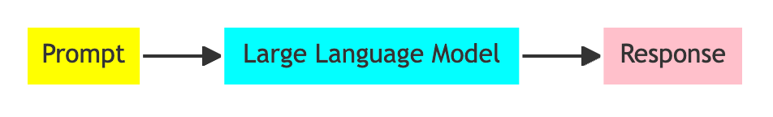

# Mermaid Workflow Lab

## Prompt

```linenums="0"
Create a mermaid diagram of a three step workflow on a gray background,
Make it have three boxes connected with arrows.
Label the first box "Prompt".  Make it yellow.
Label the second box "Large Language Model". Make it cyan.
Label the third box "Response". Make it pink.
```

## Response



## Show Code

```mermaid
{
  "diagramLanguage": "mermaid",
  "diagramType": "graph",
  "diagram": "graph LR
      A[Prompt] --> B[Large Language Model]
      B --> C[Response]
      style A fill:#ffff00
      style B fill:#00ffff
      style C fill:#ffc0cb"
}
```