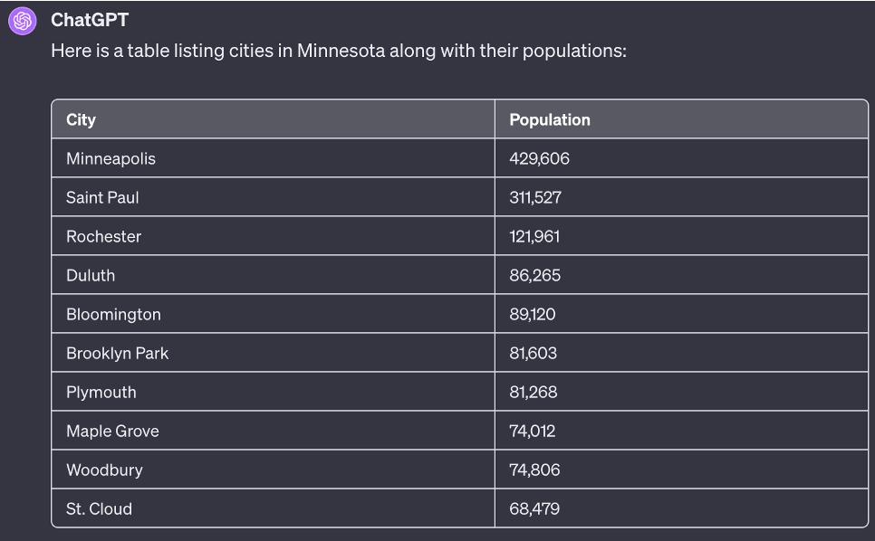

# Markdown Table

```
Create a table.
For each row, list a city in Minnesota
In the first column, list the city name.
In the second column, list the population.
Round the population to the nearest three digits.
```



```
Return as Markdown
```

| City           | Population |
|----------------|------------|
| Minneapolis    | 429,606    |
| Saint Paul     | 311,527    |
| Rochester      | 121,961    |
| Duluth         | 86,265     |
| Bloomington    | 89,120     |
| Brooklyn Park  | 81,603     |
| Plymouth       | 81,268     |
| Maple Grove    | 74,012     |
| Woodbury       | 74,806     |
| St. Cloud      | 68,479     |

## Grocery List

### Prompt

```
Create a table of the items that a person typically gets at a grocery store.
Return the results in a single raw markdown table.
Make the first column be the category.
Make the second column be the name of the product
Make the third column be the typical price.
Create subtotals and totals.
Return the result as a single markdown file.
```

| Category | Product Name | Typical Price |
|---|---|---|
| Fruits | Apples (1 lb) | $1.50 |
| Fruits | Bananas (1 lb) | $0.60 |
| Fruits | Oranges (1 lb) | $1.20 |
| Vegetables | Carrots (1 lb) | $0.90 |
| Vegetables | Lettuce (1 head) | $1.50 |
| Vegetables | Tomatoes (1 lb) | $2.00 |
| Dairy | Milk (1 gallon) | $3.50 |
| Dairy | Eggs (dozen) | $2.50 |
| Dairy | Cheese (1 lb) | $5.00 |
| Meat | Chicken breast (1 lb) | $3.00 |
| Meat | Ground beef (1 lb) | $4.00 |
| Meat | Bacon (1 lb) | $5.00 |
| Bakery | Bread (1 loaf) | $2.50 |
| Bakery | Bagels (6 pack) | $3.00 |
| Bakery | Croissants (6 pack) | $4.50 |
| Snacks | Potato chips (bag) | $3.00 |
| Snacks | Cookies (pack) | $2.50 |
| Snacks | Nuts (1 lb) | $6.00 |
| Beverages | Coffee (1 lb) | $6.00 |
| Beverages | Tea (box) | $4.00 |
| Beverages | Soda (12 pack) | $5.00 |
| Household | Paper towels (6 rolls) | $8.00 |
| Household | Toilet paper (12 rolls) | $10.00 |
| Household | Laundry detergent (bottle) | $15.00 |
| Fruits | Subtotal | $3.30 |
| Vegetables | Subtotal | $4.40 |
| Dairy | Subtotal | $11.00 |
| Meat | Subtotal | $12.00 |
| Bakery | Subtotal | $10.00 |
| Snacks | Subtotal | $11.50 |
| Beverages | Subtotal | $15.00 |
| Household | Subtotal | $33.00 |
| Total |  | $100.20 |
