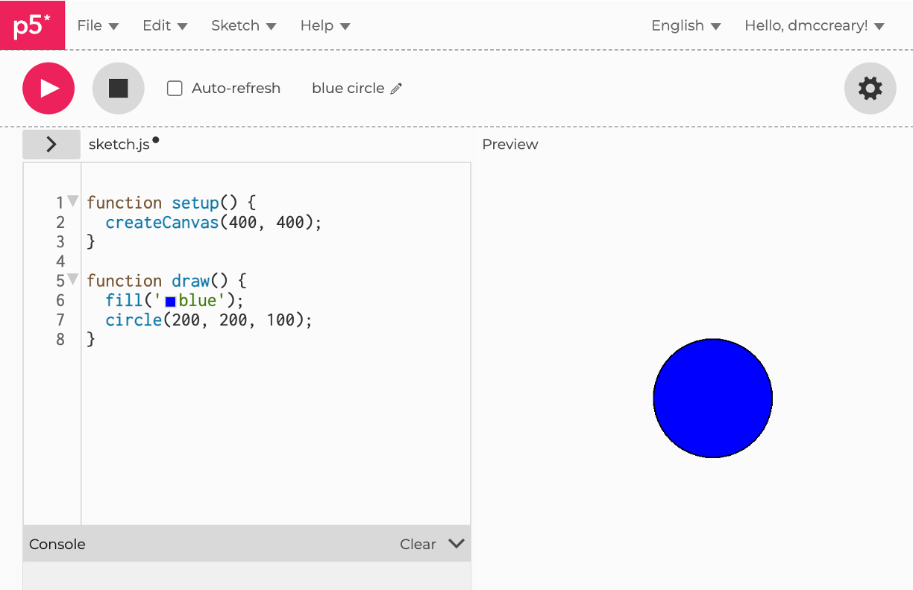

# Blue Circle

## Prompt

```linenums="0"
Generate a p5.js sketch on a 400x400 canvas.
Draw a blue circle.
```

```js
function setup() {
  createCanvas(400, 400);
}

function draw() {
  fill('blue'); 
  circle(200, 200, 100);
}
```

