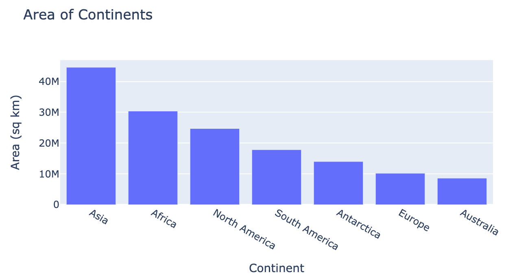

# Plot the Areas of Continents

## Prompt

```linenums="0"
Create a Python plotly program to draw a vertical bar chart.
Show the area of all the continents.
Verify the code is correct.
```

```python
import plotly.express as px

# Example data, in reality, this should be replaced with the actual data.
# The values here are rough estimates and not accurate.
continents = ['Asia', 'Africa', 'North America', 'South America', 'Antarctica', 'Europe', 'Australia']
area = [44579000, 30370000, 24709000, 17840000, 14000000, 10180000, 8600000] # in square kilometers

# Create a vertical bar chart
fig = px.bar(x=continents, y=area, title="Area of Continents", labels={'x':'Continent', 'y':'Area (sq km)'})

# Show figure
fig.show()
```



## Debugging Tip

I originally called the file plotly.py

I asked ChatGPT:

```
import plotly.express as px

ModuleNotFoundError: No module named 'plotly.express'; 'plotly' is not a package

When I ask "pip freeze", it says the following libraries are installed:

plotly @ file:///opt/conda/envs/env/conda-bld/plotly_1698259245963/work/packages/python/plotly/dist/plotly-5.18.0.tar.gz
plotly-express==0.4.0
```

The error you're encountering, ModuleNotFoundError: No module named 'plotly.express'; 'plotly' is not a package, suggests a conflict or issue with your Plotly installation. Here are some steps to resolve this issue:

Check for Name Conflicts: Ensure there are no files or directories in your working directory named plotly.py or a folder named plotly. Such conflicts can cause Python to try to import your local file or directory instead of the actual Plotly package.