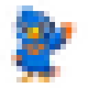
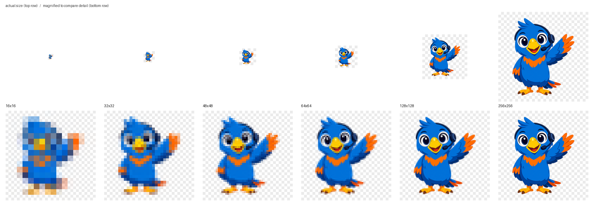

# Favicon Contact Sheet

The site favicon is a single `.ico` file at `docs/img/favicon.ico` that carries
**six** separate renditions inside it. Browsers pick whichever one fits the
context — a 16×16 for the tab strip, a 256×256 for a macOS Finder preview —
so all six need to be checked, not just the big one.

This page shows every embedded rendition at true size next to a magnified
blow-up, so you can see exactly what a browser will draw.

!!! mascot-tip "Polly's Tip"
    
    Most image tools only ever show you the *largest* image inside an `.ico`.
    That is why a 16×16 can quietly turn to mush and still look perfect in
    Preview. Always check the small one — it is the one people actually see.

## Source

| Property | Value |
|----------|-------|
| Source image | `docs/img/mascot/welcome.png` (Polly, waving) |
| Generated by | `book-installer` feature 3b — `generate-favicon.py` |
| Output | `docs/img/favicon.ico` |
| Embedded sizes | 16, 32, 48, 64, 128, 256 px |
| Total file size | 81 KB |
| Background | transparent |

## All Six Renditions

Each row shows the rendition at its true pixel size, then magnified with
nearest-neighbour scaling so individual pixels stay crisp. The magnification
factor drops for the larger sizes (8× at 16 px down to 2× at 256 px) so every
blow-up lands at a comparable width.

| Size | Actual | Magnified | Where it is used |
|------|--------|--------------|------------------|
| **16×16** |  |  | Browser tab, bookmarks bar |
| **32×32** |  |  | Retina tab, Windows taskbar |
| **48×48** |  |  | Windows site icons, toolbars |
| **64×64** |  |  | Windows jump lists |
| **128×128** |  |  | Chrome Web Store, macOS Dock |
| **256×256** |  |  | Windows Vista+, macOS Finder |

## Combined Sheet

The same six renditions side by side — true size on top, magnified below, on a
checkerboard so transparency is visible rather than assumed:



## Known Limitation

At **16×16** the full-body pose does not survive the downscale. Polly's head,
wing, body, and feet all compress into roughly a dozen pixels, and the result
reads as a blue smudge rather than a parrot. Every size from 32 px up is clear.

This is inherent to putting a full-body character in a tab icon, not a fault in
the generator. Two ways to fix it if the tab icon ever matters more than brand
consistency:

1. **Crop to the head.** Polly's face — big eyes, yellow beak — survives 16×16
   easily, because there are far fewer shapes competing for the same pixels.
2. **Regenerate the source without the glow.** `welcome.png` carries a baked-in
   background glow that stays opaque nearly to the edges, so the generator's
   transparent-trim step only removed 8 px of 548. A clean cutout would let
   Polly fill more of the tile at every size.

## Regenerating This Page

Rebuild the `.ico` from the mascot:

```bash
python3 "$BK_HOME/skills/book-installer/scripts/generate-favicon.py" --src docs/img/mascot/welcome.png --out docs/img/favicon.ico
```

Inspect every embedded size and write a fresh contact sheet:

```bash
bk-show-favicon docs/img/favicon.ico --out docs/img/favicon/contact-sheet.png
```
