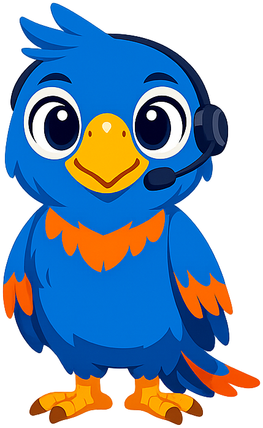
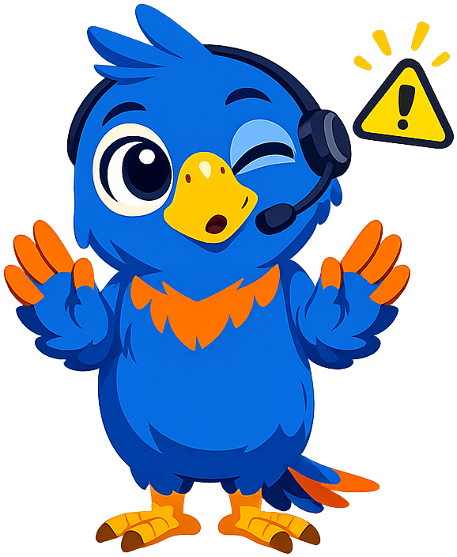

# Polly's Style Guide

This page shows all mascot admonition styles for reference.

!!! mascot-neutral "A Note from Polly"
    
    Use your words! This is the neutral style, used for general sidebars or introductions.

!!! mascot-welcome "Welcome!"
    
    Let's craft the perfect prompt! In this chapter, we'll discover how to communicate
    effectively with large language models. Get ready to level up your AI skills!

!!! mascot-thinking "Key Insight"
    
    Words matter - let's get them right! Notice that the way you structure your prompt
    directly affects the quality of the response. It's like giving directions - the
    clearer you are, the better the destination!

!!! mascot-tip "Polly's Tip"
    
    Time to talk to AI! Always include an example of the output format you want.
    Show, don't just tell - LLMs learn by example just like we do!

!!! mascot-warning "Watch Out!"
    
    Use your words! Don't assume the AI knows what you mean by "make it better."
    Be specific about what "better" means - shorter? more formal? more examples?

!!! mascot-celebration "Great Progress!"
    
    Let's craft the perfect prompt! You've mastered the fundamentals of prompt
    engineering. That's something to squawk about!

!!! mascot-encourage "You Can Do This!"
    
    Words matter - let's get them right! Chain-of-thought prompting can feel
    tricky at first. That's completely normal! With practice, you'll be
    chaining prompts like a pro.
