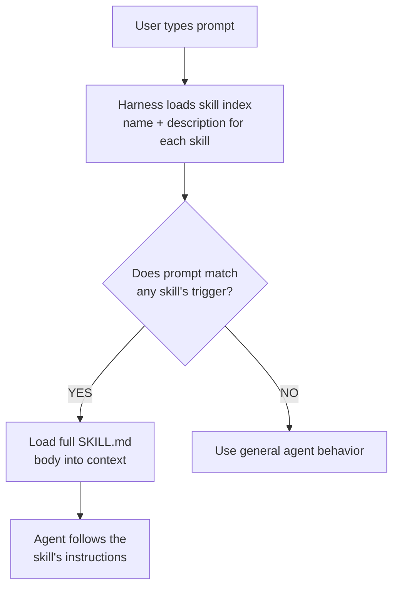
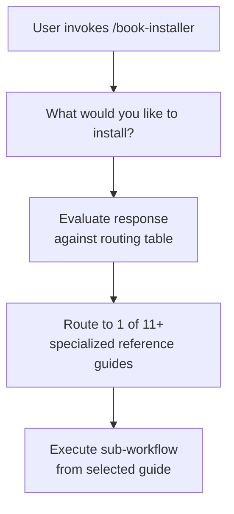
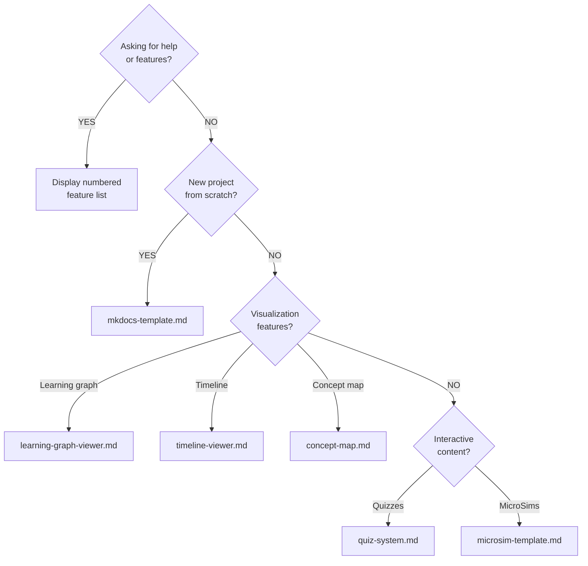
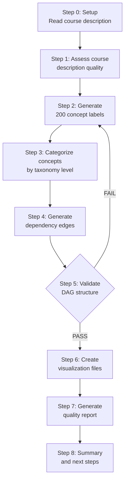
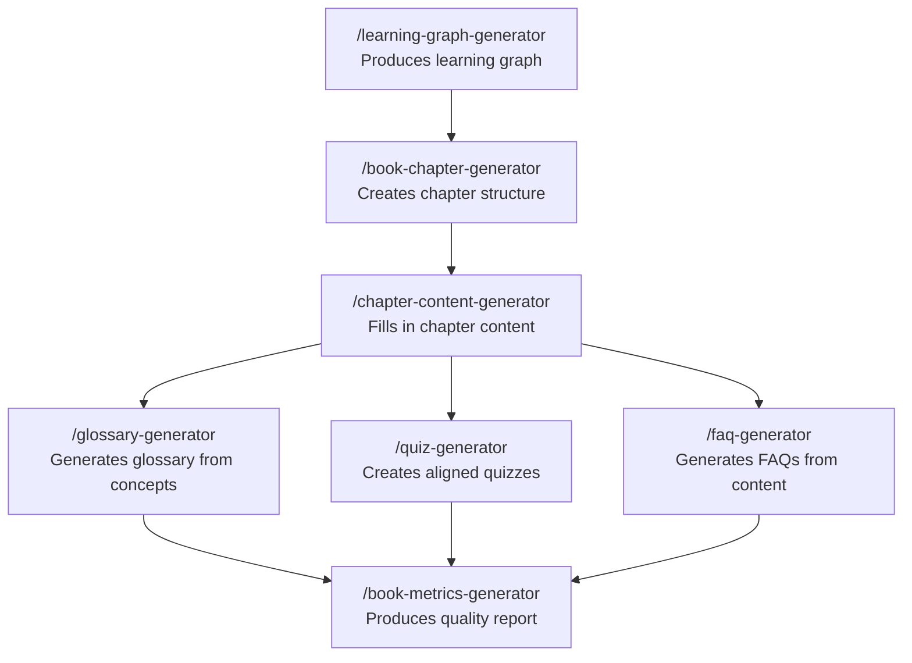

# Meta-Skills: Using the Skill Creator to Build New Skills

## Lecture Overview

**Duration:** 60 minutes
**Level:** Intermediate to Advanced
**Prerequisites:** Basic familiarity with Claude Code, prompt engineering fundamentals, understanding of AI agent harnesses

---

## Part 1: What Are Agent Skills and Why They Matter (10 minutes)

### The Problem Skills Solve

Every time you ask an AI agent to perform a complex task, you face the same challenge: the agent needs precise instructions to do the job consistently well. Without skills, you would need to re-type detailed instructions every single time. Skills solve this by packaging expert knowledge into reusable, triggerable instruction sets that any user can invoke.

Think of skills as **reusable recipes for AI agents**. Just as a cookbook gives a chef precise steps for making a souffl&eacute;, a skill gives an AI agent precise rules for completing a complex task.

### What Makes Skills So Powerful

Ageny Skills are not just saved prompts. They are structured instruction packages that include:

1. **Metadata for intent matching** - The agent knows *when* to use the skill
2. **Step-by-step workflows** - Precise sequences of actions
3. **Decision trees and rules** - Conditional logic for handling variations
4. **Reference materials** - Domain knowledge loaded on demand
5. **Executable scripts** - Code that runs deterministically when needed
6. **Quality validation** - Built-in checks to ensure output meets standards

**Key insight:** Skills transform AI agents from general-purpose assistants into domain experts that follow precise, battle-tested procedures. A skill for generating quiz questions does not just "write some questions" - it checks content readiness scores, distributes questions across Bloom's Taxonomy levels, validates against learning objectives, and formats everything consistently.

### Real-World Impact

Without skills, users get inconsistent results. One day the agent generates a glossary with circular definitions; the next day it produces definitions that reference undefined terms. With a well-crafted glossary-generator skill, every glossary follows the same quality standards: definitions are concise, non-circular, distinct from each other, and free of business rules.

---

## Part 2: How AI Harnesses Match Intent to Skills (10 minutes)

### The Intent-Matching Pipeline

When you type a message into Claude Code (or any AI harness that supports skills), the system goes through a critical matching process before the agent even begins working:

<!-- ASCII original:
User types prompt
    ↓
Harness loads skill index (name + description for each skill)
    ↓
Agent evaluates: "Does this prompt match any skill's trigger criteria?"
    ↓
If YES → Load the full SKILL.md body into context
    ↓
Agent follows the skill's instructions
-->



The **description field** in a skill's metadata is the single most important piece of text in the entire skill. It is the *only* information the agent sees when deciding whether to trigger the skill. The full body of the skill is not loaded until after the match is made.

### Anatomy of a Skill File

Every skill lives in a directory with a required `SKILL.md` file:

```
skill-name/
├── SKILL.md           ← Required: metadata + instructions
├── references/        ← Optional: domain knowledge files
├── scripts/           ← Optional: executable code
└── assets/            ← Optional: templates, images
```

The `SKILL.md` file has two parts:

```markdown
---
name: glossary-generator
description: >
  This skill automatically generates a comprehensive glossary
  of terms from a learning graph's concept list. Use this skill
  when creating a glossary for an intelligent textbook.
---

## Instructions

Step 1: Read the learning graph...
Step 2: For each concept, generate a definition...
```

### The Description is Everything

A poorly written description means the skill never gets triggered - or gets triggered at the wrong time. Compare these:

**Bad description:**
```
description: Generates glossaries
```

**Good description:**
```
description: >
  This skill automatically generates a comprehensive glossary
  of terms from a learning graph's concept list, ensuring each
  definition is precise, concise, distinct, non-circular, and
  free of business rules. Use this skill when creating a glossary
  for an intelligent textbook after the learning graph exists.
```

The good description tells the agent:

- **What** it does (generates glossary from concept list)
- **How** it does it (with specific quality criteria)
- **When** to use it (after learning graph exists)
- **Context** (intelligent textbook projects)

### The Context Window Challenge

Here is where things get interesting - and where understanding the technical constraints matters.

Every skill's name and description gets loaded into the agent's context window at the start of every conversation. If you have 50 skills, each with a 200-word description, that is 10,000 tokens of skill metadata consuming context space before the user even types their first message.

**The old 200K context window limitation:** With the earlier 200K token context windows, Claude Code could practically only evaluate the first ~30 skills. Skills beyond that limit were effectively invisible - they existed on disk but never got matched.

**The new 1M context window:** With 1 million token context windows now available, the system can evaluate significantly more skills. This is a game-changer for power users who maintain large skill libraries. However, more skills still means more tokens consumed by metadata, so there is always a practical upper bound.

**Best practice:** Keep descriptions under 1,024 characters. Be precise about triggers. Do not pad descriptions with marketing language - every word should help the agent make a better matching decision.

### Progressive Disclosure: The Three-Level Loading System

Skills use a clever three-level system to manage context efficiently:

| Level | What Loads | When | Size |
|-------|-----------|------|------|
| **Level 1: Metadata** | Name + description | Always in context | ~100 words |
| **Level 2: SKILL.md body** | Full instructions | When skill triggers | < 5,000 words |
| **Level 3: References** | Domain knowledge files | When needed during execution | Unlimited |

This means a skill can contain thousands of lines of reference material without consuming any context until the agent actually needs it. The book-installer skill, for example, has 11 detailed reference guides totaling tens of thousands of words, but only the relevant guide gets loaded based on what the user asks for.

---

## Part 3: The Anthropic Skill Creator (15 minutes)

### What is the Skill Creator?

The skill creator is itself a skill - a meta-skill that generates new skills. It is invoked with `/skill-creator` in Claude Code and guides you through a structured process for designing, building, and validating a new skill.

This is one of the most elegant examples of bootstrapping in AI tooling: **the skill that teaches the agent how to build skills was itself built as a skill.**

### How to Invoke the Skill Creator

There are several ways to trigger the skill creator:

```
# Direct invocation
/skill-creator

# Natural language (intent matching)
"I want to create a new skill for generating API documentation"

# With specific parameters
"Create a skill that converts CSV files to formatted markdown tables"
```

When you invoke `/skill-creator`, Claude loads the full skill creator instructions - a comprehensive 17,800-character guide that includes:

- A 6-step creation process
- Rules for naming, descriptions, and structure
- Patterns for progressive disclosure
- Validation requirements
- Reference files for workflows and output patterns

### The 6-Step Skill Creation Process

The skill creator walks through these steps:

**Step 1: Understand the Need**
What task does the user perform repeatedly? What goes wrong when the agent does it without a skill? What are the quality criteria?

**Step 2: Design the Trigger**
Write a description that captures exactly when this skill should fire. Test it mentally: "If a user typed X, would this description cause the right match?"

**Step 3: Write the Instructions**
Structure the body with clear steps, rules, and decision points. Use progressive disclosure - put core workflow in SKILL.md, put detailed domain knowledge in reference files.

**Step 4: Add Resources**
Do you need reference files for domain knowledge? Scripts for deterministic operations? Assets for output templates?

**Step 5: Validate**
Run the validation script to check naming conventions, description length, and structural requirements:

- Name must be kebab-case (lowercase, hyphens)
- Name maximum: 64 characters
- Description maximum: 1,024 characters
- No angle brackets in descriptions
- Valid YAML frontmatter

**Step 6: Test and Iterate**
Try the skill with real prompts. Does it trigger correctly? Does it produce consistent, high-quality output? Refine based on results.

### Rules the Skill Creator Enforces

The skill creator has learned - through extensive iteration - a set of rules that produce better skills:

**Naming Rules:**

- Kebab-case only: `my-skill-name` not `mySkillName`
- No leading or trailing hyphens
- No consecutive hyphens
- Maximum 64 characters
- Names should be descriptive but concise

**Description Rules:**

- Must include what the skill does AND when to trigger it
- Maximum 1,024 characters
- No HTML angle brackets
- Should list specific trigger phrases or contexts

**Body Rules:**

- Keep under 500 lines to minimize context bloat
- Use headers and numbered steps for clarity
- Put detailed knowledge in reference files, not in the body
- Include validation criteria so the agent knows what "done well" looks like

**What NOT to Include:**

- No README.md files
- No CHANGELOG files
- No installation guides
- No auxiliary documentation
- Only files the agent needs to do the job

### How the Skill Creator Has Evolved

The skill creator has gone through significant evolution as the community learned what makes skills effective:

**Early days:** Skills were essentially long prompts saved to files. They had no structure, no metadata, and no progressive disclosure. Every skill loaded its entire content into context regardless of relevance.

**The metadata revolution:** Adding YAML frontmatter with name and description fields enabled intent matching. Now skills could be triggered automatically instead of requiring explicit invocation.

**Progressive disclosure:** The three-level loading system (metadata → body → references) dramatically improved context efficiency. Skills could grow much larger without penalizing every conversation.

**Validation tooling:** Scripts like `validate.py` and `quick_validate.py` enforce structural rules automatically, catching common mistakes before they cause problems.

**Pattern libraries:** Reference files like `workflows.md` and `output-patterns.md` codify best practices, so new skill authors do not have to rediscover what works.

**Today:** The skill creator produces skills that are structurally sound, context-efficient, and well-documented from the first draft. It represents years of collective learning about what makes AI instructions effective.

---

## Part 4: The Surprising Simplicity of Skill Creation (5 minutes)

### It Is Easier Than You Think

One of the biggest barriers to skill adoption is that novice users assume creating a skill requires programming expertise. They imagine they need to understand YAML schemas, write complex scripts, and configure build systems.

The reality? Creating a basic skill takes about 2 minutes:

```
User: "I want to create a skill that generates meeting agendas 
       from a list of topics"

Claude: [Creates the skill directory, writes SKILL.md with proper 
         frontmatter, structures the instructions, validates the 
         output]

Done. The skill is ready to use.
```

Here is a complete, functional skill that took seconds to create:

```markdown
---
name: meeting-agenda
description: >
  Generates structured meeting agendas from a list of topics
  with time allocations, discussion leaders, and action items.
  Use when the user needs to create a meeting agenda.
---

## Instructions

1. Ask for the meeting duration and list of topics
2. Allocate time proportionally based on topic complexity
3. For each topic, include:
   - Time allocation (minutes)
   - Discussion leader (if specified)
   - Key questions to address
   - Expected outcome or decision needed
4. Add a 5-minute buffer for opening and closing
5. Format as a clean markdown table
```

That is it. That is a working skill. It will trigger when someone asks for a meeting agenda, and it will produce consistent, well-structured output every time.

### The Progression from Simple to Sophisticated

Most users should start simple and add complexity only when needed:

| Complexity Level | What You Add | Example |
|---------|-------------|---------|
| **Basic** | SKILL.md with frontmatter + simple steps | Meeting agenda generator |
| **Intermediate** | Decision trees, validation rules | Quiz generator with Bloom's Taxonomy |
| **Advanced** | Reference files, scripts, quality scoring | Learning graph generator with DAG validation |
| **Expert** | Cross-skill dependencies, routing tables | Book installer with 11 reference guides |

---

## Part 5: Multi-Task Skills and Complex Workflows (10 minutes)

### One Skill, Many Actions

A single skill can orchestrate dozens of distinct actions. The key is using **routing tables** and **decision trees** to direct the agent to the right action based on user intent.

### Example: The Book Installer Skill

The `/book-installer` skill is one of the most sophisticated examples of a multi-task skill. It serves as a **routing hub** for installing features into intelligent textbooks built with MkDocs Material.

When invoked, it does not perform a single action. Instead, it evaluates what the user needs and routes to the appropriate sub-workflow:

<!-- ASCII original:
User: "/book-installer"
    ↓
"What would you like to install?"
    ↓
Evaluates user response against routing table
    ↓
Routes to one of 11+ specialized reference guides
-->



**The Routing Table Pattern:**

| User Says | Routes To | What Happens |
|-----------|-----------|-------------|
| "Set up a new textbook" | mkdocs-template.md | Creates full MkDocs project structure |
| "Add a learning graph viewer" | learning-graph-viewer.md | Installs vis.js-based graph visualization |
| "I need a mascot" | learning-mascot.md | Guides character design with CSS integration |
| "Add skill tracking" | skill-tracker.md | Installs student progress tracking system |
| "Set up feedback system" | feedback-micro-ui.md | Adds like/dislike buttons to pages |
| "Help" or "What can you do?" | Displays feature list | Shows numbered menu of all capabilities |

Each reference guide is itself a detailed workflow - the learning mascot guide alone is 400+ lines with character design questions, subject-area suggestions, pose variants, and CSS templates.

**The Decision Tree Pattern:**

<!-- ASCII original:
Is the user asking for help or listing features?
  → YES: Display numbered feature list
  → NO: Continue evaluation
Is this a new project from scratch?
  → YES: Route to mkdocs-template.md
  → NO: Continue evaluation
Does the user want visualization features?
  → Learning graph? → learning-graph-viewer.md
  → Timeline? → timeline-viewer.md
  → Concept map? → concept-map.md
Does the user want interactive content?
  → Quizzes? → quiz-system.md
  → MicroSims? → microsim-template.md
-->



### Rules and Quality Scoring Within Skills

Advanced skills embed explicit quality criteria that the agent must evaluate. The quiz-generator skill, for example, includes a **Content Readiness Score**:

```
Before generating quiz questions, evaluate the chapter:

Score 90-100 (Rich):    Full content, examples, diagrams → Generate 15 questions
Score 70-89  (Good):    Solid content, some gaps → Generate 12 questions  
Score 50-69  (Basic):   Outline-level content → Generate 8 questions
Score below 50:         Insufficient content → Warn user, suggest running 
                        chapter-content-generator first
```

The learning-graph-generator skill includes **DAG validation rules**:

```
After generating the dependency graph:
1. Check for cycles (dependencies must form a DAG)
2. Verify all referenced concepts exist in the concept list
3. Ensure foundational concepts have no prerequisites
4. Validate that advanced concepts depend on intermediate ones
5. Check that no concept depends on itself
```

These embedded rules are what separate skills from simple prompt templates. They encode expert judgment that would otherwise require a human reviewer.

### Sequential Workflows

The learning-graph-generator demonstrates an 8-step sequential workflow where each step builds on the previous:

<!-- ASCII original:
Step 0: Setup - Read course description
Step 1: Assess course description quality (score it)
Step 2: Generate 200 concept labels
Step 3: Categorize concepts by taxonomy level
Step 4: Generate dependency edges
Step 5: Validate the DAG structure
Step 6: Create visualization files
Step 7: Generate quality report
Step 8: Summary and next steps
-->



The agent cannot skip steps - Step 5 validates the output of Steps 2-4, and if validation fails, the agent loops back to fix issues before proceeding.

---

## Part 6: Skills Calling Skills (5 minutes)

### Composability: The Power of Skill Chains

One of the most powerful features of the skill ecosystem is that **skills can reference and invoke other skills**. This creates composable workflows where complex processes are broken into manageable, reusable pieces.

**Example chain for building an intelligent textbook:**

<!-- ASCII original:
/learning-graph-generator → /book-chapter-generator → /chapter-content-generator
→ /glossary-generator → /quiz-generator → /faq-generator → /book-metrics-generator
-->



Each skill in this chain explicitly states its prerequisites in its description:

- The quiz-generator says: *"Use this skill after chapter content has been generated (use chapter-content-generator first)"*
- The chapter-content-generator says: *"Use this skill when the book-chapter-generator skill has created chapter directories"*
- The glossary-generator says: *"Use this skill when creating a glossary for an intelligent textbook after the learning graph exists"*

This creates a **dependency graph of skills** - the agent understands the correct order and can warn users if prerequisites are not met.

### Recursive Skill Invocation

In principle, skills can call skills that call other skills, creating deep invocation chains. The book-installer skill might trigger the mkdocs-template skill, which sets up a project structure, and then the user immediately invokes the learning-graph-generator, which produces output consumed by the chapter-content-generator.

The practical limit is context window size - each skill invocation loads instructions into context, and deep chains can consume significant tokens. This is why progressive disclosure and concise skill bodies matter so much.

---

## Part 7: Standardization, Installation, and the Ecosystem (5 minutes)

### How Skills Are Installed

Skills are installed through a surprisingly simple mechanism: **symbolic links**. A skill lives in a source directory (like a shared skills repository) and gets linked into the user's `~/.claude/skills/` directory:

```bash
# Installing a skill is just creating a symlink
ln -s /path/to/shared-skills/quiz-generator ~/.claude/skills/quiz-generator
```

This approach has several advantages:

- **No copying** - Updates to the source propagate automatically
- **Easy removal** - Delete the symlink, keep the source
- **Shared libraries** - Teams can maintain a central skills repository
- **Version control** - The source skills live in git repositories

Installers automate this process, scanning a skills repository and creating the appropriate symlinks for tools like Claude Code.

### Anthropic's Role in the Skill Movement

Anthropic was a founding force behind the skill movement. By building skill support directly into Claude Code, they established the patterns and standards that the broader ecosystem now follows. The SKILL.md format, the YAML frontmatter convention, the progressive disclosure architecture - these all originated from Anthropic's work on Claude Code.

**Today, Claude Code follows skill rules more faithfully than any other harness.** When a skill says "do not create README files," Claude Code respects that instruction. When a skill specifies a 6-step sequential workflow, Claude Code follows each step in order. This reliability is what makes skills genuinely useful rather than merely suggestive.

### The Compliance Gap in Other Harnesses

Other AI harnesses have begun claiming skill support, but there is a significant gap between "supports skills" and "faithfully follows skill rules." Common issues include:

- **Ignoring negative instructions** - Skills that say "do NOT do X" get ignored
- **Skipping validation steps** - Agents skip quality checks to save time
- **Flattening progressive disclosure** - Loading all reference files at once instead of on demand
- **Incomplete metadata matching** - Only matching on skill name, not the full description
- **Breaking sequential workflows** - Parallelizing steps that must be sequential

When evaluating a harness for skill support, the test is simple: create a skill with explicit rules, including negative rules ("do not create auxiliary files"), and see if the harness follows all of them. Claude Code consistently passes this test. Many competitors do not.

---

## Part 8: The Future of Skills (5 minutes)

### Current State: 82,000+ Skills and Growing

Skill search engines are already tracking over 82,000 skills across the ecosystem. This explosive growth brings both opportunity and challenges:

**Opportunities:**

- Vast library of pre-built expertise covering nearly every domain
- Community-driven quality improvement through usage and feedback
- Cross-pollination of patterns between domains

**Challenges:**

- **Discovery** - How do you find the right skill among 82,000 options?
- **Quality variance** - Not all skills are well-crafted; many are just saved prompts with metadata
- **Rating and trust** - No universal system for rating skill quality or trustworthiness
- **Version compatibility** - Skills written for one context window size may not work well in another
- **Naming conflicts** - Multiple skills claiming the same name or trigger phrases

### The Sharing Challenge

Sharing skills between users and teams raises important questions:

- **Portability** - Skills that reference specific file paths or tools may not work in other environments
- **Security** - Skills with embedded scripts need trust verification
- **Customization vs. standardization** - How much should a shared skill be customizable?
- **Attribution** - Who maintains a shared skill? Who is responsible for bugs?

### Predictions for the Future

1. **Skill marketplaces** will emerge with ratings, reviews, and verified publishers - similar to browser extension stores or package managers
2. **Skill composition tools** will make it easier to chain skills together visually, like connecting nodes in a workflow editor
3. **Automated skill generation** will improve - AI agents will observe user patterns and suggest new skills automatically
4. **Cross-harness standards** will develop, though adoption will be uneven and contentious
5. **Skill testing frameworks** will become standard, allowing automated verification that a skill produces correct output across a range of inputs
6. **Context window growth** will continue to expand what is practical - skills that are impractical today due to size constraints will become viable
7. **Skill specialization** will accelerate as domains develop their own skill ecosystems (education skills, DevOps skills, legal skills, medical documentation skills)

### Building Skills That Last

To create skills that stand the test of time:

- **Make them general** - Test with multiple users, not just yourself
- **Include validation** - Build in quality checks so the skill self-corrects
- **Document triggers clearly** - Future users need to know exactly when to use the skill
- **Keep the body concise** - Resist the urge to over-specify; trust the agent's judgment for non-critical decisions
- **Use progressive disclosure** - Put detailed knowledge in reference files
- **Version thoughtfully** - When updating skills, consider backward compatibility for users who depend on current behavior

---

## Summary and Key Takeaways

| Topic | Key Point |
|-------|-----------|
| **What skills are** | Reusable, structured instruction packages that make AI agents into domain experts |
| **Intent matching** | The description field is everything - it is the only thing the agent sees when deciding to trigger |
| **Context management** | Progressive disclosure (3 levels) keeps context efficient |
| **Skill creator** | A meta-skill that guides you through a 6-step process for building new skills |
| **Simplicity** | A basic skill takes 2 minutes to create - most users overestimate the difficulty |
| **Multi-task skills** | Routing tables and decision trees let one skill handle many actions |
| **Composability** | Skills can call skills, creating powerful workflow chains |
| **Installation** | Symbolic links make skills easy to install, share, and update |
| **Anthropic's role** | Founded the skill movement; Claude Code remains the gold standard for skill compliance |
| **Future** | 82,000+ skills tracked; marketplaces, ratings, and cross-harness standards coming |

---

## Discussion Questions

1. What repetitive task in your workflow would benefit most from a skill?
2. How would you write the description field to ensure accurate intent matching?
3. What quality validation rules would you embed in your skill?
4. When should a skill use reference files versus putting everything in the body?
5. How would you test a skill to ensure it works for users beyond yourself?

---

## Hands-On Exercise

**Create your first skill in class (15 minutes if time permits):**

1. Identify a task you perform at least weekly with an AI agent
2. Invoke `/skill-creator` and describe the task
3. Review the generated SKILL.md - check the description, steps, and rules
4. Test the skill with a real prompt
5. Refine based on the output quality
6. Share your skill with a classmate and see if it works for them too
