# List of MicroSims for Agent Orchestration

Interactive Micro Simulations to help students learn agent orchestration and prompt engineering fundamentals.

-   **[AI Concepts Hierarchy](./ai-concepts-hierarchy/index.md)**

    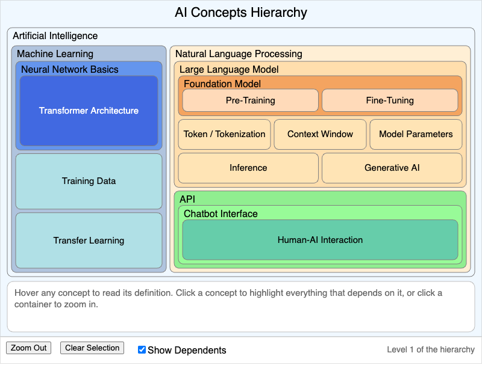

    A nested infographic of the twenty foundational AI concepts, from Artificial Intelligence at the outside down to Human-AI Interaction at the centre, with hover definitions and click-to-highlight dependencies.

-   **[Claude Code Setup](./claude-code-setup/index.md)**

    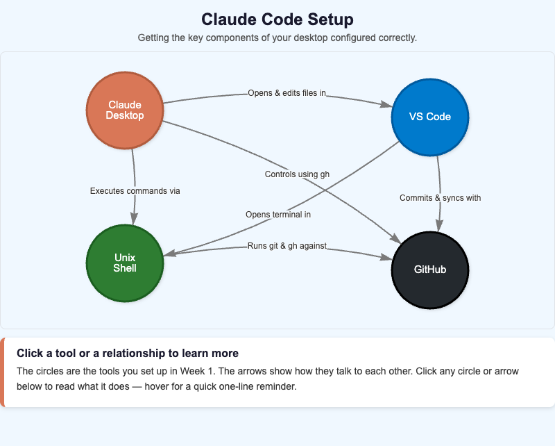

    Interactive vis-network diagram of the four Week 1 tools — Claude Desktop, GitHub, VS Code, and the Unix shell — and the labeled relationships that connect them.

-   **[Claude Desktop Footer Regions](./claude-desktop-footer/index.md)**

    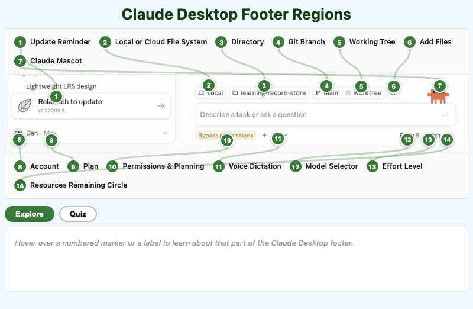

    An interactive, labeled tour of the Claude Desktop footer bar — file context, Git status, permissions, model, effort, and account controls.

-   **[Claude Desktop Home Screen](./claude-desktop-home-screen/index.md)**

    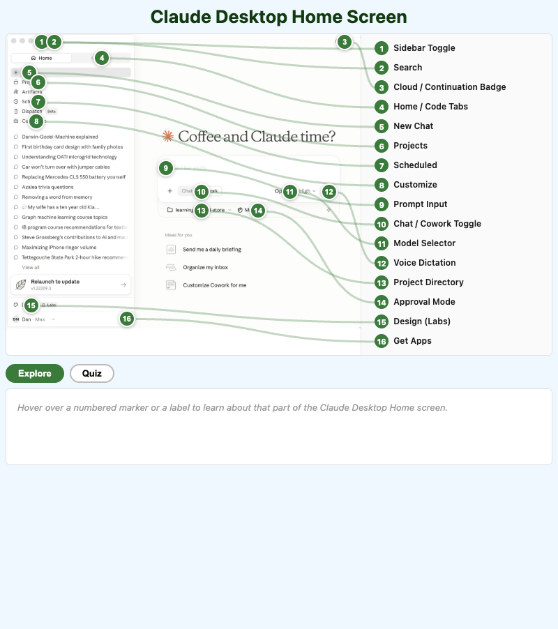

    An interactive, labeled tour of the Claude Desktop Home screen — sidebar, prompt box, mode toggles, and model controls.

-   **[Context Management Decision Framework](./context-management-decision-framework/index.md)**

    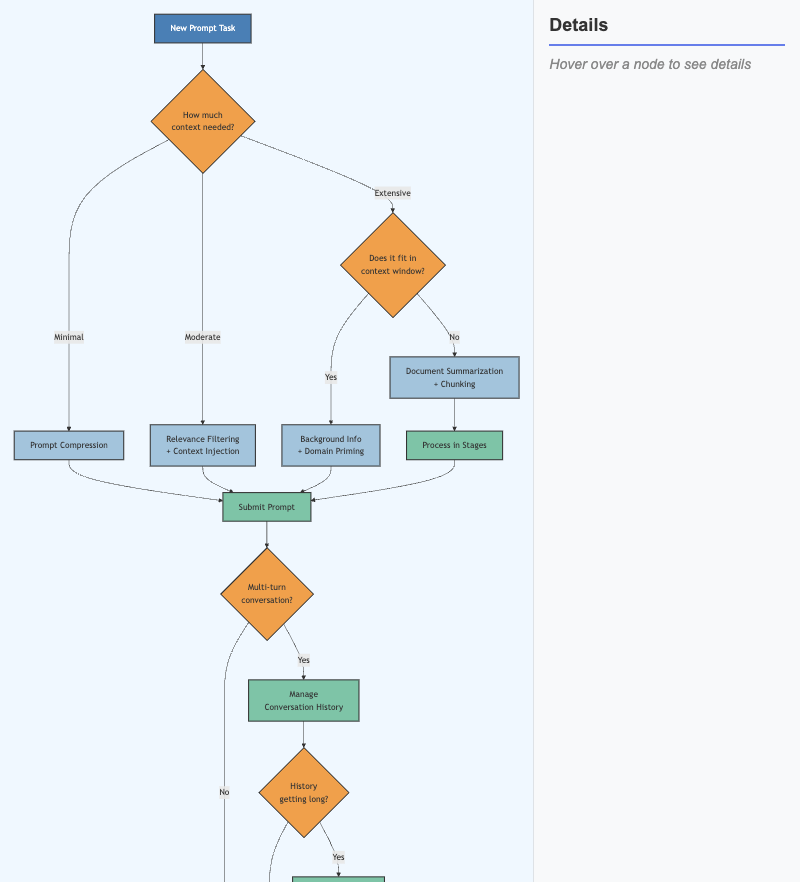

    An interactive decision tree for choosing a context management strategy, from prompt compression through chunking to conversation history management, with hover details for every step.

-   **[Embedding Space Explorer](./embedding-space/index.md)**

    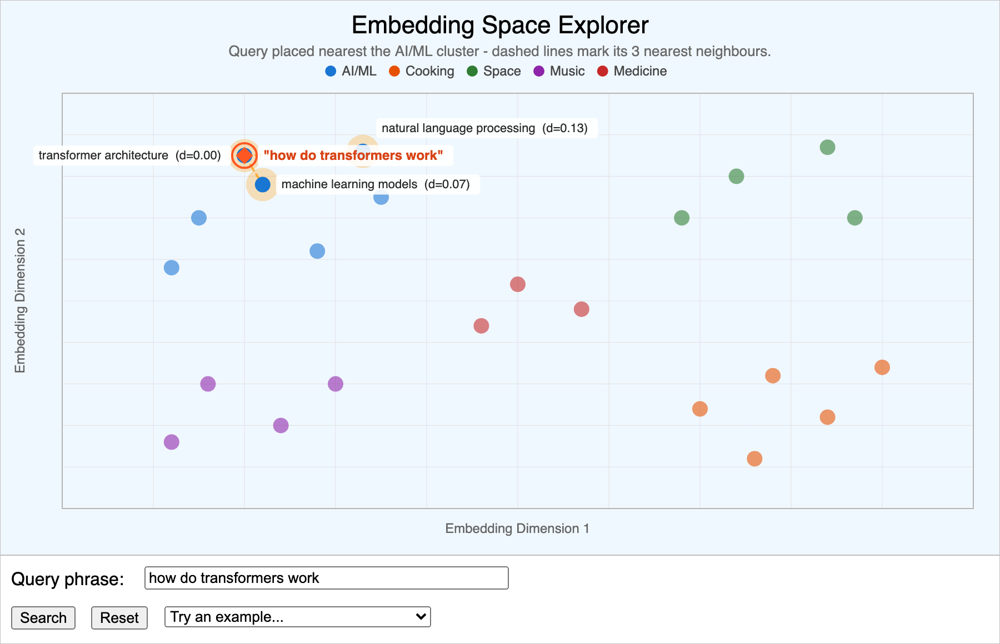

    A two-dimensional map of text embeddings where semantically similar phrases cluster together, with a search box that plots your own query and draws dashed lines to its three nearest neighbors.

-   **[Foundation Model Training Pipeline](./foundation-model-pipeline/index.md)**

    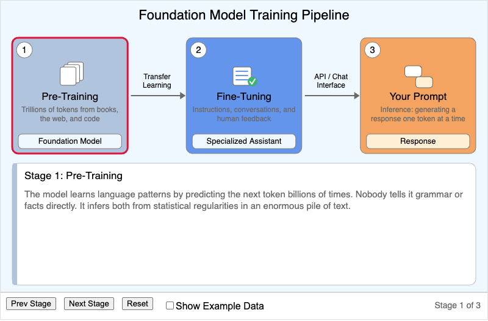

    A three-stage walkthrough of how raw text becomes a useful AI assistant - pre-training, fine-tuning, and inference - with a toggle that swaps plain-language explanations for concrete sample data.

-   **[Learning Graph Viewer](./graph-viewer/index.md)**

    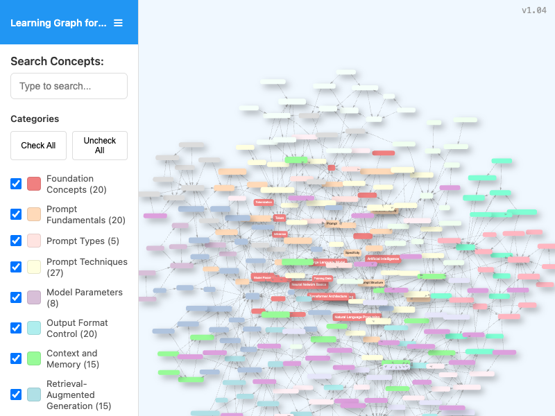

    An interactive vis-network view of the course learning graph, with concept search, category filters, pan and zoom navigation, and live counts of visible nodes and edges.

-   **[Long-Form Document Processing Strategies](./long-form-document-processing-strategies/index.md)**

    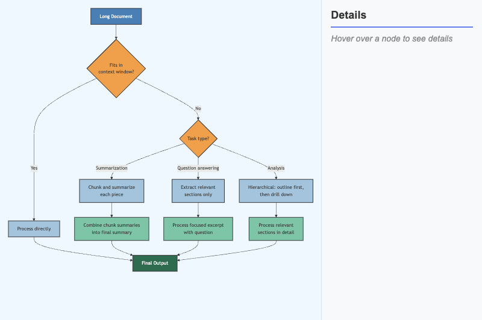

    An interactive decision flowchart for processing documents that do not fit in the context window, branching on document size and task type, with hover details for every step.

-   **[PowerShell vs. WSL Comparison Infographic](./powershell-vs-wsl-comparison/index.md)**

    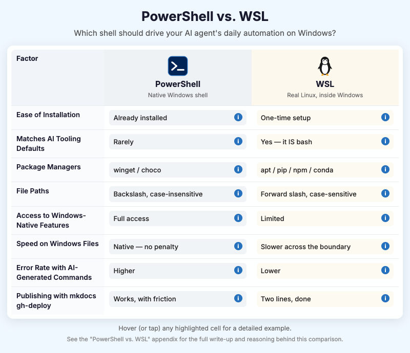

    Three-column comparison infographic contrasting PowerShell and WSL for AI-agent automation on Windows, with hoverable cells revealing detailed command examples.

-   **[Prompt Iteration Cycle](./prompt-iteration-cycle/index.md)**

    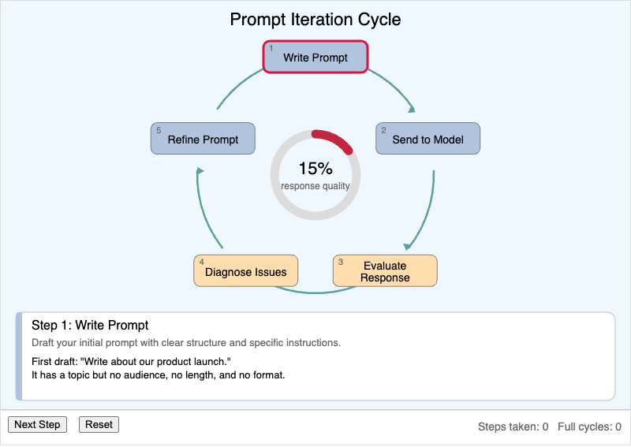

    A five-step refinement loop - write, send, evaluate, diagnose, refine - with a quality gauge in the centre that climbs as the learner works around the cycle.

-   **[Prompt Quality Evaluator](./prompt-quality-evaluator/index.md)**

    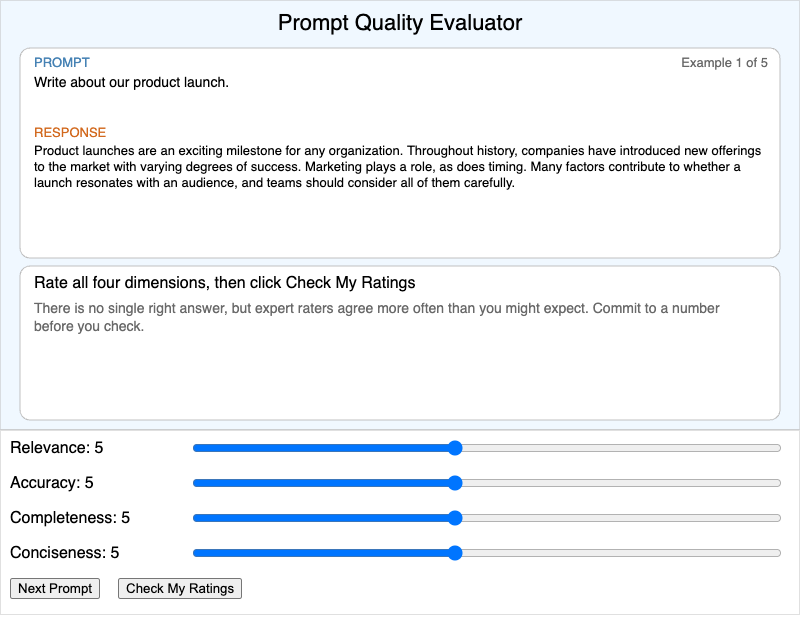

    A calibration exercise where students rate five prompt and response pairs on relevance, accuracy, completeness, and conciseness, then compare their ratings against expert scores.

-   **[Temperature Explorer](./temperature-explorer/index.md)**

    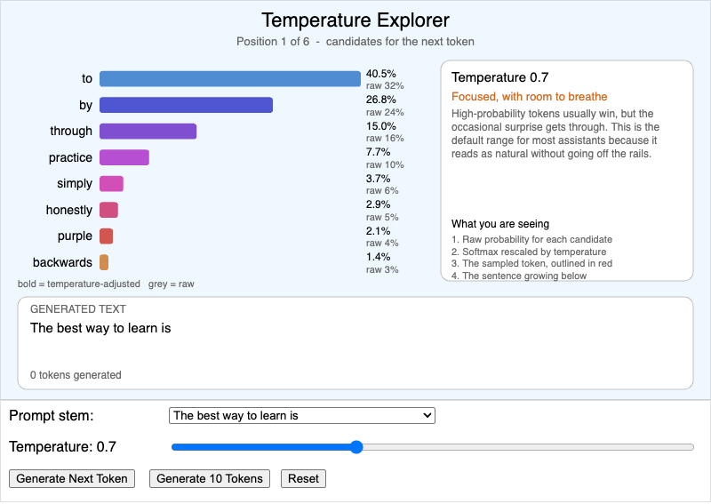

    An interactive bar chart of candidate next tokens showing how the temperature parameter reshapes the probability distribution, with live sampling that builds a sentence one token at a time.

